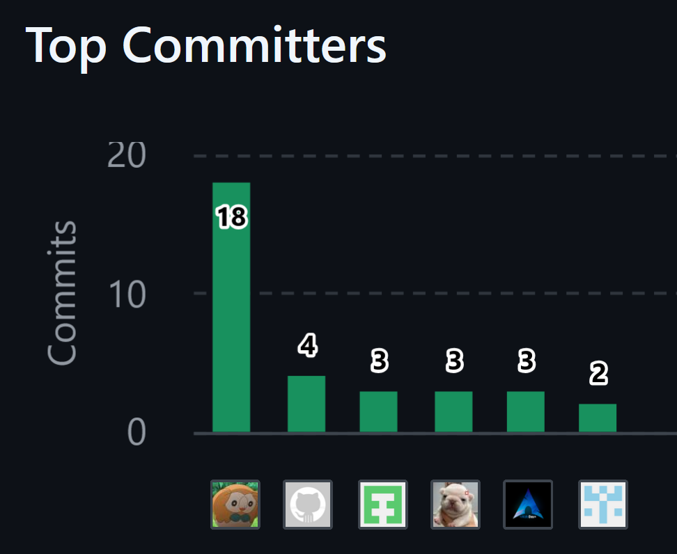
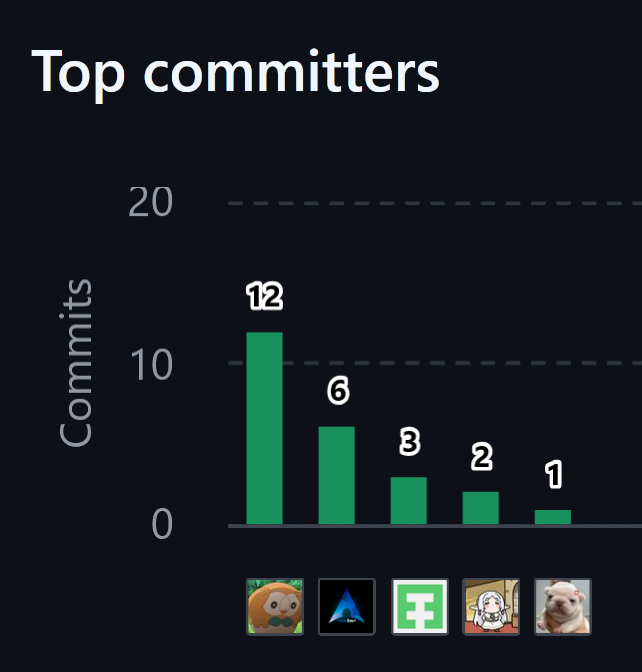
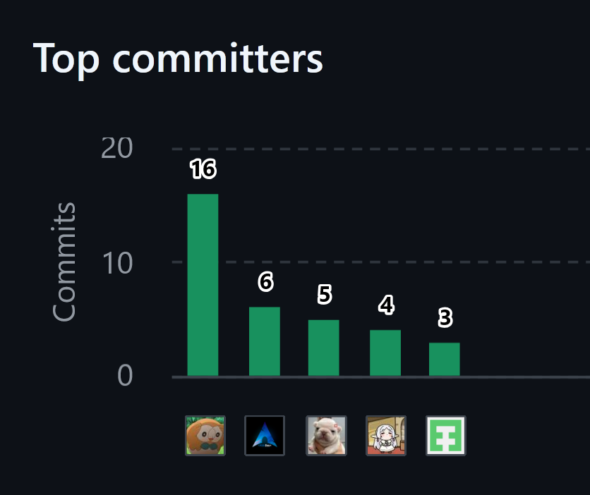

### Project Report Collaboration Insights

#### Enlances a los repositorios y organización de GitHub

- **Organización de GitHub de andeva** 
andeva-upc 
[https://github.com/andeva-upc](https://github.com/andeva-upc)

- **Repositorio de Github del informe** 
atelier-report-11848 
[https://github.com/andeva-upc/atelier-report-11848](https://github.com/andeva-upc/atelier-report-11848)

- **Repositorio de Github del website** 
atelier-website-open-source 
[https://github.com/andeva-upc/atelier-website-open-source](hhttps://github.com/andeva-upc/atelier-website-open-source)

- **Repositorio de Github del webapp** 
atelier-webapp-open-source 
[https://github.com/andeva-upc/atelier-webapp-open-source](https://github.com/andeva-upc/atelier-webapp-open-source)

- **Repositorio de Github del platform** 
atelier-platform 
[https://github.com/andeva-upc/atelier-platform](https://github.com/andeva-upc/atelier-platform)

- **Repositorio de Github del course** 
atelier-course-11848 
[https://github.com/andeva-upc/atelier-course-11848](https://github.com/andeva-upc/atelier-course-11848)

#### Reporte de colaboración del AV1

El presente documento corresponde al primer avance (AV1) del reporte del proyecto. En esta fase inicial, se documentan los primeros entregables que establecen las bases y la estructura fundamental para el desarrollo del producto. A continuación, se detalla la contribución y responsabilidad inicial de cada miembro del equipo:

- **Luis Daniel Granda Ibarra:** Desarrolló la sección del Lean UX Process y elaboró los artefactos de Empathy Mapping e Impact Mapping. Asimismo, colaboró en la redacción de las User Stories y diseñó los wireframes y mock-ups correspondientes al Web Applications UX/UI Design.

- **Joel Huamani Estefanero:** Redactó las secciones de Startup Profile, Solution Profile y Segmentos Objetivo del Capítulo 1. Adicionalmente, desarrolló las User Stories, el Product Backlog, las Style Guidelines y la Information Architecture, encargándose también de la creación de los wireframes y mock-ups tanto para la Landing Page como para el Web Applications UX/UI Design.

- **Aldo Jeanfranco Machacca Soto:** Se encargó del análisis de los competidores y de la creación de las secciones relacionadas con el modelo C4, el Class Diagram y el Database Diagram.

- **Mariana Hortencia Morocho Pinedo:** Llevó a cabo el proceso de Needfinding y participó en la creación de los wireframes y mock-ups para el Web Applications UX/UI Design.

- **Adiel Abdiaz Sanchez Santin:** Fue responsable del Big Picture Event Storming, la definición del Ubiquitous Language y el Design-Level Event Storming, aportando además en el desarrollo del Class Diagram.

Finalmente, se presenta un extracto visual obtenido de la pestaña Pulse de nuestro repositorio en GitHub. Esta gráfica evidencia el inicio de nuestra actividad colaborativa, mostrando el registro de los primeros commits realizados por cada integrante para la configuración y estructuración inicial del proyecto.
&emsp;&emsp;&emsp;&emsp;

#### Reporte de colaboración del TB1

Este reporte consolida los resultados y entregables correspondientes al primer trabajo (TB1) del proyecto. El documento abarca el cumplimiento de los objetivos iniciales y la materialización del primer hito de evaluación. El desglose de las responsabilidades y aportes ejecutados por cada integrante se describe a continuación:

- **Luis Daniel Granda Ibarra:** Implementó las correcciones de la sección de Lean UX Process y completó satisfactoriamente sus tareas asignadas para el Sprint 2.

- **Joel Huamani Estefanero:** Realizó las correcciones en "Antecedentes y Problemática" y "Análisis de entrevistas", así como en las User Stories y el Impact Mapping. Además, dirigió la ejecución del Sprint 2 y cumplió con sus respectivas responsabilidades.

- **Aldo Jeanfranco Machacca Soto:** Se encargó de redefinir el diagrama de la base de datos (Database Diagram) y completó las tareas que le correspondían dentro del Sprint 2.

- **Mariana Hortencia Morocho Pinedo:** Aplicó las correcciones en la fase de Needfinding, redactó las descripciones correspondientes a los artefactos rediseñados y cumplió con sus asignaciones durante el Sprint 2.

- **Jennifer Yamilet Riveros Vera:** Fue responsable de rediseñar los artefactos del Needfinding, llevar a cabo la reconstrucción de los mock-ups como prototipos y cumplir con sus objetivos del Sprint 2.

- **Adiel Abdiaz Sanchez Santin:** Se encargó de estructurar y organizar el Big Picture Event Storming de acuerdo con los lineamientos de la rúbrica de evaluación, además de ejecutar las tareas que le fueron asignadas en el Sprint 2.

Para finalizar, se adjunta la métrica de participación extraída de la sección Pulse del repositorio en GitHub. Este reporte visual ilustra el volumen de commits ejecutados por cada miembro del equipo, validando el esfuerzo conjunto, la distribución equitativa del trabajo y el correcto uso del control de versiones durante este primer periodo de desarrollo.
&emsp;&emsp;&emsp;&emsp;

#### Reporte de colaboración del AV2

El presente documento corresponde al segundo avance (AV2) del reporte del proyecto. En esta sección se detallan los nuevos entregables desarrollados para esta fase, así como la implementación de las correcciones y mejoras sugeridas en las revisiones anteriores. A continuación, se especifica la contribución de cada miembro del equipo:

- **Luis Daniel Granda Ibarra:** Cumplio con las tareas en el desarollo del sprint 3 y realizo sus entrevistas correspondiente para el validation interviews.

- **Joel Huamani Estefanero:** Cumplio con las tareas en el desarollo del sprint 3, agregar user stories, modificar el product backlog, modificar el diagrama de base de datos, modificar el sprint backlog 1, 2 y 3 y realizo sus entrevistas correspondiente para el validation interviews.

- **Aldo Jeanfranco Machacca Soto:** Cumplio con las tareas en el desarollo del sprint 3, cambiar las imagenes del Software Architecture Container Diagrams y realizo sus entrevistas correspondiente para el validation interviews.

- **Jennifer Yamilet Riveros Vera:** Correcion del artefacto de los user personas, modificar el Class Diagram y realizo sus entrevistas correspondiente para el validation interviews..

- **Adiel Abdiaz Sanchez Santin:** Agregar el bounded context iam al Design-Level Event Storming, con mejoras en el bounded context core, y y realizo sus entrevistas correspondiente para el validation interviews.

Finalmente, la siguiente evidencia visual ha sido extraída de la pestaña Pulse del repositorio del proyecto en GitHub. Esta sección refleja la dinámica de trabajo y la actividad reciente del equipo, ilustrando de manera resumida la cantidad de commits realizados por cada integrante, los pull requests gestionados y el flujo de integración de código durante este periodo.
&emsp;&emsp;&emsp;&emsp;

##### Reporte de colaboración del TB2

El presente reporte consolida los resultados y entregables correspondientes al TB2 del proyecto. Este documento abarca las correcciones aplicadas a los hitos previos para asegurar la calidad del entregable final. Las contribuciones específicas del equipo se desglosan de la siguiente manera:

- El integrante Luis Granda, se encargo de realizar las vistas de telemetry, dashboard de cliente del webapp y documentacion de endpoints.
- El integrante Joel Huamani, realizó las vistas de inicio de sesion, con inicio de google y registro de un taller con una sucursal.
- El integrante Aldo Machacca, realizó las vistas de billing y configuracion del cliente y administrador.
- La integrante Jennifer Riveros, hizó la documentacion de sus endpoints y agrego los mockups mobile.
- El integrante Adiel Sanchez, realizó las vistas del dashboard del administrador.

Finalmente, este gráfico representa la cantidad de commits realizados por cada miembro del equipo en el repositorio del proyecto. Cada barra representa a un miembro del equipo y la altura de la barra indica el número total de commits realizados por esa persona.
&emsp;&emsp;&emsp;&emsp;

