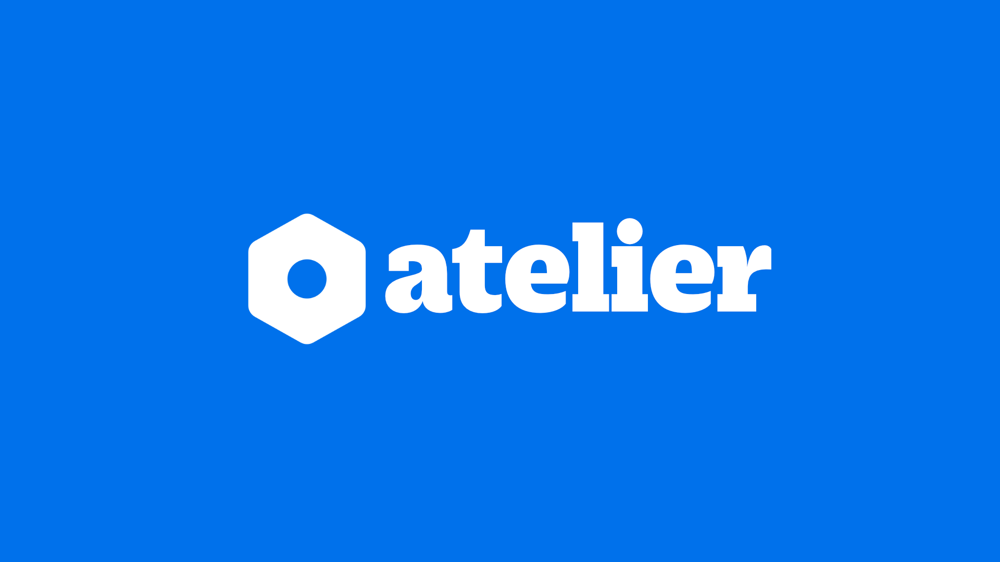
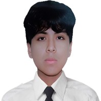
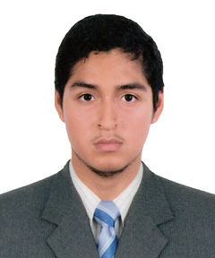
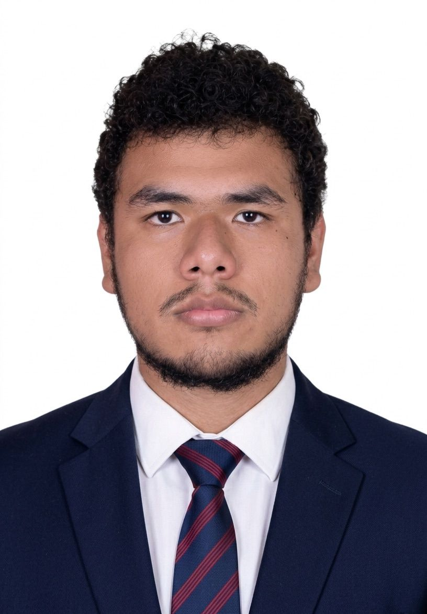

# Capítulo I: Introducción {#cap-1}

## 1.1. Startup Profile {#cap-1-1}

&emsp;&emsp;&emsp;&emsp;En esta sección, se presentará la startup de manera general. Además, de una descripción de los integrantes de esta misma.

### 1.1.1.&emsp;&emsp;*Descripción de la Startup* {#cap-1-1-1}

&emsp;&emsp;&emsp;&emsp;Andeva es una startup peruana concebida y desarrollada por estudiantes de Ingeniería de Software de la Universidad Peruana de Ciencias Aplicadas (UPC). Nuestro principal producto atelier, está diseñado para transformar radicalmente el modelo operativo tradicional de los talleres automotrices, evolucionándolo de un enfoque reactivo a uno preventivo e inteligente.

&emsp;&emsp;&emsp;&emsp;Para lograrlo, la solución se basa en una plataforma web y app mobile que integra hardware de diagnóstico vehicular (OBD2) para recolectar telemetría crítica en tiempo real. Estos datos se transmiten a través de una API segura hacia nuestro backend para su análisis profundo, lo que permite anticipar fallas mecánicas y optimizar los cronogramas de mantenimiento antes de que ocurran problemas mayores.

&emsp;&emsp;&emsp;&emsp;Más allá del diagnóstico técnico, atelier funciona como un sistema integral de gestión empresarial (ERP) que centraliza y automatiza toda la operación administrativa del taller. La plataforma permite un control exhaustivo del inventario y un seguimiento detallado de los clientes y sus respectivos vehículos, así como la administración eficiente de los empleados y sus cargas de trabajo. Adicionalmente, el sistema agiliza el cierre comercial mediante la integración de pasarelas de pagos y la generación automática de facturas, completando la experiencia con herramientas de contabilidad adaptadas al rubro.

&emsp;&emsp;&emsp;&emsp;**Misión:** Transformar la industria del mantenimiento automotriz en el Perú proporcionando a los talleres una solución tecnológica todo-en-uno que facilite la transición hacia un mantenimiento reactivo hacia un mantenimiento preventivo inteligente. Buscamos profesionalizar la gestión empresarial de los talleres, fomentar una cultura de seguridad basada en datos y mejorar radicalmente la transparencia con los conductores.

&emsp;&emsp;&emsp;&emsp;**Visión:** Ser la plataforma líder en el mercado peruano y el referente regional en software de gestión y mantenimiento vehicular predictivo, empoderando a miles de talleres con herramientas de monitoreo inteligente y control administrativo que garanticen la rentabilidad de los negocios, la seguridad en los trayectos y la vida útil de los vehículos.

**Figura 1**

*Imagotipo de atelier*

### 1.1.2.&emsp;&emsp;*Perfiles de Integrantes del Equipo* {#cap-1-1-2}

**Tabla 1**

*Startup Working Team Profile Matrix*

<table style="width: 100%; table-layout: fixed; word-wrap: break-word; font-size: 0.8em;">
	<tbody>
		<tr>
			<td><b>Foto</b></td>
			<td><b>Nombre</b></td>
			<td><b>Carrera</b></td>
		</tr>
		<tr>
			<td rowspan="3"></td>
			<td>Huamani Estefanero, Joel – U20241E275</td>
			<td>Ingeniería de Software</td>
		</tr>
		<tr>
			<td colspan="2"><b>Descripción</b></td>
		</tr>
		<tr>
			<td colspan="2">Soy estudiante de Ingeniería de software. Me considero alguien introvertido y reflexivo, con una tendencia natural a sobrepensar las cosas desde múltiples perspectivas antes de actuar. Esta característica, que me lleva a examinar cada detalle minuciosamente y curiosidad con aprender cosas nuevas me llevan a imaginar y desarrollar cosas en mi mente.
			A lo largo de mi desarrollo he trabajado con lenguajes como C++, Python y Java, explorando profundamente diversas librerías y frameworks de cada ecosistema. En cada proyecto, he asumido mis tareas con meticulosidad y pensamiento crítico, guiado por principios que valoro profundamente, como la precisión técnica.
			Entre mis habilidades distintivas destacan la capacidad de análisis exhaustivo, el pensamiento sistemático y la habilidad para traducir ideas complejas en implementaciones técnicas sólidas.
			En cuanto a competencias personales, destaco mi creatividad para encontrar soluciones no convencionales y mi capacidad de síntesis después de largos procesos de reflexión.
			Dentro del startup, me visualizo como el arquitecto técnico y conceptual. Me apasiona crear soluciones que no solo funcionen correctamente, sino que estén diseñadas con una atención meticulosa a cada componente.</td>
		</tr>
		<tr>
			<td rowspan="3"></td>
			<td>Machacca Soto, Aldo Jeanfranco – U202419485</td>
			<td>Ingeniería de Software</td>
		</tr>
		<tr>
			<td colspan="2"><b>Descripción</b></td>
		</tr>
		<tr>
			<td colspan="2">Soy Aldo Jeanfranco Machacca Soto, actualmente estoy cursando la carrera de Ingeniería de Software, disciplina centrada en el diseño, desarrollo y mantenimiento de soluciones tecnológicas eficientes, escalables y de calidad. En cuanto a mi perfil técnico, me destaco principalmente en el ámbito del desarrollo backend, contando con sólida experiencia en la creación y arquitectura de APIs. Mi stack tecnológico abarca lenguajes como Python, C++, JavaScript y TypeScript, además de frameworks y librerías como React y Next.js para el desarrollo frontend. Tengo experiencia en la gestión de bases de datos optimizadas para soportar grandes volúmenes de información, así como en procesos de despliegue (deploy) para llevar proyectos a producción. Como habilidad diferenciadora, cuento con experiencia práctica integrando agentes de inteligencia artificial (como OpenCode) en los flujos de trabajo. En un equipo, puedo aportar una visión integral del ciclo de vida del software, capaz de conectar eficientemente la lógica del servidor, la interfaz de usuario y la infraestructura, garantizando soluciones robustas y de alto rendimiento.</td>
		</tr>
		<tr>
			<td rowspan="3"></td>
			<td>Granda Ibarra, Luis Daniel – U20241E401</td>
			<td>Ingeniería de Software</td>
		</tr>
		<tr>
			<td colspan="2"><b>Descripción</b></td>
		</tr>
		<tr>
			<td colspan="2">Soy estudiante de 5.° ciclo de Ingeniería de Software en la UPC, enfocado en el desarrollo de soluciones tecnológicas de alto impacto y el análisis avanzado de datos. Mi formación técnica se respalda en el dominio de Python y C++ para el desarrollo de algoritmos eficientes, así como en el manejo estratégico de SQL para la gestión de bases de datos y Excel para el modelado de información. Me apasiona la Ciencia de Datos y el Machine Learning, áreas donde busco transformar la complejidad técnica en herramientas de decisión para las empresas líderes del mercado.  Me considero un perfil dinámico, responsable y con una alta capacidad de adaptabilidad, cualidades que potencio fuera del entorno académico a través de la disciplina del deporte y la música. La constancia que aplico en la calistenia, la natación y el gimnasio, sumada a la creatividad que desarrollo con la guitarra, me permiten abordar los retos de ingeniería con una mentalidad resiliente y un pensamiento lateral. Mi meta es consolidarme como un profesional indispensable en el ecosistema tecnológico, aportando valor real a través de la innovación y la ingeniería de calidad.</td>
		</tr>
		<tr>
            <td rowspan="3"></td>
            <td>Sánchez Santin, Adiel Abdiaz – U20241E287</td>
            <td>Ingeniería de Software</td>
        </tr>
        <tr>
            <td colspan="2"><b>Descripción</b></td>
        </tr>
        <tr>
            <td colspan="2">Soy estudiante de Ingeniería de Software con un perfil analítico y detallista. Me considero una persona introvertida y reflexiva, lo que me lleva a investigar y entender bien cómo funcionan las herramientas antes de utilizarlas. Tengo conocimientos en lenguajes como C++, Python y Java, y me gusta explorar sus librerías para comprender la lógica detrás de cada proyecto. En el equipo, trato de aportar desde el análisis y la organización técnica, buscando siempre que las soluciones sean ordenadas y funcionen correctamente. Mi enfoque está en el aprendizaje constante y en traducir ideas complejas en implementaciones técnicas claras y funcionales.</td>
        </tr>
		<tr>
			<td rowspan="3"></td>
			<td>Riveros Vera, Jennifer Yamilet - U20241C998</td>
			<td>Ingeniería de Software</td>
		</tr>
		<tr>
			<td colspan="2"><b>Descripción</b></td>
		</tr>
		<tr>
			<td colspan="2">Curso el quinto ciclo de la carrera de Ingeniería de Software. Me caracterizo por ser una persona colaborativa y con alta capacidad de empatía, con una marcada inclinación hacia el desarrollo frontend. Me apasiona construir interfaces atractivas y bien estructuradas, priorizando siempre que la experiencia del usuario sea cómoda y natural. Tengo bases sólidas en C++ y Python, conocimientos que combino con mi interés por el diseño visual y el comportamiento funcional de las aplicaciones.</td>
		</tr>
	</tbody>
</table>