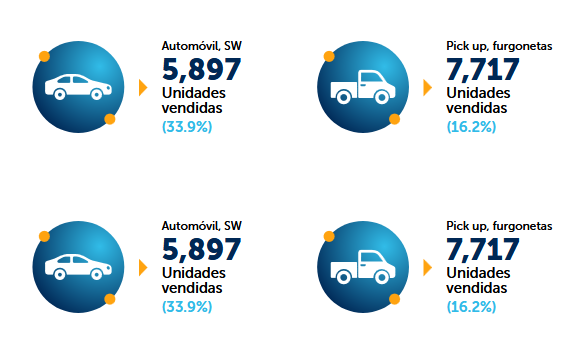
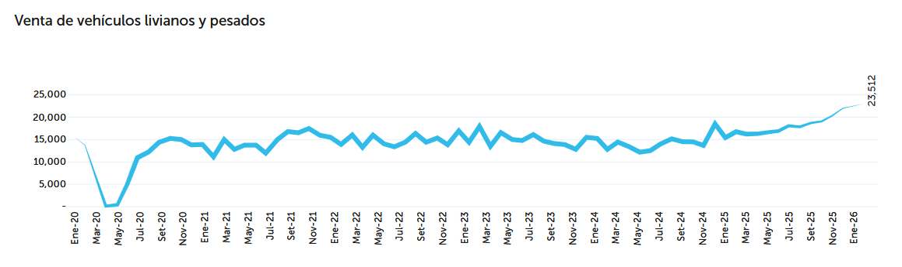
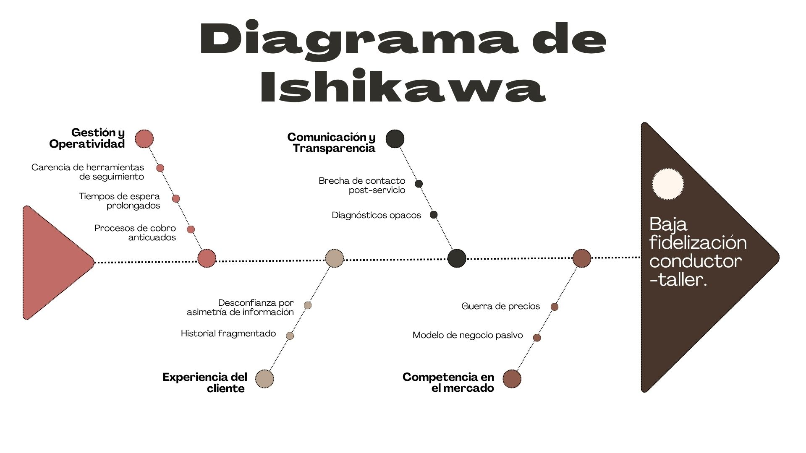
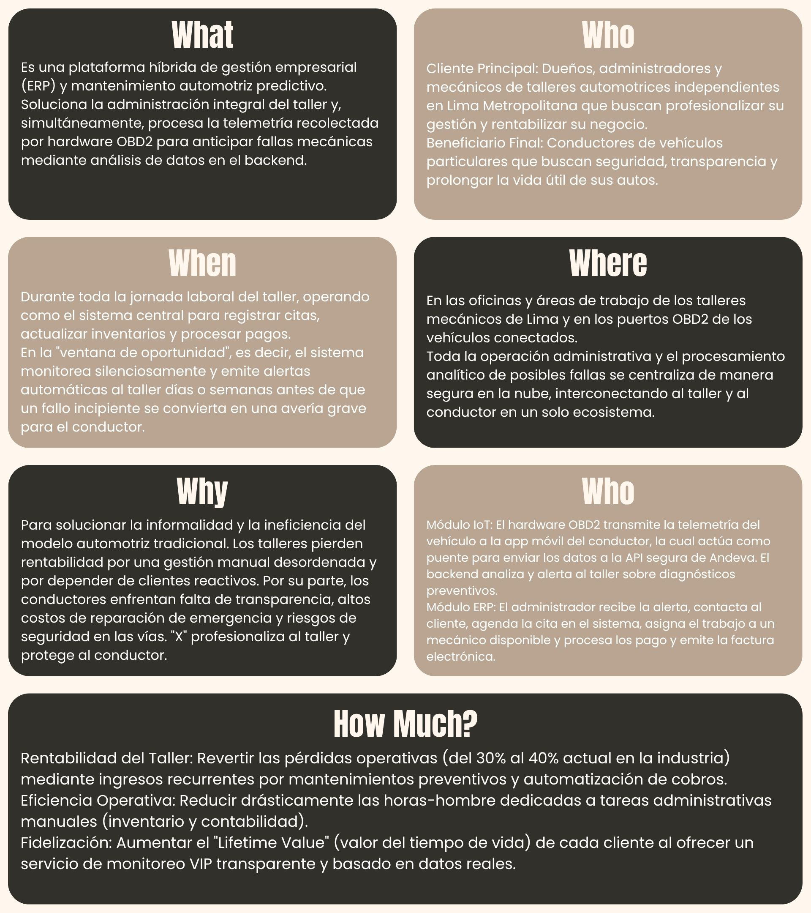
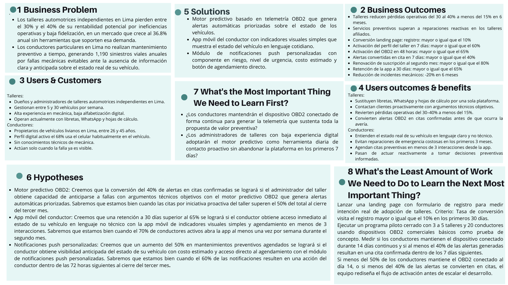

## 1.2. Solution Profile {#cap-1-2}

&emsp;&emsp;&emsp;&emsp;A continuación, se darán a conocer los detalles del perfil de la solución respaldada por antecedentes sólidos y confiables. Aparte de ello, el uso de técnicas como “Diagrama de Ishikawa”, “5W’s y 2H’s” y “Lean UX Canvas”.

### 1.2.1.&emsp;&emsp;*Antecedentes y Problemática* {#cap-1-2-1}

&emsp;&emsp;&emsp;&emsp;En Lima, el modelo de actuar ante fallos mecánicos imprevistos es reactivo. Por ello, buscamos quitar el modelo actual e instaurar un modelo proactivo que beneficie a los conductores económicamente, dándole una mayor vida útil a su vehículo, como también a los talleres, proporcionándoles una fuente de clientes fieles.

&emsp;&emsp;&emsp;&emsp;Según el informe del sector automotor, realizado por la Asociación Automotriz del Perú, señala que en los últimos dos meses del año 2026 se vendieron 41,584 unidades de vehículos livianos, representando un aumento del 36.8% respecto al año pasado en el mismo periodo (AAP, 2026, p. 5).

**Figura 2**

*Venta de vehículos livianos y pesados en el periodo enero-febrero 2026*

&emsp;&emsp;&emsp;&emsp;Con respecto a la gráfica de la Figura 3. Los resultados indican una tendencia anual a seguir comprando vehículos livianos y grandes (AAP, 2026, p. 7) que requieren de un servicio para poder mantener a estos mismos en las máximas condiciones.

**Figura 3**

*Ventas de vehículos livianos y pesados desde enero del 2020 a enero del 2026*

&emsp;&emsp;&emsp;&emsp;Hay varias formas como los seguros vehiculares, pero son muy volátiles, con servicios pésimos o no son una opción viable económicamente. Por otra parte, los 38000 talleres de Lima Metropolitana y del Callao presentaron pérdidas del 30% a 40%, lo que conlleva a que hay un bajo uso de estos debido a la disparidad de precios entre talleres, generando baja fidelización y flujo de clientes (Fiestas et al., 2021).

&emsp;&emsp;&emsp;&emsp;El no contar con un servicio de mantenimiento o arreglo de fallas mecánicas lleva a que según el boletín estadístico anual de siniestralidad vial 2024, realizado por el Observatorio Nacional de Seguridad Vial, señala que de un total de 87757 siniestros de tránsitos a nivel nacional el 1,2% de muertes son por partes de fallas mecánicas y de un 0,2% por falta de luces (ONSV, 2025, p. 17). Esto representaría que el 1,4% de los siniestros de tránsito son por factores vehiculares, los porcentajes pueden sonar bajos, pero en total hablamos de 1190 siniestros que pudieron haberse evitado con un mantenimiento adecuado.

**Figura 4**

*Porcentajes de siniestros según su causa, 2024*

&emsp;&emsp;&emsp;&emsp;Por ello, en andeva hemos considerado pertinente elaborar dos artefactos que pongan en perspectiva los aspectos fundamentales de la problemática que aborda Atelier. Por un lado, mediante 2 diagramas de Ishikawa identificamos las causas raíz que explican el constante uso de un modelo reactivo en el Perú y baja fidelización conductor-taller.

**Figura 5**

*Diagrama de Ishikawa, efecto: Uso de un modelo reactivo en el Perú*

**Figura 6**

*Diagrama de Ishikawa, efecto: Baja fidelización conductor-taller*

&emsp;&emsp;&emsp;&emsp;Por otro lado, mediante el diagrama 5W’s + 2H’s delimitamos operativamente el problema y la solución.

**Figura 7**

*Diagrama 5W’s + 2H’s - atelier*

&emsp;&emsp;&emsp;&emsp;A partir de este contexto, la oportunidad comercial que Andeva desea aprovechar radica en la inmensa brecha tecnológica de estos 38,000 talleres independientes. Existe un mercado masivo desatendido que opera de manera informal y que requiere una transición urgente hacia la digitalización. La oportunidad consiste en introducir un modelo SaaS accesible que integre hardware de telemetría IoT con un sistema de planificación de recursos.

&emsp;&emsp;&emsp;&emsp;Al ofrecer esta solución, la startup tiene la oportunidad de capturar a los talleres que buscan modernizarse para retener la creciente demanda del parque automotor, permitiéndoles monetizar el mantenimiento preventivo y transformar un gasto reactivo del conductor en una inversión predecible y segura.

&emsp;&emsp;&emsp;&emsp;Sin embargo, para capitalizar esta oportunidad, la solución tecnológica debe diseñarse y operar considerando las siguientes restricciones críticas del mercado:

&emsp;&emsp;&emsp;&emsp;Existe una alta resistencia al cambio tecnológico por parte de mecánicos tradicionales, lo que exige que el software tenga una curva de aprendizaje mínima, interfaces intuitivas y requiera muy pocos clics para operar.

&emsp;&emsp;&emsp;&emsp;El sistema depende de una conexión a internet estable en los talleres para la sincronización en tiempo real del ERP y la recepción de telemetría. En zonas de Lima con conectividad variable, esto representa una limitante técnica.

&emsp;&emsp;&emsp;&emsp;El dispositivo OBD2 debe asegurar compatibilidad y estandarización de lectura de datos frente a un parque automotor peruano sumamente heterogéneo.

### 1.2.2.&emsp;&emsp;*Lean UX Process* {#cap-1-2-2}

&emsp;&emsp;&emsp;&emsp;En esta sección, se abordará el uso del Lean UX Process, un marco de trabajo específicamente diseñado y centrado en el usuario, en el cual validaremos la solución con técnicas como "Lean UX Problem Statements", "Lean UX Assumptions", "Lean UX Hypothesis Statements" y "Lean UX Canvas".

#### 1.2.2.1.&emsp;&emsp;*Lean UX Problem Statements* {#cap-1-2-2-1}

**Problem Statement 1: Talleres Automotrices**

&emsp;&emsp;&emsp;&emsp;El sector de mantenimiento automotriz en Lima tiene como objetivo que los talleres independientes puedan gestionar su operación diaria de forma eficiente, mantener una comunicación fluida con sus clientes y fidelizarlos a través de un servicio confiable y oportuno.

&emsp;&emsp;&emsp;&emsp;Sin embargo, los talleres independientes en Lima están perdiendo entre el 30% y el 40% de su rentabilidad potencial y presentan niveles bajos de fidelización de clientes, situación que se agrava en un contexto donde el parque automotor de Lima crece al 36.8% anual sin que la demanda de mantenimiento pueda ser atendida de forma eficiente.

&emsp;&emsp;&emsp;&emsp;¿Cómo podríamos mejorar la capacidad operativa y de fidelización de los talleres automotrices independientes en Lima, de modo que puedan incrementar su rentabilidad y atender de manera oportuna la creciente demanda del mercado?

**Problem Statement 2: Conductores Particulares**

&emsp;&emsp;&emsp;&emsp;El mantenimiento vehicular en Lima tiene como objetivo que los conductores particulares puedan mantener sus vehículos en condiciones seguras y operativas, tomando decisiones informadas y oportunas respecto a su mantenimiento antes de que surjan averías graves.

&emsp;&emsp;&emsp;&emsp;Sin embargo, los conductores particulares en Lima no están realizando su mantenimiento de manera preventiva, lo que se refleja en 1,190 siniestros viales anuales causados por fallas mecánicas que pudieron haberse evitado con una intervención oportuna, según el Observatorio Nacional de Seguridad Vial (2024).

&emsp;&emsp;&emsp;&emsp;¿Cómo podríamos mejorar el acceso de los conductores particulares en Lima a información clara y oportuna sobre el estado de su vehículo, de modo que puedan tomar decisiones de mantenimiento preventivo antes de que una falla menor escale a una avería grave?

#### 1.2.2.2.&emsp;&emsp;*Lean UX Assumptions* {#cap-1-2-2-2}

**BUSINESS ASSUMPTIONS**

**¿Quiénes son mis clientes iniciales?**
&emsp;&emsp;&emsp;&emsp;Nuestros clientes iniciales son dueños y administradores de talleres automotrices independientes en Lima Metropolitana que gestionan entre 5 y 30 vehículos por semana, operan sin herramientas tecnológicas especializadas y están dispuestos a adoptar tecnología si esta demuestra retorno económico concreto en los primeros 3 meses.

**¿Cómo adquiriremos a la mayoría de nuestros clientes?**
&emsp;&emsp;&emsp;&emsp;Adquiriremos a la mayoría de nuestros clientes mediante demostraciones presenciales del sistema en talleres piloto de Lima y un período de prueba gratuito de 30 días. Los conductores serán adquiridos indirectamente a través del taller: cada taller piloto incorporado referirá la app a sus clientes habituales, alcanzando al menos 20 instalaciones activas por taller.

**¿Cómo haremos dinero?**
&emsp;&emsp;&emsp;&emsp;Generaremos ingresos mediante un modelo SaaS con suscripción mensual escalonada según el número de vehículos monitoreados y el nivel de funcionalidades ERP habilitadas, complementado por la venta o arriendo del hardware OBD2 a los talleres afiliados.

**¿Frente a quién competimos?**
&emsp;&emsp;&emsp;&emsp;Existen competidores regionales con propuestas de digitalización parcial para talleres, creemos que nuestra ventaja radica en la integración única de diagnóstico predictivo vía OBD2 con ERP completo. Sin embargo, reconocemos que nuestro mayor obstáculo será la costumbre arraigada de los talleres de operar con métodos manuales familiares y sin costo directo, generando resistencia al cambio tecnológico.

**¿Cuál es nuestro mayor riesgo de producto?**
&emsp;&emsp;&emsp;&emsp;Nuestro mayor riesgo es que los administradores de talleres con baja experiencia digital abandonen la plataforma en los primeros 7 días al percibir el onboarding como complejo, y que los conductores desconecten el dispositivo OBD2 después de los primeros días por considerarlo innecesario, bloqueando la generación de telemetría que sustenta toda la propuesta de valor preventiva.

**BUSINESS OUTCOMES**

**¿Cómo sabremos que resolvimos el problema del negocio?**
&emsp;&emsp;&emsp;&emsp;Sabremos que resolvimos el problema del negocio cuando los talleres afiliados reduzcan sus pérdidas operativas del 30 al 40% actual a menos del 15% dentro de los primeros 6 meses, y cuando el número de servicios de mantenimiento preventivo realizados mensualmente supere al número de reparaciones reactivas de emergencia en esos mismos talleres.

**¿Qué vamos a medir?**

- Tasa de conversión de visita a la landing page hacia registro del taller: meta mayor o igual al 10%.
- Tasa de activación completa del perfil del taller en los primeros 7 días post-registro: meta mayor o igual al 60%.
- Tasa de activación del dispositivo OBD2 por conductor en las primeras 48 horas: meta mayor o igual al 65%.
- Porcentaje de alertas OBD2 que se convierten en cita confirmada dentro de 7 días: meta mayor o igual al 40%.
- Tasa de renovación de suscripción mensual al cierre del segundo mes: meta mayor o igual al 80%.
- Retención de la app del conductor a 30 días: meta mayor o igual al 65%.
- Reducción de incidentes por fallas mecánicas entre conductores activos: meta 20% en 6 meses.

**USER ASSUMPTIONS**

**¿Quién es el usuario?**
&emsp;&emsp;&emsp;&emsp;Nuestros usuarios son, por un lado, emprendedores y mecánicos que administran talleres automotrices independientes con alta experiencia práctica en su oficio, pero baja alfabetización digital formal, que actualmente gestionan su operación con libretas físicas, grupos de WhatsApp y hojas de cálculo. Por otro lado, conductores particulares propietarios de vehículos livianos en Lima, con perfil digital activo, sin conocimientos técnicos de mecánica, que toman decisiones de mantenimiento únicamente cuando la falla ya es visible.

**¿Dónde encaja nuestro producto en su trabajo o vida diaria?**
&emsp;&emsp;&emsp;&emsp;Para el administrador del taller, el producto encaja como la herramienta central de gestión durante las horas de operación del negocio: revisar agenda y alertas al inicio del día, registrar órdenes durante el servicio y facturar al cierre. Para el conductor, encaja como una app de referencia pasiva integrada a su rutina digital, que le notifica proactivamente cuando su vehículo requiere atención sin que tenga que buscar esa información activamente.

&emsp;&emsp;&emsp;&emsp;**¿Qué problemas tiene nuestro usuario que debemos resolver?**
&emsp;&emsp;&emsp;&emsp;El administrador enfrenta un caos administrativo diario; citas sin registrar, inventario descontrolado, historial de vehículos disperso; que le consume tiempo, le genera errores y le impide anticiparse a las necesidades de sus clientes, resultando en pérdidas operativas del 30 al 40%. El conductor carece de información anticipada sobre el estado real de su vehículo: el 18% olvida hacer mantenimiento, el 15% desconfía del diagnóstico del taller y el 32% lo posterga por percibirlo como un gasto elevado e incierto.

**USER OUTCOMES**

**¿Qué beneficio obtendrán al usar el producto?**
&emsp;&emsp;&emsp;&emsp;El administrador del taller obtendrá control total de su agenda, inventario y facturación desde una sola plataforma, recuperando el tiempo perdido en gestión manual y ganando la capacidad de contactar a sus clientes proactivamente con argumentos técnicos objetivos basados en datos reales del vehículo. El conductor obtendrá acceso al estado técnico real de su vehículo en lenguaje claro y no técnico, evitando reparaciones de emergencia costosas; con una expectativa de ahorro concreto y atribuible al uso de la app dentro de los primeros 3 meses.

**¿Por qué los usuarios buscarán nuestro servicio?**
&emsp;&emsp;&emsp;&emsp;El administrador lo buscará porque es la única solución en el mercado peruano que integra diagnóstico vehicular predictivo con gestión administrativa completa del taller en un solo ecosistema. El conductor lo buscará porque le da la tranquilidad de saber que su vehículo está siendo monitoreado en tiempo real y recibirá una alerta antes de que una falla menor se convierta en una avería que paralice su vehículo y su economía.

**FEATURES**

**¿Qué características son importantes para resolver estas necesidades?**

- Si implementamos un motor predictivo basado en telemetría OBD2 que genere alertas automáticas priorizadas sobre el estado de los vehículos, entonces los administradores podrán anticiparse a las fallas de sus clientes y contactarlos proactivamente antes de que ocurra una avería, aumentando la confianza y la fidelización.
- Si implementamos una app móvil del conductor que muestre el estado de su vehículo mediante indicadores visuales simples y en lenguaje cotidiano, entonces los conductores podrán comprender el estado técnico real de su vehículo sin necesidad de ir al taller, reduciendo el olvido y la postergación del mantenimiento.
- Si implementamos un módulo de notificaciones push personalizadas que incluya el nombre del componente en riesgo, el nivel de urgencia y el costo estimado de atención con un botón de agendamiento directo, entonces los conductores podrán tomar una decisión informada e inmediata sin fricciones, aumentando la tasa de conversión de alerta a cita confirmada.

#### 1.2.2.3.&emsp;&emsp;*Lean UX Hypothesis Statements* {#cap-1-2-2-3}

**Hipótesis 1: Motor Predictivo OBD2**

&emsp;&emsp;&emsp;&emsp;Creemos que la conversión del 40% de alertas generadas en citas confirmadas dentro de los 7 días siguientes se logrará si el administrador del taller obtiene la capacidad de anticiparse a las fallas de sus clientes con argumentos técnicos objetivos con el motor predictivo basado en telemetría OBD2 que genera alertas automáticas priorizadas.

&emsp;&emsp;&emsp;&emsp;Sabremos que estamos bien cuando veamos que el porcentaje de citas originadas por iniciativa proactiva del taller supera el 50% del total de citas registradas en la plataforma al cierre del tercer mes de operación.

**Hipótesis 2: App Móvil del Conductor**

&emsp;&emsp;&emsp;&emsp;Creemos que una tasa de retención de la app a 30 días superior al 65% se logrará si el conductor particular obtiene acceso inmediato al estado técnico real de su vehículo en lenguaje claro y no técnico con la posibilidad de agendar una cita en menos de 3 interacciones con la app móvil que muestra el estado del vehículo mediante indicadores visuales simples y lenguaje cotidiano.

&emsp;&emsp;&emsp;&emsp;Sabremos que estamos bien cuando veamos que el 70% de los conductores activos abre la app al menos una vez por semana y el 40% de las aperturas resulta en una acción concreta revisión del estado del vehículo o agendamiento de cita durante el segundo mes de uso.

**Hipótesis 3: Módulo de Notificaciones Push Personalizadas**

&emsp;&emsp;&emsp;&emsp;Creemos que un aumento del 50% en los mantenimientos preventivos agendados se logrará si el conductor particular obtiene visibilidad anticipada sobre el estado de su vehículo con el costo estimado de atención y acceso directo al agendamiento con el módulo de notificaciones push personalizadas que incluye el componente en riesgo, el nivel de urgencia y un botón de agendamiento directo.

&emsp;&emsp;&emsp;&emsp;Sabremos que estamos bien cuando veamos que al menos el 60% de las notificaciones preventivas enviadas resultan en una acción del conductor apertura de la app, contacto con el taller o agendamiento de cita dentro de las 72 horas siguientes, medido al cierre del tercer mes de uso.

#### 1.2.2.4.&emsp;&emsp;*Lean UX Canvas* {#cap-1-2-2-4}

**Figura 8**

*Lean UX Canvas*

