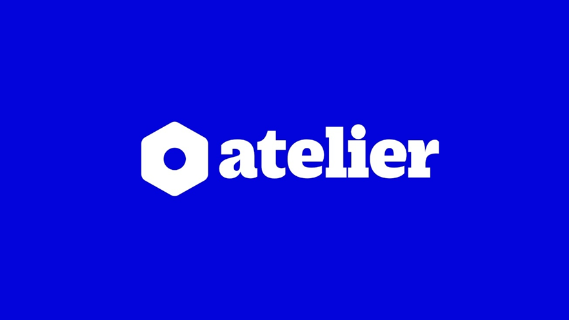
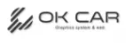

# Capítulo II: Requirements Elicitation & Analysis {#cap-2}

## 2.1. Competidores {#cap-2-1}

&emsp;&emsp;&emsp;&emsp;En esta sección, se detallarán, analizarán y compararán propuestas ya existentes en el mercado con nuestra propuesta de solución con el fin de identificar oportunidades y puntos de mejora para satisfacer los problemas de nuestros segmentos objetivos identificados.

### 2.1.1.&emsp;&emsp;*Análisis Competitivo* {#cap-2-1-1}

**Tabla 2**

*Competitive Analysis Landscape*

<table style="width: 100%; table-layout: fixed; word-wrap: break-word; font-size: 0.5em;">
	<tbody>
		<tr>
			<td colspan="2" style="width: 10%;"><b>Competidor</b></td>
			<td style="width: 22.5%;">

</td>
			<td style="width: 22.5%;">

</td>
			<td style="width: 22.5%;">

</td>
			<td style="width: 22.5%;">

</td>
		</tr>
		<tr>
			<td rowspan="2">Perfil</td>
			<td>Overview</td>
			<td>Andeva es una startup peruana de base tecnológica, concebida y desarrollada por estudiantes de Ingeniería de Software de la UPC en 2025. Nuestro producto "X" transforma el modelo operativo de los talleres automotrices, evolucionándolo de un enfoque reactivo a uno preventivo e inteligente mediante hardware OBD2 + IA predictiva + ERP todo-en-uno.</td>
			<td>Startup peruana fundada en 2022 en Lima, especializada en digitalizar talleres mecánicos independientes. Resuelve el caos administrativo (papel, Excel, WhatsApp desordenado) centralizando órdenes de trabajo, inventario y caja en una sola plataforma en la nube.</td>
			<td>Startup mexicana fundada en 2019, líder en Latam con presencia en 6 países (México, Colombia, Perú, Chile, Argentina, Ecuador). Digitaliza talleres medianos y grandes, eliminando el papel y centralizando la operación completa (administrativa + comercial).</td>
			<td>Empresa española fundada en 2008 en Valencia, con +15 años de trayectoria. ERP robusto para cadenas de talleres y grandes operadores. Resuelve la complejidad administrativa de multi-sucursales con consolidado financiero y control centralizado</td>
		</tr>
		<tr>
			<td>Ventaja Competitiva</td>
			<td>Somos el único en Perú que integra hardware OBD2 propio con IA predictiva real (telemetría en vivo, no solo historial). Nuestra facturación electrónica SUNAT es nativa y nuestra IA anticipa fallas con >85% de confianza en los próximos 7–30 días. Además, somos 100% peruanos con soporte local en WhatsApp y el respaldo académico de la UPC.</td>
			<td><b>Adaptación 100% a la realidad peruana</b>: facturación electrónica SUNAT nativa, alertas ilimitadas por WhatsApp (el canal que los dueños ya usan) y soporte local en tiempo real (<2h de respuesta). Su curva de aprendizaje es mínima (<15 min de onboarding).</td>
			<td><b>App móvil para clientes finales</b> muy pulida (historial del vehículo, citas, pagos en línea) que genera fidelización. Su módulo de "Proyección de Servicios" usa IA básica para predecir mantenimientos por historial, no por telemetría.</td>
			<td><b>Escalabilidad enterprise</b>: soporta 50+ sucursales con roles granulares, alertas de ITV/mantenimiento preventivo y consultas a la DGT (en España). Certificación de seguridad ISO 27001, algo crítico para cadenas grandes</td>
		</tr>
		<tr>
			<td rowspan="2">Perfil de Marketing</td>
			<td>Mercado Objetivo</td>
			<td>Talleres multimarca independientes de pequeño y mediano tamaño en Lima Metropolitana (1–5 elevadores), que atienden vehículos particulares 2018+ (con puerto OBD2 accesible), con facturación entre S/ 8,000 y S/ 40,000 mensuales y buscan diferenciarse con tecnología preventiva.</td>
			<td>Talleres multimarca independientes de <b>pequeño y mediano tamaño</b> en Lima Metropolitana (1–5 elevadores), que atienden vehículos particulares y motos, con facturación entre S/ 5,000 y S/ 30,000 mensuales</td>
			<td>Talleres multimarca de <b>mediano y gran tamaño</b> (2–10 elevadores) en zonas urbanas de Latinoamérica, que facturan más de $8,000 USD mensuales y tienen entre 5 y 20 empleados.</td>
			<td><b>Cadenas de talleres</b> y grupos automotrices (3–50 sucursales) en España y Latinoamérica, que facturan más de €50,000 mensuales y requieren consolidado financiero y control centralizado</td>
		</tr>
		<tr>
			<td>Estrategias de Marketing</td>
			<td>Marketing digital B2B con casos de éxito de talleres piloto en Lima, demos en vivo mostrando diagnósticos predictivos en tiempo real, alianzas con importadoras de repuestos para exhibir nuestro hardware OBD2, y participación en ferias universitarias y eventos de innovación automotriz (ej. Expo Mecánica Perú). Programa de referidos: 1 mes gratis + S/ 100 por cada taller invitado.</td>
			<td><b>Marketing digital B2B</b>: fuerte presencia en Facebook/Instagram con casos de éxito de talleres locales (San Borja, MotoPro). Demos gratuitas por Zoom, programa de referidos (1 mes gratis por cada taller invitado) y SEO en Google para "software para taller mecánico Perú"</td>
			<td><b>Estrategia híbrida</b>: publicidad pagada en Google Ads y Facebook, presencia en ferias automotrices (Expo Mecánica México, Automecánica Bogotá), webinars semanales y programa de embajadores (talleres que recomiendan la herramienta a cambio de descuentos)</td>
			<td><b>Venta consultiva B2B</b>: participación en ferias industriales (Feria de Barcelona, Automecánica São Paulo), partnerships con consultoras de gestión automotriz, casos de estudio de cadenas exitosas. Sin publicidad masiva; enfoque en referidos y eventos del sector</td>
		</tr>
		<tr>
			<td rowspan="3">Perfil de Producto</td>
			<td>Productos y Servicios</td>
			<td>Plataforma web + app móvil nativa (iOS/Android) + hardware OBD2 propio: diagnóstico predictivo en tiempo real, ERP completo (órdenes, inventario, caja, agenda), facturación electrónica SUNAT, pasarelas de pago (Yape, Plin, tarjetas), dashboards de rentabilidad, alertas WhatsApp automáticas. Implementación en 1–2 días + capacitación remota. Soporte local por WhatsApp y teléfono (8am–10pm, lunes a sábado)</td>
			<td>Software web y móvil (responsive) de gestión: órdenes de servicio, inventario, caja, agenda, facturación electrónica SUNAT, alertas WhatsApp. <b>No incluye hardware OBD2</b>. Soporte técnico por chat y WhatsApp de lunes a sábado (8am–8pm)</td>
			<td>Software web y app móvil (iOS/Android) para taller y cliente: órdenes de servicio, inventario, facturación (MX/CO), pasarela de pagos, módulo de lealtad, proyección de servicios. <b>No incluye hardware OBD2</b>. Soporte por chat, email y WhatsApp (lunes a viernes, 9am–6pm CDMX)</td>
			<td>ERP web (desktop-first): agenda multi-sucursal, órdenes de reparación, facturación, stock avanzado, campañas de marketing (email/SMS), integración con contabilidad externa (Sage, ContaPlus). <b>No incluye hardware OBD2</b>. Soporte por email y teléfono (lunes a viernes, 9am–6pm CET).</td>
		</tr>
		<tr>
			<td>Precios y Costos</td>
			<td>Cobramos un modelo híbrido: <b>suscripción mensual desde S/ 199/mes</b> (incluye software ERP completo + IA predictiva + SUNAT + app). El <b>hardware OBD2 cuesta S/ 499</b> (pago único) o <b>S/ 49/mes</b> en comodato (alquiler con opción a compra). No hay costo de implementación (onboarding de 1 día + capacitación remota incluidos). No cobramos comisión por pasarela de pagos. No hay add-ons; todo está incluido.</td>
			<td>Suscripción mensual desde <b>S/ 129.99</b> (Plan Básico) hasta <b>S/ 249.99</b> (Plan Empresarial). No hay costo de implementación (onboarding gratuito). No cobran comisión por pasarela de pagos, pero las alertas SMS premium y el módulo avanzado de reportes son add-ons de ~S/ 30/mes</td>
			<td>Suscripción desde <b>$37 USD/mes</b> (~S/ 140) hasta <b>$97 USD/mes</b> (~S/ 370) según número de órdenes de trabajo. <b>Costo de implementación: $150 USD</b> (capacitación inicial). Módulo de contabilidad avanzada es add-on de $25 USD/mes. Sin comisiones por pasarela.</td>
			<td><b>Precio no publicado</b> (cotización personalizada). Estimado: <b>€80–€200/mes</b> (~S/ 320–S/ 800). <b>Implementación: €500–€1.500</b> (configuración + capacitación). Módulos extra son add-ons de €30–€50/mes</td>
		</tr>
		<tr>
			<td>Canales de Distribución</td>
			<td>Modelo híbrido SaaS + hardware propio. El cliente se registra en nuestra web, recibe el dispositivo OBD2 en 24h en Lima (aliados logísticos) y empieza a usarlo en <48h. Venta directa digital + alianzas con importadoras de repuestos para exhibición del hardware. Soporte local en WhatsApp (8am–10pm).</td>
			<td><b>100% SaaS (nube)</b>. El cliente se registra en mitaller.com.pe, paga con tarjeta/Yape y empieza a usarlo en <15 min. Venta directa digital + demos por Zoom. Sin distribuidores físicos</td>
			<td><b>SaaS en la nube</b> con venta híbrida: web directa + distribuidores locales en algunos países (en Perú, venta 100% digital). Onboarding de 3 días incluido en plan Premium</td>
			<td><b>SaaS en la nube</b>, pero con venta consultiva (demo + cotización). Partners/distribuidores en España; en Perú, venta directa web + Zoom. Implementación de 2–4 semanas.</td>
		</tr>
		<tr>
			<td rowspan="4">Análisis SWOT</td>
			<td>Fortalezas</td>
			<td>Somos el único con hardware OBD2 + IA predictiva real (telemetría en vivo, no solo historial). Nuestra facturación electrónica SUNAT es nativa + contabilidad automatizada (asientos automáticos). Somos 100% peruanos desarrollados en la UPC (credibilidad académica + soporte local). Nuestro dashboard predictivo muestra fallas probables en 7–30 días con >85% de confianza. App móvil nativa (iOS/Android) para dueños y conductores.</td>
			<td>
				<ul>
					<li><b>Marca 100% peruana</b> con soporte local en WhatsApp (respuesta <2h).</li>
					<li>Facturación electrónica SUNAT 100% integrada y actualizada.</li>
					<li>+80 talleres activos en Lima (casos de éxito visibles: San Borja, MotoPro).</li>
					<li>Interfaz muy intuitiva para dueños no técnicos</li>
				</ul>
			</td>
			<td>
				<ul>
					<li><b>Presencia en 6 países</b> (economías de escala).</li>
					<li>App móvil muy pulida para clientes (historial, citas, pagos).</li>
					<li>Módulo de "Proyección de Servicios" (predictivo básico por historial).</li>
					<li>Capacitación ilimitada incluida en todos los planes</li>
				</ul>
			</td>
			<td>
				<ul>
					<li><b>ERP enterprise-grade</b> (escalable a 50+ sucursales).</li>
					<li>Alertas de ITV/Mantenimiento preventivo (por tiempo/km).</li>
					<li>Integración con contadores externos (Sage, ContaPlus).</li>
					<li>+15 años en el mercado (trayectoria sólida).</li>
				</ul>
			</td>
		</tr>
		<tr>
			<td>Debilidades</td>
			<td>Somos startup en etapa temprana (sin base instalada grande ni casos de éxito masivos aún). Dependemos inicialmente de importación de hardware OBD2 (riesgo de cadena de suministro). Tenemos presupuesto limitado para marketing vs. competidores regionales (OK CAR, Bujia). Nuestra curva de aprendizaje es ligeramente mayor por la integración hardware-software (requiere capacitación inicial).</td>
			<td>
				<ul>
					<li><b>Cero integración con hardware OBD2</b> (no hacen diagnóstico predictivo, solo recordatorios manuales).</li>
					<li>Módulo de contabilidad básico (no genera asientos automáticos).</li>
					<li>No tiene app nativa móvil (solo web responsive).</li>
					<li>Sin IA para ayudar en diagnósticos</li>
				</ul>
			</td>
			<td>
				<ul>
					<li><b>Sin integración OBD2</b> (el predictivo es por kilometraje/tiempo, no por telemetría).</li>
					<li>Facturación electrónica <b>no adaptada a SUNAT</b> (solo México/Colombia).</li>
					<li>Soporte en español pero desde México (huso horario -6, lento para urgencias peruanas).</li>
					<li>Interfaz sobrecargada para talleres pequeños</li>
				</ul>
			</td>
			<td>
				<ul>
					<li><b>Enfoque 100% administrativo</b> (cero diagnóstico técnico).</li>
					<li><b>Precio alto</b> para talleres independientes peruanos (pyme).</li>
					<li>Sin facturación electrónica SUNAT.</li>
					<li>Implementación lenta (semanas vs. minutos)</li>
				</ul>
			</td>
		</tr>
		<tr>
			<td>Oportunidades</td>
			<td>El crecimiento explosivo de vehículos conectados en Perú (2024–2026): +40% de autos 2018+ con puerto OBD2 accesible. La demanda de predictivo real: talleres buscan diferenciarse ofreciendo "chequeo preventivo con tecnología de agencia". Las alianzas con aseguradoras (Rímac, Pacífico) para talleres certificados con monitoreo preventivo. Los fondos concursables (Innóvate Perú, StartUP Perú) para startups de base tecnológica de la UPC. La expansión a flotas corporativas (taxis, delivery, logística) que requieren mantenimiento preventivo.</td>
			<td>
				<ul>
					<li>Crecimiento de vehículos híbridos/eléctricos en Lima (requieren nuevos flujos de trabajo).</li>
					<li>Adopción masiva de Yape/Plin en talleres pequeños.</li>
					<li>Alianzas con aseguradoras para talleres certificados.</li>
				</ul>
			</td>
			<td>
				<ul>
					<li>Expandir a talleres de cadena (multi-sucursal) en Perú.</li>
					<li>Integrar pasarelas locales (Yape, Plin, Niubiz).</li>
					<li>Alianzas con importadoras de scanners OBD2 (para competir contigo).</li>
				</ul>
			</td>
			<td>
				<ul>
					<li>Crecimiento de cadenas de talleres en Lima (AutoFast, Speedy).</li>
					<li>Demanda de ERPs multi-sucursal con consolidado financiero.</li>
					<li>Alianzas con aseguradoras para talleres de red.</li>
				</ul>
			</td>
		</tr>
		<tr>
			<td>Amenazas</td>
			<td>La entrada agresiva de competidores (OK CAR, Bujia) integrando hardware OBD2 de terceros para copiar nuestro modelo. Los cambios bruscos en normativa SUNAT que nos obliguen a reprogramar el módulo de facturación. La entrada de importadoras chinas de scanners OBD2 lanzando su propio software gratuito para capturar el mercado. La resistencia al cambio de dueños de talleres tradicionales (preferencia por "lo que siempre ha funcionado").</td>
			<td>
				<ul>
					<li><b>Entrada de Andeva con OBD2 + IA</b> (propuesta de valor superior).</li>
					<li>Cambios bruscos en normativa SUNAT (ej. nueva versión de facturación electrónica).</li>
					<li>Competidores internacionales (OK CAR, Bujia) bajando precios para ganar share.</li>
				</ul>
			</td>
			<td>
				<ul>
					<li><b>Andeva con hardware propio + SUNAT nativo</b>.</li>
					<li>Fortalecimiento de competidores locales (Mi Taller) con mejor adaptación tributaria.</li>
					<li>Devaluación del sol que encarezca su suscripción en USD.</li>
				</ul>
			</td>
			<td>
				<ul>
					<li><b>Andeva con modelo más ágil y barato</b> para el 90% del mercado.</li>
					<li>Competidores locales (Mi Taller) escalando a multi-sucursal.</li>
					<li>Brecha horaria (España -6h) que dificulta soporte en tiempo real.</li>
				</ul>
			</td>
		</tr>
	</tbody>
</table>

### 2.1.2.&emsp;&emsp;*Estrategias y Tácticas frente a Competidores* {#cap-2-1-2}

**Tabla 3**

*Tabla de estrategias y tácticas frente a competidores*

<table>
	<tbody>
		<tr>
			<td><b>Competidores</b></td>
			<td><b>Táctica diferenciadora</b></td>
			<td><b>Fortalezas del rival que enfrentamos</b></td>
			<td><b>Debilidad del rival que aprovecharemos</b></td>
		</tr>
		<tr>
			<td>

</td>
			<td>Ellos se posicionan como <b>la opción 100% peruana y la más fácil de usar</b>: "En 15 minutos tu taller está digitalizado". Su gancho es la <b>inmediatez</b> (sin implementación larga) y el <b>soporte local por WhatsApp</b> que responde en menos de 2 horas, algo que los dueños de taller valoran más que cualquier funcionalidad avanzada .</td>
			<td><b>Adaptación total a SUNAT y confianza local</b>: Llevan 4 años (2022–2026) en el mercado peruano con +80 talleres activos que son sus mejores embajadores. Su facturación electrónica nunca falla porque la actualizan con cada cambio de la SUNAT, y eso genera una <b>barrera de confianza</b> muy alta: ningún dueño quiere arriesgarse a multas por un software nuevo</td>
			<td><b>Somos técnicos, ellos solo administrativos</b>: Mi Taller CRM solo gestiona papeles (órdenes, facturas, inventario), pero <b>no se conecta al vehículo</b>. El mecánico sigue usando su escáner OBD2 por separado y luego escribe manualmente el diagnóstico en el sistema. <b>Nuestra oportunidad:</b> "X" elimina ese paso manual: nuestro hardware OBD2 envía los datos directamente a la plataforma, nuestra IA diagnostica y genera la orden de trabajo automática. Les ganamos en <b>velocidad de diagnóstico</b> y <b>prevención real de fallas</b></td>
		</tr>
		<tr>
			<td>

</td>
			<td>Ellos se venden como <b>la plataforma más completa para crecer</b>: "Lleva tu taller a otro nivel". Su gancho es la <b>app móvil para clientes finales</b> (el conductor puede ver el historial, agendar citas y pagar desde su celular), lo que los talleres usan como herramienta de fidelización. También destacan su módulo de "Proyección de Servicios" que sugiere mantenimientos futuros basados en historial</td>
			<td><b>Presencia regional y app pulida</b>: Operan en 6 países con miles de talleres, lo que les da economías de escala para invertir en una app móvil muy bien diseñada y en capacitación continua (webinars, academia en línea). Su efecto red es fuerte: los talleres que ya usan OK CAR atraen a otros por la app del cliente, que se ve "profesional" y moderna</td>
			<td><b>Su "predictivo" es falso, el nuestro es real</b>: La "Proyección de Servicios" de OK CAR solo dice "le toca cambio de aceite en 3 meses" basado en la última visita, <b>no lee datos reales del auto</b>. Además, <b>no tienen facturación electrónica para SUNAT</b> (solo México/Colombia), lo que obliga a los talleres peruanos a usar un sistema paralelo para facturar. <b>Nuestra oportunidad:</b> "X" ofrece predictivo real (lee sensores en vivo) + SUNAT nativo. Les ganamos en <b>tecnología de diagnóstico</b> y <b>cumplimiento tributario todo-en-uno</b></td>
		</tr>
		<tr>
			<td>

</td>
			<td>Ellos se venden como <b>el ERP enterprise para cadenas que quieren control total</b>: "Gestiona 50 talleres como si fuera uno solo". Su gancho es la <b>escalabilidad y el consolidado financiero</b>: roles granulares, permisos por sucursal, reportes consolidados y conexión con contadores externos (Sage, ContaPlus). Apuntan a grupos automotrices, no a talleres independientes</td>
			<td><b>Trayectoria de 15+ años y robustez</b>: Llevan desde 2008 en el mercado, con certificación ISO 27001 de seguridad y clientes enterprise (cadenas de 20 - 50 sucursales). Su sistema es extremadamente estable y seguro, lo que da confianza a grandes inversionistas. Nadie los vence en <b>control multi-sucursal</b></td>
			<td><b>Son lentos, caros y nosotros ágiles, baratos y predictivos</b>: Su implementación toma 2 - 4 semanas y cuesta €500 - €1.500, algo impensable para un taller independiente peruano. Además, <b>no hacen diagnóstico técnico</b> (solo agenda, factura y controla stock) y <b>no tienen SUNAT. Nuestra oportunidad:</b> "X" se implementa en minutos, cuesta 5 - 10 veces menos y ofrece diagnóstico predictivo con OBD2. Les ganamos en <b>agilidad, precio y tecnología de diagnóstico</b> para el 90% del mercado (talleres independientes) que ellos ignoran</td>
		</tr>
	</tbody>
</table>