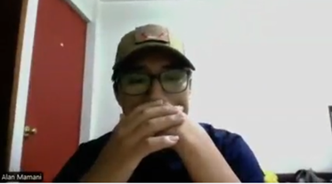
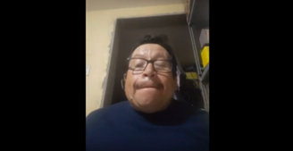
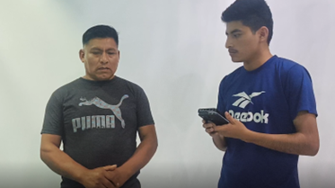
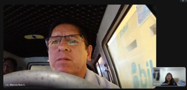

## 2.2. Entrevistas {#cap-2-2}

&emsp;&emsp;&emsp;&emsp;En esta sección, se aborda todo lo relacionado a la recopilación de información en base a las entrevistas a los segmentos objetivo identificados anteriormente.

### 2.2.1.&emsp;&emsp;*Diseño de Entrevistas* {#cap-2-2-1}

&emsp;&emsp;&emsp;&emsp;A continuación, se presenta las preguntas principales para las entrevistas de los segmentos objetivo identificados.

**Tabla 4**

*Preguntas para el Segmento Objetivo: Dueños o administradores de talleres automotrices independientes en Lima*

<table>
	<tbody>
		<tr>
			<td colspan="2">
<b>Preguntas</b>
</td>
		</tr>
		<tr>
			<td>1</td>
			<td>¿Cómo describiría un día típico administrando su taller y cuáles son sus principales objetivos comerciales a corto plazo?</td>
		</tr>
		<tr>
			<td>2</td>
			<td>¿Cuáles son los problemas mecánicos más frecuentes, graves y costosos con los que llegan los clientes a su taller?</td>
		</tr>
		<tr>
			<td>3</td>
			<td>Actualmente, ¿cómo es la comunicación con los clientes para los mantenimientos o posibles fallos que se puedan dar?</td>
		</tr>
		<tr>
			<td>4</td>
			<td>¿Qué tan difícil le resulta lograr que un cliente regrese para un mantenimiento preventivo en lugar de esperar a que el auto se malogre por completo?</td>
		</tr>
		<tr>
			<td>5</td>
			<td>¿Qué herramientas digitales, software o aplicaciones utiliza en este momento para gestionar las citas, el historial de clientes o el diagnóstico de los vehículos?</td>
		</tr>
		<tr>
			<td>6</td>
			<td>¿Hay alguna marca de escáner automotriz, software o herramienta tecnológica en la que confíe plenamente y considere indispensable en su taller?</td>
		</tr>
		<tr>
			<td>7</td>
			<td>¿Con qué frecuencia utiliza herramientas de diagnóstico por puerto OBD2 y qué tan familiarizado está su equipo con la lectura de estos datos?</td>
		</tr>
		<tr>
			<td>8</td>
			<td>Si su taller tuviera la capacidad de saber anticipadamente que el auto de un cliente está a punto de presentar una falla grave, ¿cómo aprovecharía esa ventaja?</td>
		</tr>
		<tr>
			<td>9</td>
			<td>¿Qué le parecería contar con una plataforma web que le alerte automáticamente sobre posibles fallas en los autos de sus clientes para que usted pueda contactarlos proactivamente y agendar una cita?</td>
		</tr>
		<tr>
			<td>10</td>
			<td>¿Qué impacto cree que tendría ofrecer este servicio de "monitoreo preventivo" en la confianza y la fidelidad de sus clientes actuales?</td>
		</tr>
		<tr>
			<td>11</td>
			<td>¿Estaría dispuesto a recomendar a sus clientes el uso de un pequeño dispositivo OBD2 con Bluetooth para poder monitorear sus vehículos a distancia?</td>
		</tr>
		<tr>
			<td>12</td>
			<td>Para gestionar citas, ¿prefiere utilizar una computadora de escritorio en su oficina, una laptop, su teléfono cellular o a mano?</td>
		</tr>
		<tr>
			<td>13</td>
			<td>¿Cómo describiría su personalidad al momento de adoptar nuevas tecnologías en su negocio: precavido, curioso o pionero?</td>
		</tr>
		<tr>
			<td>14</td>
			<td>¿Qué redes sociales o plataformas utiliza más para informarse sobre novedades en mecánica y gestión de talleres?</td>
		</tr>
		<tr>
			<td>15</td>
			<td>¿Qué funciones específicas le gustaría ver en un "panel de control" diseñado exclusivamente para su taller?</td>
		</tr>
	</tbody>
</table>

**Tabla 5**

*Preguntas para el Segmento Objetivo: Conductores de vehículos de Lima*

<table>
	<tbody>
		<tr>
			<td colspan="2">
<b>Preguntas</b>
</td>
		</tr>
		<tr>
			<td>1</td>
			<td>¿Para qué utiliza su vehículo principalmente en su día a día y qué metas tiene respecto al cuidado de su auto?</td>
		</tr>
		<tr>
			<td>2</td>
			<td>Cuénteme sobre la peor experiencia o la mayor frustración que haya tenido relacionada con una avería mecánica inesperada.</td>
		</tr>
		<tr>
			<td>3</td>
			<td>¿Cómo lleva actualmente el control de los mantenimientos de su auto (cambios de aceite, revisión de frenos, etc.)? ¿Usa alguna libreta, app o se fía de su memoria?</td>
		</tr>
		<tr>
			<td>4</td>
			<td>¿Cómo es su relación con su mecánico o taller de confianza y por qué medio de comunicación prefieren coordinar (WhatsApp, llamadas, redes)?</td>
		</tr>
		<tr>
			<td>5</td>
			<td>¿Se considera una persona hábil con la tecnología? ¿Cuáles son las tres aplicaciones móviles que más utiliza en su día a día?</td>
		</tr>
		<tr>
			<td>6</td>
			<td>¿Qué marcas de tecnología le generan más confianza y le facilitan la vida diaria?</td>
		</tr>
		<tr>
			<td>7</td>
			<td>¿Alguna vez se ha encendido la luz de "Check Engine" en su tablero? ¿Qué suele hacer inmediatamente cuando eso ocurre?</td>
		</tr>
		<tr>
			<td>8</td>
			<td>¿Qué pensaría si su mecánico le escribiera un mensaje de WhatsApp advirtiéndole de una posible falla en su motor semanas antes de que usted lo note o de que el auto se detenga?</td>
		</tr>
		<tr>
			<td>9</td>
			<td>¿Estaría dispuesto a mantener conectado un pequeño escáner Bluetooth/WiFi en su auto y descargar una app en su celular si eso le ayuda a prevenir fallas mecánicas costosas?</td>
		</tr>
		<tr>
			<td>10</td>
			<td>¿Le generaría alguna preocupación compartir los datos internos de funcionamiento de su vehículo con su taller mecánico para poder recibir este servicio predictivo?</td>
		</tr>
		<tr>
			<td>11</td>
			<td>¿Suele mantener el Bluetooth o datos móviles de su celular encendido de forma habitual mientras conduce?</td>
		</tr>
		<tr>
			<td>12</td>
			<td>¿Qué tan frustrante le resulta tener que descargar crearse cuentas en nuevas aplicaciones móviles?</td>
		</tr>
		<tr>
			<td>13</td>
			<td>¿Qué beneficio exacto le convencería de descargar la aplicación de su taller mecánico?</td>
		</tr>
		<tr>
			<td>14</td>
			<td>Al momento de cuidar su auto, ¿cómo se describiría: una persona "reactiva" o "preventiva" a los fallos vehiculares?</td>
		</tr>
		<tr>
			<td>15</td>
			<td>Si su auto presentara un problema no urgente, ¿prefiere que el taller le avise mediante una llamada telefónica formal, un correo electrónico o un mensaje rápido de WhatsApp?</td>
		</tr>
	</tbody>
</table>

### 2.2.2.&emsp;&emsp;Registro de Entrevistas {#cap-2-2-2}

&emsp;&emsp;&emsp;&emsp;A continuación, se mostrarán los registros de las entrevistas realizadas a nuestros segmentos objetivos. Cada entrevista conforma un cuadro, el cual contiene lo siguiente nombre, edad, provincia y ocupación, captura de pantalla de la entrevista, link de la entrevista: [upc-pre-202610-1asi0729-11848-andeva-needfinding-sprint-1](https://upcedupe-my.sharepoint.com/:v:/g/personal/u20241e275_upc_edu_pe/IQACV3nK06DbQ4UkN7W5GI0hAZE3xb22h8MdWhces5Vj55w?nav=eyJyZWZlcnJhbEluZm8iOnsicmVmZXJyYWxBcHAiOiJPbmVEcml2ZUZvckJ1c2luZXNzIiwicmVmZXJyYWxBcHBQbGF0Zm9ybSI6IldlYiIsInJlZmVycmFsTW9kZSI6InZpZXciLCJyZWZlcnJhbFZpZXciOiJNeUZpbGVzTGlua0NvcHkifX0&e=BTQX8d) y resumen de la entrevista.

**Segmento Objetivo 1: Dueños o administradores de talleres automotrices independientes en Lima**

**Tabla 6**

*Entrevista a Alan Mamani*

<table>
	<tbody>
		<tr>
			<td>
<b>Datos del Entrevistado</b>
</td>
			<td rowspan="2"></td>
		</tr>
		<tr>
			<td>Nombre: Alan Mamani 
            Edad: 27 
            Provincia: Lima 
            Ocupación: Administrador Auxiliar 
			Minuto de inicio: 00:00 
			Duración: 18:33min 
            </td>
		</tr>
		<tr>
			<td colspan="2">
<b>Resumen</b>
</td>
		</tr>
		<tr>
			<td colspan="2">Joven técnico que asiste tanto en la administración como en la mecánica del taller. Su principal objetivo es lograr reparaciones de alta calidad para asegurar la retención de clientes. Identifica que la mayoría de los usuarios son altamente reactivos, acudiendo solo cuando ocurren averías graves y costosas. No utiliza software de gestión en el taller; toda la agenda la lleva en una libreta física o en las notas de su Smartphone. Para diagnósticos, emplean escáneres físicos conectados a la computadora del auto. Para actualizarse, consulta las páginas web oficiales de las marcas de autos desde su navegador. Se describe como "precavido". Teme que la nueva tecnología sea un gasto innecesario que entorpezca el trabajo en lugar de facilitarlo. Utiliza WhatsApp y llamadas telefónicas directas para coordinar citas. Valora enormemente la idea de un escáner OBD2 Bluetooth y un panel de control automatizado que requiera "pocos clics". Desea ver gráficas de clientes y un historial de códigos de error ordenado.</td>
		</tr>
	</tbody>
</table>

**Tabla 7**

*Entrevista a Marcelo Ramos*

<table>
	<tbody>
		<tr>
			<td>
<b>Datos del Entrevistado</b>
</td>
			<td rowspan="2"></td>
		</tr>
		<tr>
			<td>Nombre: Marcelo Ramos 
            Edad: 73 
            Provincia: Lima 
            Ocupación: Mecánico 
			Minuto de inicio: 18:34 
			Duración: 17:24min 
            </td>
		</tr>
		<tr>
			<td colspan="2">
<b>Resumen</b>
</td>
		</tr>
		<tr>
			<td colspan="2">Mecánico veterano desde 1976 dedicado a motores pesados. Su motivación es trabajar con honestidad y formar estudiantes de SENATI. Su mayor frustración es la negligencia de los conductores, quienes provocan fallas catastróficas por no realizar mantenimientos y suelen mentir sobre el origen de la falla. A pesar de confiar en su juicio para detectar fallas, se apoya fuertemente en tecnología de vanguardia por obligación del mercado. Utiliza escáneres multimarca, destacando su preferencia y confianza absoluta por la marca Autel, seguida de FCar y Launch. Utiliza su Smartphone constantemente. Escéptico respecto a la adopción tecnológica por parte del cliente, ya que percibe que los conductores peruanos no quieren pagar por innovación. Sin embargo, como técnico, está abierto a plataformas que no limiten o bloqueen la información. Depende 100% de las llamadas telefónicas y de WhatsApp; incluso diagnostica ruidos de motores a través de audios enviados por sus clientes desde provincias. Pide que la aplicación web sea transparente, nacional y que no restrinja los datos a mitad de camino. Considera que el sistema predictivo salvaría motores de reparaciones totales.</td>
		</tr>
	</tbody>
</table>

**Tabla 8**

*Entrevista a Jorge Aguilar*

<table>
	<tbody>
		<tr>
			<td>
<b>Datos del Entrevistado</b>
</td>
			<td rowspan="2"></td>
		</tr>
		<tr>
			<td>Nombre: Jorge Aguilar 
            Edad: 65 
            Provincia: Lima 
            Ocupación: Mecánico 
			Minuto de inicio: 35:58 
			Duración: 18:34min 
            </td>
		</tr>
		<tr>
			<td colspan="2">
<b>Resumen</b>
</td>
		</tr>
		<tr>
			<td colspan="2">Mecánico de campo con 53 años de experiencia, atiende maquinaria estacionaria y automotriz directamente donde el cliente se queda varado. Se frustra por la mala calidad del combustible peruano, que arruina los sistemas de inyección modernos. Lleva el control del historial de sus clientes en una Laptop mediante anotaciones y usa un cuaderno físico como respaldo. Utiliza un escáner de marca española (Jaltest) que le permite ver telemetría en tiempo real. Se autodefine como "un poco flojo" para el uso de laptops y chats, adoptando un perfil muy precavido. Cuando llega un equipo nuevo, prefiere buscar tutoriales en YouTube o revisar links en su navegador enviados por proveedores antes de manipularlo por temor a estropearlo. Utiliza llamadas y WhatsApp. Cuando no hay señal, los operadores le envían videos por WhatsApp de las fallas. magina la plataforma como una "alarma" de hospital que le indique qué equipo exacto presenta baja presión de aceite, permitiéndole llamar al cliente para que apague el motor a tiempo.</td>
		</tr>
	</tbody>
</table>

**Tabla 9**

*Entrevista a Reinaldo Machacca*

<table>
	<tbody>
		<tr>
			<td>
<b>Datos del Entrevistado</b>
</td>
			<td rowspan="2"></td>
		</tr>
		<tr>
			<td>Nombre: Reinaldo Machacca 
            Edad: 41 
            Provincia: Lima 
            Ocupación: Mecánico Electrónico 
			Minuto de inicio: 54:32 
			Duración: 18:38min 
            </td>
		</tr>
		<tr>
			<td colspan="2">
<b>Resumen</b>
</td>
		</tr>
		<tr>
			<td colspan="2">Especialista en electrónica automotriz. Enfrenta las averías más complejas y costosas generadas por fallos en las unidades de control. Su objetivo es estar a la vanguardia con los vehículos modernos. Es un usuario de tecnología avanzada. Posee múltiples escáneres de marcas como Autel, Thinkcar, FCAR y Launch, reconociendo que ninguna marca es 100% completa. Usa osciloscopios y multímetros. Es un perfil "pionero". Exige estar constantemente actualizado y mantiene contacto estrecho con proveedores de software para recibir parches de actualización. Utiliza llamadas telefónicas y gestión de contactos directa desde su Smartphone. Considera indispensable tener un aplicativo ERP que le sirva como panel de control para registrar fechas, kilometraje exacto, modelo y tipo de reparación. Ve el uso del OBD2 Bluetooth como una gran ayuda para prevenir que el cliente se quede botado en lugares peligrosos o de difícil acceso para grúas.</td>
		</tr>
	</tbody>
</table>

**Segmento Objetivo 2: Conductores de vehículos de Lima**

**Tabla 10**

*Entrevista a Henry Huamani*

<table>
	<tbody>
		<tr>
			<td>
<b>Datos del Entrevistado</b>
</td>
			<td rowspan="2"></td>
		</tr>
		<tr>
			<td>Nombre: Henry Huamani 
            Edad: 53 
            Provincia: Lima 
            Ocupación: Conductor 
			Minuto de inicio: 01:13:10 
			Duración: 11:50min 
            </td>
		</tr>
		<tr>
			<td colspan="2">
<b>Resumen</b>
</td>
		</tr>
		<tr>
			<td colspan="2">Utiliza su Toyota sedán para ir al trabajo. Se considera un usuario "preventivo", guiándose estrictamente por el sticker de kilometraje del lubricentro. Su mayor dolor fue quedarse botado camino al trabajo por un termostato roto que fundió el radiador, generándole fuertes pérdidas de dinero y tiempo. Posee un Smartphone marca Honor. Las aplicaciones que más domina son WhatsApp, TikTok y Messenger. Mantiene siempre activos sus datos móviles y el Bluetooth para conectarse a la radio del auto. Le resulta muy fácil descargar aplicaciones y crearse cuentas. Sin embargo, desconoce la tecnología OBD2, asumiendo que solo es para "autos de alta gama". Prefiere netamente los mensajes de WhatsApp para notificaciones de mantenimiento; las llamadas las considera invasivas si no es emergencia. Descargaría la aplicación de su taller principalmente para optimizar su tiempo al sacar citas y conocer el costo aproximado de la reparación antes de ir al local.</td>
		</tr>
	</tbody>
</table>

**Tabla 11**

*Entrevista a Miguel Álvarez*

<table>
	<tbody>
		<tr>
			<td>
<b>Datos del Entrevistado</b>
</td>
			<td rowspan="2"></td>
		</tr>
		<tr>
			<td>Nombre: Miguel Álvarez 
            Edad: 25 
            Provincia: Lima 
            Ocupación: Conductor 
			Minuto de inicio: 01:25:01 
			Duración: 23:05min 
            </td>
		</tr>
		<tr>
			<td colspan="2">
<b>Resumen</b>
</td>
		</tr>
		<tr>
			<td colspan="2">Conduce camionetas y sedanes de la empresa. Intenta ser preventivo, pero admite que la rutina lo vuelve descuidado. Sus mayores frustraciones son los autos que no encienden por falsas señales de sensores y bomberos de grifo que confunden diésel con gasolina. Perfil altamente digital. Prefiere utilizar Waze por encima de Google Maps porque confía más en su cálculo de rutas y personalización de tráfico. Entiende a la perfección qué es el puerto OBD2 y la luz del Check Engine. Le aburre crear cuentas nuevas y exige opciones de Single Sign-On como con Google. Aceptaría compartir sus datos telemáticos sin dudarlo, siempre y cuando la aplicación esté respaldada por una marca oficial o un taller serio que le ofrezca garantía de privacidad. Desprecia el correo electrónico. Prefiere WhatsApp para avisos. Quiere una app "didáctica" que le muestre resúmenes anuales de su manejo y le envíe ofertas personalizadas para renovar aceite.</td>
		</tr>
	</tbody>
</table>

**Tabla 12**

*Entrevista a Marcos Ruiz*

<table>
	<tbody>
		<tr>
			<td>
<b>Datos del Entrevistado</b>
</td>
			<td rowspan="2"></td>
		</tr>
		<tr>
			<td>Nombre: Marcos Ruiz 
            Edad: 45 
            Provincia: Lima 
            Ocupación: Taxista 
			Minuto de inicio: 01:48:07 
			Duración: 10:30min 
            </td>
		</tr>
		<tr>
			<td colspan="2">
<b>Resumen</b>
</td>
		</tr>
		<tr>
			<td colspan="2">Cuida su vehículo meticulosamente y se considera "preventivo". Su peor experiencia traumática fue quedarse varado de madrugada bajo la lluvia en un descampado porque un conector eléctrico se mojó y no sabía cómo arreglarlo. Es usuario fiel de la marca Samsung. Utiliza intensivamente su Smartphone con apps como WhatsApp, Telegram, Facebook, Instagram y LinkedIn. Siempre mantiene el Bluetooth encendido. No siente frustración al descargar nuevas apps o crear cuentas, viéndolas como herramientas que facilitan la vida. No tiene preocupaciones de privacidad respecto a compartir la salud de su motor con el mecánico. refiere WhatsApp. Valora que los mecánicos modernos ahora le envíen fotos y videos por este medio para demostrarle qué pieza está dañada. Desea una aplicación que le permita programar sus controles de mantenimiento de manera ordenada y que prevenga averías que lo puedan dejar inmovilizado.</td>
		</tr>
	</tbody>
</table>

**Tabla 13**

*Entrevista a Eugenio Estefanero*

<table>
	<tbody>
		<tr>
			<td>
<b>Datos del Entrevistado</b>
</td>
			<td rowspan="2"></td>
		</tr>
		<tr>
			<td>Nombre: Eugenio Estefanero 
            Edad: 75 
            Provincia: Lima 
            Ocupación: Conductor Jubilado 
			Minuto de inicio: 01:58:38 
			Duración: 08:33 
            </td>
		</tr>
		<tr>
			<td colspan="2">
<b>Resumen</b>
</td>
		</tr>
		<tr>
			<td colspan="2">Conductor de la tercera edad, 100% reactivo por costumbre. Anota las fechas de mantenimiento en una libreta de papel. Ha sufrido retrasos graves en viajes por olvidar medir la presión de la llanta de repuesto y se le ha roto la faja de distribución en plena ruta por no cambiarla a tiempo. Uso tecnológico extremadamente básico. Solo utiliza el teléfono celular para usar WhatsApp básico y hacer llamadas. Nunca mantiene encendido el Bluetooth porque no sabe para qué sirve y no sabe cómo crear cuentas en aplicaciones. Tiene una alta barrera tecnológica. No utilizaría escáneres ni descargaría aplicaciones por cuenta propia, limitándose a pagar la mano de obra. A diferencia de los jóvenes, rechaza la automatización por mensajes y exige comunicación mediante llamadas telefónicas formales para mantener un trato "personal" y directo con el mecánico. Para este usuario, la plataforma no debe ser una App orientada al cliente, sino una herramienta de uso interno del taller que le permita al mecánico avisarle y citarlo de forma oportuna.</td>
		</tr>
	</tbody>
</table>

**Tabla 14**

*Entrevista a Roxana Conde*

<table>
	<tbody>
		<tr>
			<td>
<b>Datos del Entrevistado</b>
</td>
			<td rowspan="2"></td>
		</tr>
		<tr>
			<td>Nombre: Roxana Conde 
            Edad: 22 
            Provincia: Lima 
            Ocupación: Estudiante Universitaria 
			Minuto de inicio: 02:07:12 
			Duración: 10:51min 
            </td>
		</tr>
		<tr>
			<td colspan="2">
<b>Resumen</b>
</td>
		</tr>
		<tr>
			<td colspan="2">Joven universitaria, es su primer auto. Se describe como "reactiva" y "desordenada" con sus mantenimientos (anota fechas en notas del celular o confía en su memoria). Su mayor frustración ocurrió cuando su auto no encendió la mañana de un examen crucial en la universidad, causándole un estrés inmenso y perjudicando sus notas por exceso de confianza.Perfil nativo digital. Las tres aplicaciones que no puede dejar de usar a diario son WhatsApp, Google Maps e Instagram. Cuando se le encendió el Check Engine, entró en pánico, buscó soluciones en Google y le escribió a su mecánico por WhatsApp. Considera tedioso crear cuentas nuevas, pero lo haría gustosa si la App le garantiza evitar gastos fuertes. Tendría una leve preocupación inicial por la privacidad de los datos telemáticos, pero cedería si su taller se lo explica bien. Ignora los correos electrónicos. Exige que las notificaciones preventivas lleguen por WhatsApp y reserva las llamadas telefónicas exclusivamente para emergencias críticas. Espera un recordatorio automático que le notifique el costo aproximado del arreglo antes de ir al taller y que le brinde la tranquilidad de saber que no se quedará botada antes de un evento importante.</td>
		</tr>
	</tbody>
</table>

### 2.2.3.&emsp;&emsp;*Análisis de Entrevistas* {#cap-2-2-3}

&emsp;&emsp;&emsp;&emsp;Con base en la información detallada y los resúmenes obtenidos de las entrevistas, se ha realizado un análisis estadístico y conductual por cada segmento objetivo.

**Segmento Objetivo 1: Dueños o administradores de talleres automotrices independientes en Lima**

&emsp;&emsp;&emsp;&emsp;El 75% de los entrevistados son técnicos senior con amplia trayectoria, mientras que el 25% representa a la nueva generación de apoyo administrativo/técnico. Esto indica que el User Persona principal del taller será un usuario maduro, experto en mecánica empírica y técnica, pero no necesariamente nativo digital.

&emsp;&emsp;&emsp;&emsp;El 100% de la muestra carece actualmente de un software ERP en la nube. Gestionan sus historiales mediante libretas físicas, notas en el celular o archivos locales en laptops, lo que valida la necesidad urgente de digitalización.

&emsp;&emsp;&emsp;&emsp;El 100% de los entrevistados utiliza escáneres físicos multimarca (Autel, Launch, FCar, Jaltest) para leer la computadora del vehículo, lo que demuestra que están completamente familiarizados con la lectura de códigos de error y telemetría, validando la viabilidad de introducir un dispositivo OBD2 propio de Atelier.

&emsp;&emsp;&emsp;&emsp;El 100% utiliza WhatsApp y llamadas telefónicas como canal exclusivo para coordinar citas, recibir evidencias (fotos/videos) de sus clientes y enviar diagnósticos.

&emsp;&emsp;&emsp;&emsp;El 75% manifiesta una profunda frustración ante la negligencia de los conductores, lo cual deriva en reparaciones complejas y clientes que mienten sobre el origen de la falla.

&emsp;&emsp;&emsp;&emsp;El 75% posee una personalidad "precavida" o "escéptica" ante nuevas tecnologías de gestión. Temen que un nuevo sistema sea un gasto inútil, entorpezca su trabajo o restrinja información. Solo el 25% tiene un perfil "pionero". Por ende, el arquetipo del mecánico exigirá una interfaz de usuario directa, transparente y que requiera una curva de aprendizaje mínima.

&emsp;&emsp;&emsp;&emsp;El 100% espera que la plataforma funcione como un "panel de control" o "alarma médica" que centralice el historial de cada vehículo y les avise preventivamente antes de que el motor sufra un daño catastrófico.

**Segmento Objetivo 2: Conductores de vehículos de Lima**

&emsp;&emsp;&emsp;&emsp;El 80% de los entrevistados mantiene el Bluetooth y los datos móviles encendidos permanentemente mientras conduce. Esto estadísticamente valida la viabilidad técnica del modelo IoT de Atelier, asegurando que el hardware OBD2 podrá triangular los datos a través del Smartphone del conductor sin fricción adicional.

&emsp;&emsp;&emsp;&emsp;El 80% utiliza y prefiere WhatsApp para recibir alertas y notificaciones del taller, rechazando canales formales como el correo electrónico. Además, el 80% domina apps de movilidad como Google Maps o Waze. Solo el 20% requiere comunicación netamente por llamada telefónica.

&emsp;&emsp;&emsp;&emsp;El 60% no tiene problemas en descargar aplicaciones si ven un beneficio claro, un 20% exige integraciones de inicio de sesión rápido por "aburrimiento" a crear cuentas, y un 20% rechaza por completo el uso de apps por barreras generacionales.

&emsp;&emsp;&emsp;&emsp;El 60% se auto-percibe como "preventivo", mientras que el 40% admite ser completamente "reactivo" o "desordenado". El User Persona del conductor deberá reflejar esta dualidad: alguien que desea cuidar su inversión, pero que la rutina o el desconocimiento técnico lo vuelven descuidado.

&emsp;&emsp;&emsp;&emsp;El 100% de la muestra relató experiencias altamente traumáticas vinculadas a averías imprevistas. Esto evidencia que el valor fundamental de Atelier para este arquetipo no es solo económico, sino la tranquilidad y la seguridad personal.

&emsp;&emsp;&emsp;&emsp;El 80% de los usuarios digitales espera una aplicación que no solo lance alertas, sino que sea "didáctica": que traduzca los códigos de falla a un lenguaje cotidiano, envíe recordatorios automáticos de mantenimiento, estime los costos aproximados de reparación y ofrezca resúmenes históricos de la salud del vehículo.