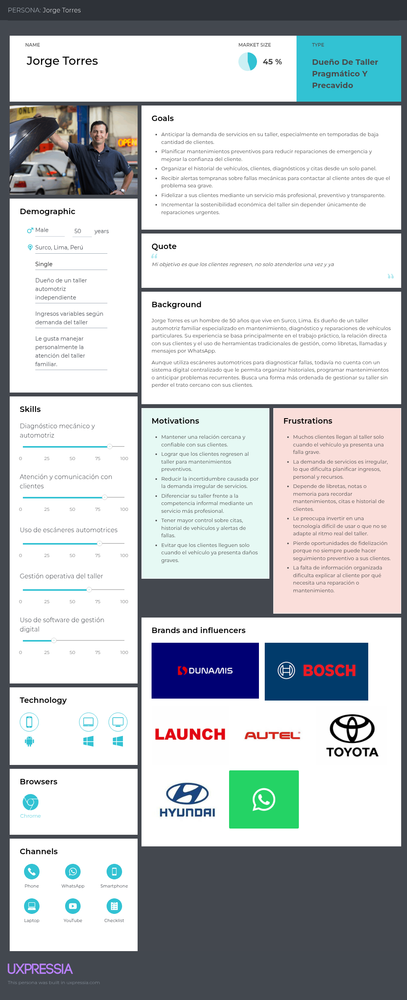
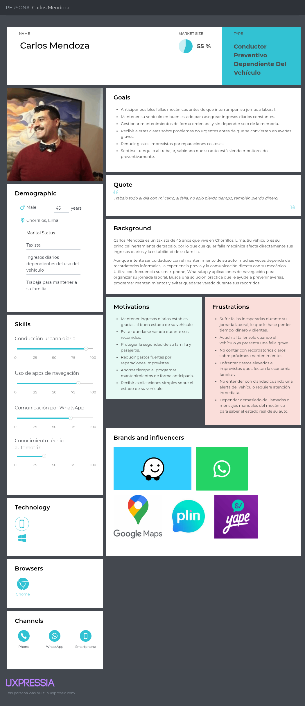
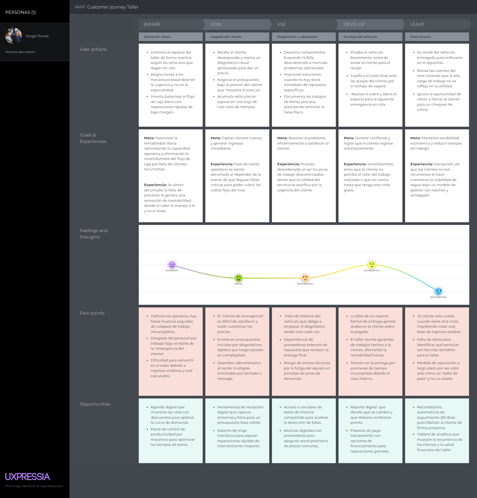
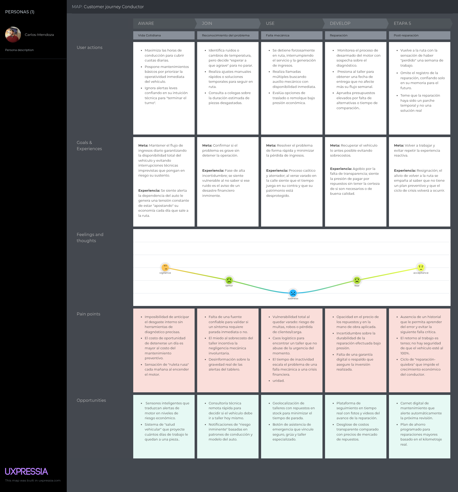
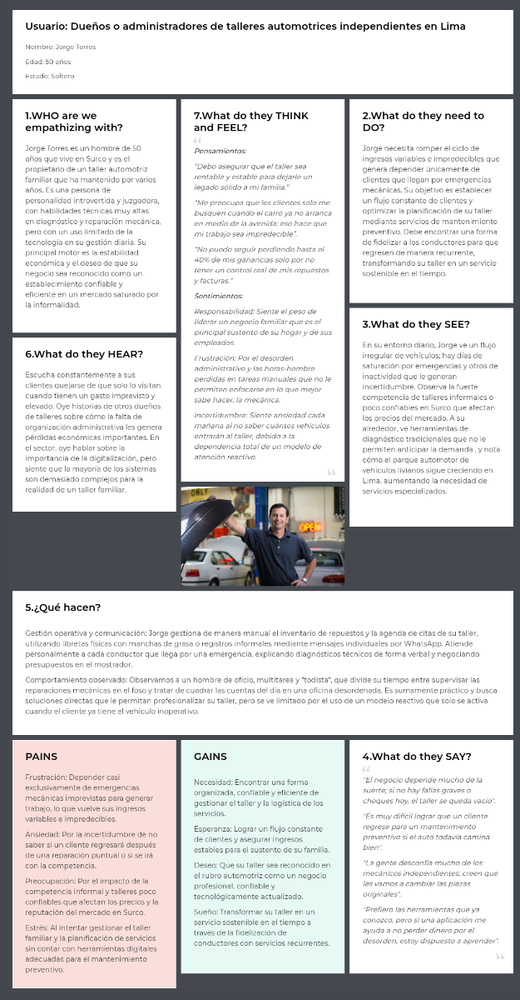
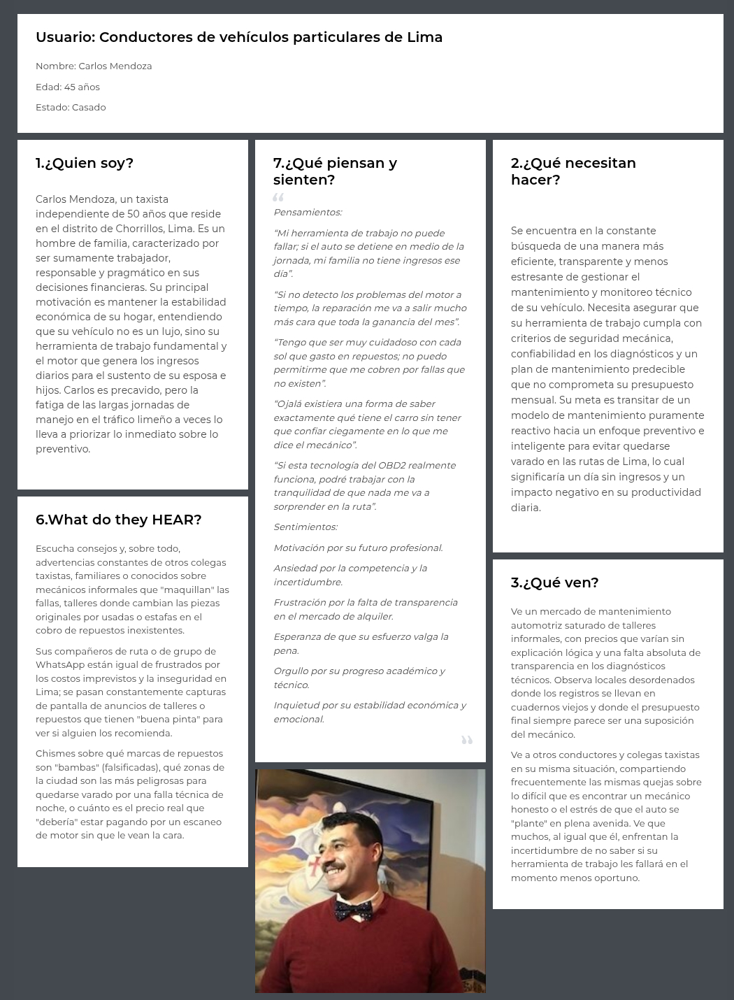
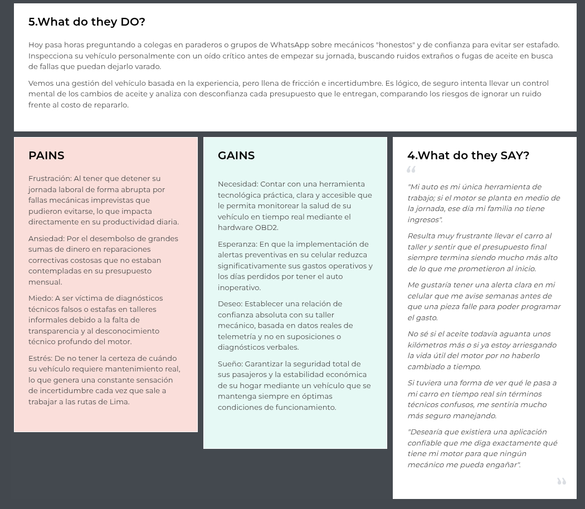

## 2.3. Needfinding {#cap-2-3}

&emsp;&emsp;&emsp;&emsp;En esta sección se explica y presenta los artefactos resultantes del proceso de análisis de la información recolectada.

### 2.3.1.&emsp;&emsp;*User Personas*{#cap-2-3-1}

&emsp;&emsp;&emsp;&emsp;Para desarrollar la propuesta de solución, se creará un User Persona por cada segmento objetivo. Este tendrá información relacionada a una persona que pertenezca al segmento objetivo respectivo. 
De esta forma, se podrá dar una idea más clara de a qué público nos estamos acercando con la idea de solución.

**Segmento Objetivo 1: Dueños o administradores de talleres automotrices independientes en Lima**

**Figura 9**

*User persona de dueños o administradores de talleres automotrices independientes en Lima*

    

[Enlace al user persona completo](https://drive.google.com/file/d/16DWBxr7SzYmYusrDQ5-nQVxWimsSq2LR/view?usp=drive_link)

**Segmento Objetivo 2: Conductores de vehículos de Lima**

**Figura 10**

*User persona de conductores de vehículos de Lima*

    

[Enlace al user persona completo](https://drive.google.com/file/d/1Y9jcc8UxjN1R96rB5HGIEg_zpsHmTKGU/view?usp=drive_link)

### 2.3.2.&emsp;&emsp;*User Task Matrix* {#cap-2-3-2}

&emsp;&emsp;&emsp;&emsp;En esta sección se presenta el User Task Matrix correspondiente a los segmentos objetivos identificados en la investigación: dueños o administradores de talleres automotrices independientes y conductores de vehículos de Lima. A partir de estos segmentos, se analizan las principales tareas que realizan en sus actividades cotidianas para alcanzar sus objetivos, considerando la importancia y frecuencia de cada una dentro de su contexto.

**Tabla 15** 

*User Task Matrix*

<table border="1" style="border-collapse: collapse; width: 100%; border-color: black;">
	<tbody>
		<tr>
            <td rowspan="2"><b>Tareas (Task)</b></td>
			<td colspan="2">
<b>Jorge Torres (Dueño)</b>
</td>
			<td colspan="2">
<b>Carlos Mendoza (Conductor)</b>
</td>
        </tr>
        <tr>
			<td>Importancia</td>
			<td>Frecuencia</td>
            <td>Importancia</td>
			<td>Frecuencia</td>
        </tr>
        <tr>
            <td>
Revisión del estado general del vehículo
</td>
            <td>Alta</td>
            <td>Alta</td>
            <td>Alta</td>
            <td>Media</td>
        </tr>
        <tr>
            <td>
Búsqueda o selección de taller de confianza
</td>
            <td>N/A</td>
            <td>N/A</td>
            <td>Alta</td>
            <td>Media</td>
        </tr>
        <tr>
            <td>
Evitar averías inesperadas durante traslados
</td>
            <td>Medio</td>
            <td>Bajo</td>
            <td>Alta</td>
            <td>Media</td>
        </tr>
        <tr>
            <td>
Búsqueda de información técnica automotriz
</td>
            <td>Alta</td>
            <td>Media</td>
            <td>Baja</td>
            <td>Baja</td>
        </tr>
        <tr>
            <td>
Limpieza y mantenimiento básico del vehículo
</td>
            <td>Media</td>
            <td>Media</td>
            <td>Media</td>
            <td>Alta</td>
        </tr>
        <tr>
            <td>
Compra de repuestos e insumos automotrices
</td>
            <td>Alta</td>
            <td>Media</td>
            <td>N/A</td>
            <td>N/A</td>
        </tr>
        <tr>
            <td>
Comunicación y atención a clientes
</td>
            <td>Alta</td>
            <td>Alta</td>
            <td>Alta</td>
            <td>Alta</td>
        </tr>
        <tr>
            <td>
Evaluación de costos de combustible
</td>
            <td>Baja</td>
            <td>Baja</td>
            <td>Alta</td>
            <td>Media</td>
        </tr>
    </tbody>
</table>

### 2.3.3.&emsp;&emsp;*User Journey Mapping* {#cap-2-3-3}

&emsp;&emsp;&emsp;&emsp;El User Journey Mapping es una técnica que permite visualizar el proceso que sigue el usuario para cumplir un objetivo, ayudándonos a entender sus acciones, emociones y puntos de dolor.

**Segmento Objetivo 1: Dueños o administradores de talleres automotrices independientes en Lima**

**Figura 11**

*User journey mapping de dueños o administradores de talleres automotrices independientes en Lima*

**Segmento Objetivo 2: Conductores de vehículos de Lima**

**Figura 12**

*User journey mapping de conductores de vehículos de Lima*

### 2.3.4.&emsp;&emsp;*Empathy Mapping* {#cap-2-3-4}

&emsp;&emsp;&emsp;&emsp;El Empathy Mapping ayuda a entender de manera más profunda a nuestros User Personas. Con esta herramienta, capturamos lo que cada usuario siente, dice, piensa y hace desde su propia perspectiva. Además, nos permite identificar sus dolores y metas, información que resulta clave para formar ideas de diseño útiles.

**Segmento Objetivo 1: Dueños o administradores de talleres automotrices independientes en Lima**

**Figura 13**

*Empathy Mapping de dueños o administradores de talleres automotrices independientes en Lima*

**Segmento Objetivo 2: Conductores de vehículos de Lima**

**Figura 14**

*Empathy Mapping de conductores de vehículos de Lima*

