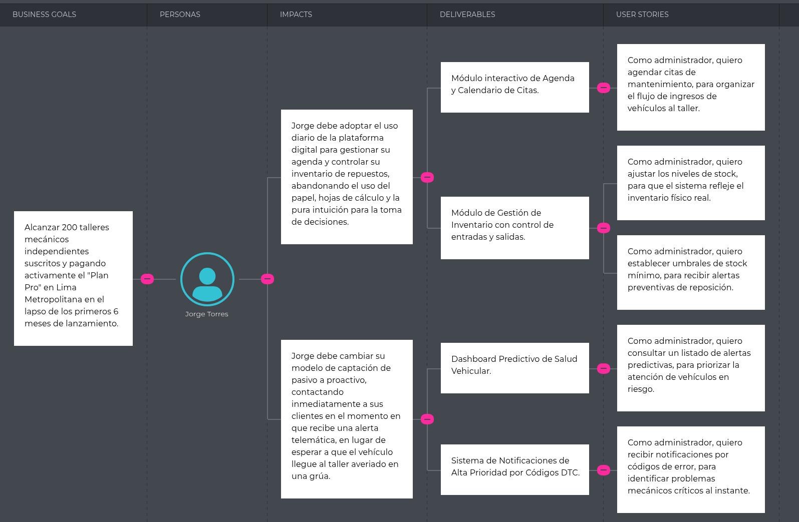
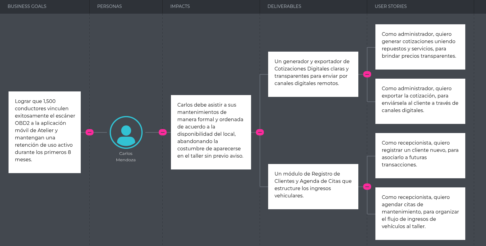

## 3.2. Impact Mapping {#cap-3-2}

&emsp;&emsp;&emsp;&emsp;En esta sección, el equipo explica y presenta el diseño del Impact Mapping para el modelo de negocio digital de Atelier. Este artefacto estratégico nos permite alinear visualmente nuestros objetivos comerciales con el comportamiento esperado de nuestros usuarios clave, definiendo qué debemos construir y cómo se traducen en requerimientos de software.

**Segmento objetivo 1: Dueños o administradores de talleres automotrices independientes en Lima**

**Figura 18**

*Impact Mapping de dueños o administradores de talleres automotrices independientes en Lima*

&emsp;&emsp;&emsp;&emsp;El primer impact map se centra en el objetivo comercial de monetización y adopción B2B: conseguir 200 talleres mecánicos suscritos al "Plan Pro" en Lima. La estrategia de impacto busca transformar radicalmente el comportamiento del dueño del taller, empujándolo a abandonar los procesos manuales y reactivos para adoptar una postura digital y proactiva. Esto se aterriza en entregables muy claros y técnicos, como módulos de inventario, agendas y, sobre todo, herramientas predictivas basadas en telemática, las cuales otorgan al taller el valor agregado necesario para justificar el pago de la suscripción al permitirles captar clientes antes de que el vehículo sufra una avería crítica.

**Segmento objetivo 2: Conductores de vehículos de Lima**

**Figura 19**

*Impact Mapping de conductores de vehículos de Lima*

&emsp;&emsp;&emsp;&emsp;El segundo impact map se enfoca en el usuario final o B2C, con la meta de lograr la vinculación y retención de 1,500 conductores usando un escáner OBD2 en su aplicación móvil. Resulta interesante que, aunque el objetivo de negocio gira en torno al conductor, el cambio de comportamiento esperado se sostiene mediante entregables y flujos de trabajo diseñados para el personal del taller. La hipótesis aquí es que al dotar al taller con generadores de cotizaciones transparentes y sistemas ágiles de agenda, se educa indirectamente al conductor para que formalice sus visitas, mejorando tanto la retención en la app como el flujo de ingresos del taller.