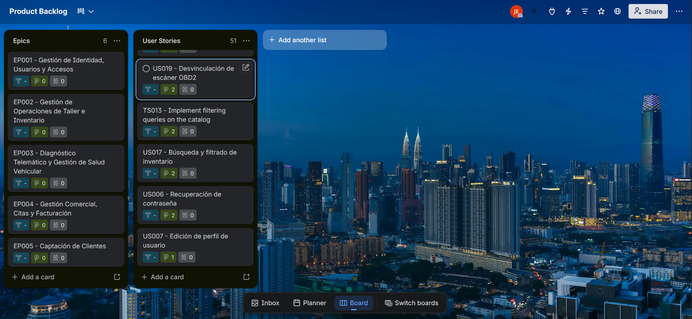

## 3.3. Product Backlog {#cap-3-3}

&emsp;&emsp;&emsp;&emsp;En esta sección se presenta la tabla del Product Backlog priorizado para la plataforma. Para estructurar este artefacto, se utilizaron puntos de historia que fueron asignados a cada historia de usuario creada, evaluando estrictamente su importancia para el contexto y valor del negocio. Para la estimación de estos puntos, el equipo utilizó la escala de Fibonacci.

&emsp;&emsp;&emsp;&emsp;Se decidió utilizar la herramienta Trello para la creación y gestión del Product Backlog. De este modo, la tabla inicia con las historias de usuario más importantes para el lanzamiento y operatividad del sistema, mientras que aquellas de menor importancia relativa se ubican en las últimas filas de dicha tabla.

**Tabla 18**

*Product Backlog de atelier*

| # Orden | User Story Id | Título                                                    | Descripción                                                                                                                                                                    | Story Points (1 / 2 / 3 / 5 / 8) |
|---------|---------------|-----------------------------------------------------------|--------------------------------------------------------------------------------------------------------------------------------------------------------------------------------|----------------------------------|
| 1       | US033         | Visualización de propuesta de valor                       | Como visitante web, quiero visualizar claramente la propuesta de valor, para comprender los beneficios operativos del software.                                                | 2                                |
| 2       | US034         | Exploración de módulos                                    | Como visitante web, quiero leer sobre las capacidades del ERP y la telemetría, para evaluar la modernización de mi negocio.                                                    | 2                                |
| 3       | US035         | Comparación de planes de suscripción                      | Como visitante web, quiero contrastar los planes de precios, para seleccionar el nivel que se ajuste a la capacidad de mi taller.                                              | 2                                |
| 4       | US036         | Presentación del equipo                                   | Como visitante web, quiero conocer la identidad del equipo desarrollador (Andeva), para establecer confianza en la plataforma.                                                 | 1                                |
| 5       | US037         | Acceso a información legal                                | Como visitante web, quiero revisar las políticas de privacidad y términos de servicio, para comprender el tratamiento de los datos telemáticos.                                | 1                                |
| 6       | US001         | Registro inicial de taller                                | Como dueño de taller, quiero registrar mi empresa, para crear un perfil oficial en la plataforma Atelier.                                                                      | 5                                |
| 7       | US002         | Selección de plan de suscripción                          | Como dueño de taller, quiero seleccionar un plan de suscripción durante el registro, para habilitar las capacidades operativas correspondientes.                               | 3                                |
| 8       | TS014         | Endpoints de Identidad y Talleres, Branches               | Como developer, quiero implementar los controladores de Workshops y Branches, para soportar la arquitectura Multi-Tenant y los pagos de suscripción de sedes.                  | 5                                |
| 9       | TS003         | Transacción de Operaciones de Servicio                    | Como developer, quiero gestionar los endpoints transaccionales de Work Orders (/api/v1/work-orders), para asegurar la integridad de la creación y seguimiento de reparaciones. | 8                                |
| 10      | US014         | Creación de Orden de Trabajo                              | Como administrador, quiero crear una Orden de Trabajo (OT), para documentar el servicio requerido por el cliente.                                                              | 5                                |
| 11      | US015         | Asignación de mecánicos a OT                              | Como administrador, quiero asignar mecánicos específicos a una OT, para delegar las responsabilidades de reparación.                                                           | 2                                |
| 12      | US016         | Actualización de estado de Orden                          | Como mecánico, quiero actualizar el estado de una OT, para que la recepción conozca el progreso de la reparación.                                                              | 2                                |
| 13      | TS004         | Endpoints de Inventario y Stock                           | Como developer, quiero estructurar las APIs base de inventario (/api/v1/inventory/products), para administrar el ciclo de vida, alta y baja de los repuestos.                  | 5                                |
| 14      | US008         | Alta de nuevos repuestos                                  | Como administrador, quiero registrar nuevos repuestos, para mantener un inventario digital estructurado.                                                                       | 3                                |
| 15      | TS009         | Implement product catalog endpoints                       | Como developer, quiero habilitar la consulta del catálogo por sucursal (/api/v1/inventory/products/branch/{branchId}), para aislar los datos operativos de cada sede.          | 5                                |
| 16      | TS010         | Implement inter-context event integration with WorkOrders | Como developer, quiero vincular las tareas de Work Orders con el inventario, para que el consumo de repuestos en el taller actualice dinámicamente las existencias.            | 8                                |
| 17      | TS002         | API de Ingesta de Telemetría                              | Como developer, quiero implementar los endpoints de telemetría (/api/v1/vh_telemetry_batches), para recibir y consultar los lotes de datos emitidos por los dispositivos OBD2. | 8                                |
| 18      | US018         | Vinculación de hardware OBD2                              | Como mecánico, quiero vincular un dispositivo OBD2 a un vehículo, para iniciar la captura de telemetría.                                                                       | 5                                |
| 19      | US020         | Visualización de telemetría en vivo                       | Como mecánico, quiero visualizar la telemetría en vivo del vehículo, para evaluar la salud del motor con precisión.                                                            | 8                                |
| 20      | TS001         | Endpoints de Autenticación                                | Como developer, quiero implementar los endpoints de autenticación (/api/v1/authentication), para gestionar el registro, acceso y recuperación de credenciales de forma segura. | 5                                |
| 21      | US003         | Inicio de sesión al sistema                               | Como usuario registrado, quiero iniciar sesión de forma segura, para acceder a mi espacio de trabajo.                                                                          | 3                                |
| 22      | TS007         | Endpoints de control de clientes y citas                  | Como developer, quiero construir las APIs de Customers y Appointments, para digitalizar la captación y el agendamiento del taller.                                             | 3                                |
| 23      | US011         | Registro de nuevo cliente                                 | Como recepcionista, quiero registrar los datos de un cliente nuevo, para asociarlo a futuras transacciones.                                                                    | 3                                |
| 24      | US024         | Agendamiento de citas                                     | Como recepcionista, quiero agendar citas de mantenimiento, para organizar el flujo de ingresos de vehículos al taller.                                                         | 3                                |
| 25      | TS005         | Procesamiento de Facturación y Pagos                      | Como developer, quiero desarrollar los endpoints financieros (/api/v1/vouchers), para consolidar el registro de comprobantes y la lógica de checkout.                          | 5                                |
| 26      | US026         | Creación de cotización digital                            | Como administrador, quiero generar cotizaciones uniendo repuestos y servicios, para brindar precios transparentes.                                                             | 5                                |
| 27      | US028         | Registro de cobro en caja                                 | Como cajero, quiero registrar el pago de una orden de trabajo, para realizar el cuadre contable diario.                                                                        | 3                                |
| 28      | TS006         | Procesamiento del Patrón Outbox                           | Como developer, quiero implementar la persistencia y lectura del patrón Outbox, para garantizar la consistencia eventual entre los microservicios y contextos delimitados.     | 8                                |
| 29      | TS011         | Implement batch management and stock adjustments          | Como developer, quiero habilitar la gestión de lotes de productos (/api/v1/inventory/products/{productId}/batches), para documentar entradas y registrar ajustes de almacén.   | 5                                |
| 30      | US009         | Ajuste manual de stock                                    | Como administrador, quiero ajustar los niveles de stock, para que el sistema refleje el inventario físico real.                                                                | 2                                |
| 31      | TS012         | Implement minimum stock alerts                            | Como developer, quiero desarrollar un proceso lógico de evaluación de umbrales, para gatillar notificaciones automáticas cuando el stock llega a niveles críticos.             | 5                                |
| 32      | US010         | Alerta de stock mínimo                                    | Como administrador, quiero establecer umbrales de stock mínimo, para recibir alertas preventivas de reposición.                                                                | 3                                |
| 33      | TS008         | Control del Personal                                      | Como developer, quiero proveer los endpoints de gestión de Empleados (/api/v1/employees), para soportar las operaciones CRUD sobre las cuentas operativas del negocio.         | 3                                |
| 34      | US004         | Invitación de empleados                                   | Como dueño de taller, quiero gestionar los perfiles de mis empleados, para que mi personal pueda acceder al sistema.                                                           | 3                                |
| 35      | US005         | Asignación de roles y permisos                            | Como dueño de taller, quiero asignar roles a mis empleados, para restringir el acceso a módulos comerciales o financieros sensibles.                                           | 5                                |
| 36      | US021         | Notificación de código DTC                                | Como administrador, quiero recibir notificaciones por códigos de error (DTC), para identificar problemas mecánicos críticos al instante.                                       | 5                                |
| 37      | US022         | Listado de alertas predictivas                            | Como administrador, quiero consultar un listado de alertas predictivas, para priorizar la atención de vehículos en riesgo.                                                     | 5                                |
| 38      | US012         | Consulta de historial clínico                             | Como mecánico, quiero consultar el historial de reparaciones de un vehículo, para diagnosticar de manera informada.                                                            | 3                                |
| 39      | US023         | Historial de Telemetría                                   | Como mecánico, quiero consultar los datos históricos de telemetría, para analizar el comportamiento del motor en el tiempo.                                                    | 5                                |
| 40      | US025         | Reprogramación de citas                                   | Como recepcionista, quiero modificar la fecha de una cita existente, para adaptarme a la disponibilidad del cliente.                                                           | 2                                |
| 41      | US027         | Envío remoto de cotización                                | Como administrador, quiero exportar la cotización, para enviársela al cliente a través de canales digitales.                                                                   | 2                                |
| 42      | US029         | Aplicación de descuentos                                  | Como administrador, quiero aplicar descuentos a la facturación, para fidelizar clientes recurrentes.                                                                           | 3                                |
| 43      | US030         | Panel de ingresos y rentabilidad                          | Como dueño de taller, quiero visualizar métricas financieras comparativas, para evaluar el crecimiento mensual del negocio.                                                    | 5                                |
| 44      | US031         | Exportación de reportes contables                         | Como dueño de taller, quiero exportar los movimientos del mes, para facilitar las declaraciones tributarias de mi contador.                                                    | 3                                |
| 45      | US032         | Sugerencia por kilometraje                                | Como recepcionista, quiero que el sistema me alerte sobre vehículos que superaron su kilometraje límite, para contactarlos proactivamente.                                     | 3                                |
| 46      | US013         | Gestión de lockers de trabajo                             | Como administrador, quiero asignar vehículos a los lockers de trabajo, para optimizar el espacio físico del taller.                                                            | 2                                |
| 47      | US019         | Desvinculación de escáner OBD2                            | Como mecánico, quiero desvincular el dispositivo OBD2, para poder utilizar el hardware en otro automóvil.                                                                      | 2                                |
| 48      | TS013         | Implement filtering queries on the catalog                | Como developer, quiero extender los endpoints GET de inventario con parámetros de búsqueda, para agilizar la localización de repuestos mediante filtros.                       | 2                                |
| 49      | US017         | Búsqueda y filtrado de inventario                         | Como administrador, quiero aplicar filtros al catálogo, para encontrar rápidamente una pieza específica durante una reparación.                                                | 2                                |
| 50      | US006         | Recuperación de contraseña                                | Como usuario, quiero solicitar la recuperación de mi cuenta, para restablecer mi acceso en caso de olvido.                                                                     | 2                                |
| 51      | US007         | Edición de perfil de usuario                              | Como usuario del sistema, quiero editar mi perfil personal, para mantener mi información de contacto actualizada.                                                              | 1                                |

**Figura 20**

*Product Backlog de atelier en Trello*

*Nota: Link de acceso a la plataforma de Trello [https://trello.com/b/jGupu9We/product-backlog](https://trello.com/b/jGupu9We/product-backlog)*

