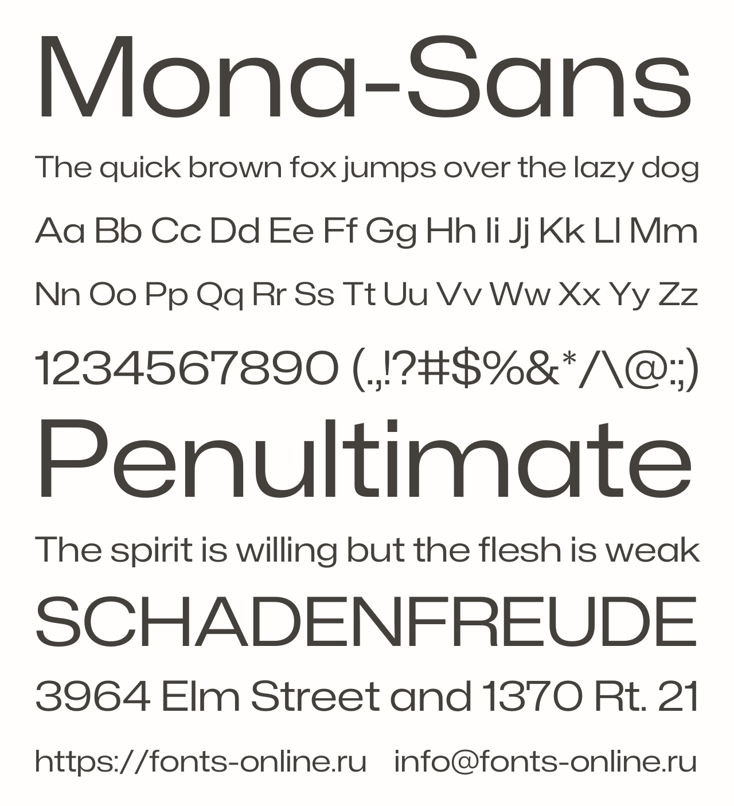
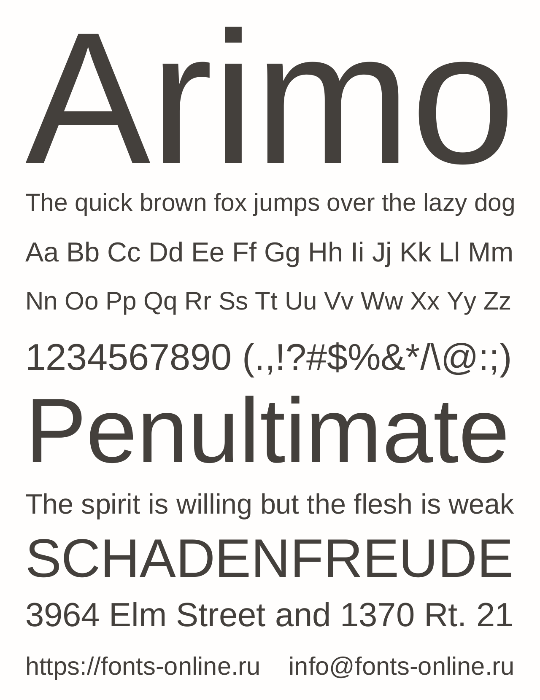
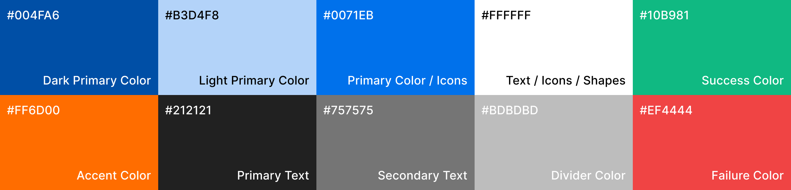

# Capítulo IV: Product Design {#cap-4}

## 4.1. Style Guidelines {#cap-4-1}

&emsp;&emsp;&emsp;&emsp;En esta sección, se sentará las bases del diseño de nuestro producto en diferentes plataformas. Se aplicarán conceptos de “IA Foundation” y “IU Design”.

### 4.1.1.&emsp;&emsp;*General Style Guidelines* {#cap-4-1-1}

&emsp;&emsp;&emsp;&emsp;En esta sección se detallan las decisiones de estilo que establecen la identidad visual de atelier, una plataforma web y aplicacion movil que busca desempeñarse y consolidarse en el mercado automotriz, exactamente dueños de tallers y conductores de Lima. El objetivo y decisiones tomadas en cuanto al branding, typography, colors, spacing y language se basan en crear una experiencia comprensible, amigable e intuitiva. Aparte de ello transmitir estabilidad y confianza.

**Branding**

&emsp;&emsp;&emsp;&emsp;Atelier es un término de origen francés que significa "taller" o "estudio", tradicionalmente reservado para el espacio de trabajo de artistas y diseñadores. A través de este nombre, buscamos reivindicar y elevar el prestigio de los profesionales que dan vida al clásico taller mecánico peruano.

&emsp;&emsp;&emsp;&emsp;Nuestro imagotipo refleja esta visión mediante un diseño limpio y claro, combinando únicamente una tuerca simplificada con el nombre de la marca. Con este enfoque visual directo y minimalista, buscamos posicionarnos de manera memorable en la mente de nuestros clientes.

**Figura 21**

*Imagotipo de atelier*

**Typography**

&emsp;&emsp;&emsp;&emsp;La tipografía es un elemento esencial para construir una identidad visual consistente y reconocible. En el caso de nuestra propuesta, seleccionamos fuentes que transmiten modernidad y claridad.

&emsp;&emsp;&emsp;&emsp;Para la fuente principal se ha seleccionado Mona Sans. Su estructura moderna, geométrica y con un marcado carácter tecnológico transmite la precisión y la innovación que definen el ecosistema de Atelier. Esta tipografía es ideal para encabezados, módulos de navegación y cifras clave dentro del panel de control, donde la claridad visual y una jerarquía sólida son fundamentales para optimizar el flujo de trabajo operativo del taller.

**Figura 22**

*Tipografía Mona Sans*

&emsp;&emsp;&emsp;&emsp;Como complemento funcional, Arimo se establece como la fuente secundaria para todo el cuerpo de texto y los componentes informativos de la plataforma. Gracias a su diseño optimizado para una alta legibilidad en pantallas, esta fuente asegura que los datos técnicos, historiales de mantenimiento y descripciones de averías sean fáciles de procesar tanto para mecánicos en el taller como para conductores en la aplicación móvil. Su uso aporta la sobriedad y eficiencia necesaria en una herramienta de gestión diseñada para transformar el diagnóstico vehicular.

**Figura 23**

*Tipografía Arimo*

**Colors**

&emsp;&emsp;&emsp;&emsp;La identidad cromática de Atelier se basa en tonos azules que refuerzan la asociación de transmitir estabilidad y confianza. Cada color cumple un rol específico para mantener consistencia y usabilidad.

&emsp;&emsp;&emsp;&emsp;El Primary Color, el cual representa el código hexadecimal #0071EB, es el corazón de la identidad visual de Atelier. Este tono azul transmite confianza, estabilidad y vanguardia tecnológica. Servirá como el ancla principal de la marca, guiando la atención del usuario hacia los elementos más importantes de la plataforma y estableciendo la conexión emocional de un servicio profesional y seguro.

&emsp;&emsp;&emsp;&emsp;El Dark Primary Color, el cual representa el código hexadecimal #004FA6, aporta profundidad, jerarquía y seriedad al sistema. Al ser una versión con menor luminosidad de la identidad principal, servirá para generar un contraste de peso que ancle la interfaz.

&emsp;&emsp;&emsp;&emsp;El Light Primary Color, el cual representa el código hexadecimal #B3D4F8, representa la sutileza, el apoyo y la accesibilidad. Servirá para suavizar la densidad de la información técnica del ERP, proporcionando resaltados gentiles y agrupando datos afines de manera visual sin competir por el protagonismo.

&emsp;&emsp;&emsp;&emsp;El Accent Color, el cual representa el código hexadecimal #FF6D00, es la inyección de energía, dinamismo y contraste absoluto en la paleta. Al ser el opuesto complementario del azul, servirá como un interruptor visual para romper la monotonía del software. Su propósito es capturar el ojo humano de manera instantánea, dirigiendo la mirada hacia acciones críticas, llamadas a la acción ineludibles o pasos finales en el flujo de trabajo del usuario.

&emsp;&emsp;&emsp;&emsp;El color blanco puro, el cual representa el código hexadecimal #FFFFFF, representa la claridad, el vacío y el respiro visual. Más allá de ser un color, servirá para esculpir el espacio negativo y aportar un contraste absoluto. Su función es actuar como la fuente de luz en la interfaz, recortando tipografías, íconos y formas geométricas sobre los fondos de color para garantizar una legibilidad impecable e inmediata.

&emsp;&emsp;&emsp;&emsp;El Primary Text, el cual representa el código hexadecimal #212121, encarna la legibilidad prolongada y el profesionalismo. Al ser un gris extremadamente oscuro en lugar de un negro puro, servirá para entregar el peso de la información técnica, los nombres de clientes y los diagnósticos sin generar la fatiga visual que el negro absoluto produce en las pantallas retroiluminadas.

&emsp;&emsp;&emsp;&emsp;El Secondary Text, el cual representa el código hexadecimal #757575, simboliza la jerarquía y el contexto de fondo. Servirá para acompañar a la información principal de manera silenciosa, entregando metadatos, fechas, horas o descripciones complementarias.

&emsp;&emsp;&emsp;&emsp;El Divider Color, el cual representa el código hexadecimal #BDBDBD, representa la estructura, el orden y los límites físicos dentro del mundo digital. Servirá para segmentar el contenido de manera muy sutil, separando listas largas de repuestos o definiendo módulos dentro de una misma pantalla. Su función es ser un organizador invisible: está ahí para mantener el orden, pero nunca para distraer al ojo de la información vital.

&emsp;&emsp;&emsp;&emsp;El Success Color, el cual representa el código hexadecimal #10B981, es el sinónimo psicológico de positividad, fluidez y salud mecánica. Aparte, tenemos el Failure Color, el cual representa el código hexadecimal #EF4444, es la máxima expresión de urgencia, precaución y detención. Servirá como una alarma visual inconfundible.

**Figura 24**

*Paleta de colores de atelier*

**Spacing**

&emsp;&emsp;&emsp;&emsp;El espaciado en Atelier define la estructura visual de la interfaz, garantizando orden, claridad y equilibrio entre los elementos. Un sistema de spacing coherente permite mejorar la legibilidad, evitar la sobrecarga visual y guiar la atención del usuario hacia lo más importante.

&emsp;&emsp;&emsp;&emsp;El espaciado se organiza en una escala de 4 px (4, 8, 12, 16, 24, 32, 40, 64). Esta base modular facilita la consistencia en todos los componentes, debe aplicarse de forma equilibrada entre textos, botones, imágenes y secciones, priorizando siempre la legibilidad y el “espacio en blanco” no es vacío: cumple el rol de dar descanso visual y marcar jerarquía en los contenidos.

**Language**

&emsp;&emsp;&emsp;&emsp;La elección de un lenguaje claro para Atelier responde a la necesidad crítica de eliminar las barreras técnicas entre la complejidad del software de gestión y el usuario final. Al ser un ecosistema que integra telemetría avanzada y procesos administrativos, una comunicación directa y sencilla garantiza que tanto el mecánico como el conductor comprendan el diagnóstico real del vehículo sin ambigüedades. Este enfoque no solo optimiza la operatividad en el taller al agilizar la toma de decisiones y reducir errores de interpretación, sino que también fortalece el pilar de transparencia de la marca, transformando datos crudos en información accionable que genera confianza, profesionalismo y seguridad en cada interacción.

**Tono de Comunicación**

&emsp;&emsp;&emsp;&emsp;El tono de comunicación de Atelier se define como profesional, empático y resolutivo. Al interactuar con los dueños y administradores de talleres, la voz de la marca es empoderadora y respetuosa, reconociendo su experiencia técnica y elevando su labor al estatus de verdaderos especialistas modernos. Por otro lado, al dirigirnos a los conductores, el tono se vuelve didáctico y tranquilizador, diseñado específicamente para reducir la ansiedad y la incertidumbre que tradicionalmente acompañan a las averías vehiculares.

&emsp;&emsp;&emsp;&emsp;Se evita por completo cualquier enfoque alarmista, técnico-agresivo o condescendiente. En su lugar, las alertas preventivas y los diagnósticos se entregan con total objetividad y transparencia. El propósito de este tono es construir un puente de confianza absoluta entre el taller y el cliente, demostrando que la plataforma no solo reporta fallas, sino que actúa como un mediador honesto que cuida la seguridad del conductor y protege la rentabilidad del negocio.

### 4.1.2.&emsp;&emsp;*Web Style Guidelines* {#cap-4-1-2}

&emsp;&emsp;&emsp;&emsp;Para el desarrollo de la interfaz de usuario de Atelier, se ha seleccionado Angular como el marco de trabajo principal debido a su robustez y capacidad para gestionar aplicaciones web de gran escala. Al ser un proyecto orientado al desarrollo de aplicaciones open source, Angular proporciona un ecosistema estructurado basado en componentes que facilita el mantenimiento y la escalabilidad del software. Esta arquitectura permite separar la lógica de negocio de la presentación, asegurando que el panel de administración para los talleres y la interfaz de monitoreo para los conductores funcionen de manera fluida y modular. La implementación se beneficia del uso de TypeScript, lo que aporta tipado estático y reduce errores durante la fase de codificación, garantizando una plataforma estable y profesional.

&emsp;&emsp;&emsp;&emsp;La experiencia visual y la interactividad se potencian mediante la integración de Angular Material, siguiendo estrictamente el sistema de diseño definido para la marca. Se emplean componentes preconstruidos y optimizados, como tablas de datos avanzadas para el inventario, cuadros de diálogo para la gestión de citas, menús laterales de navegación y modales.

**Figura 25**

*Angular Material*

&emsp;&emsp;&emsp;&emsp;La flexibilidad de Angular Material permite aplicar de forma coherente las fuentes Mona Sans y Arimo, asegurando que la jerarquía visual y la accesibilidad cumplan con los estándares de un software SaaS de alto nivel. Además, el uso de Flex Layout o Grid CSS dentro de los componentes de Angular asegura que la plataforma sea totalmente responsiva y adaptable a diversos tamaños de pantalla.