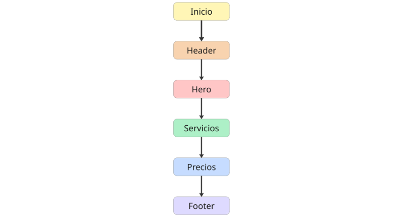
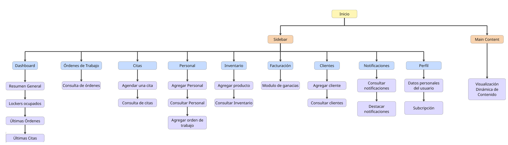

## 4.2. Information Architecture {#cap-4-2}

### 4.2.1.&emsp;&emsp;*Organization Systems* {#cap-4-2-1}

&emsp;&emsp;&emsp;&emsp;Para la arquitectura de información de Atelier, se han diseñado dos sistemas de organización diferenciados que responden a las necesidades psicológicas y operativas de cada fase del usuario: la captación comercial y la gestión administrativa.

&emsp;&emsp;&emsp;&emsp;La Landing Page de Atelier utiliza un sistema de organización secuencial, diseñado específicamente para guiar al visitante a través de una narrativa lineal sin distracciones. Esta estructura de una sola página (Single Page Application) se ha elegido para minimizar la tasa de rebote y maximizar la conversión. Al eliminar un menú de navegación tradicional con enlaces internos, se obliga al usuario a consumir la propuesta de valor en el orden lógico establecido: desde el impacto visual inicial hasta la validación del equipo y los precios, culminando en un llamado a la acción claro. Este diseño simplificado en el header, que solo presenta el logotipo y los botones de acceso, refuerza la identidad de marca y prioriza la entrada directa a la plataforma.

**Figura 26**

*Sistema de organización del Landing Page*

&emsp;&emsp;&emsp;&emsp;Para la plataforma web o Dashboard, se ha implementado un sistema de organización jerárquico y funcional basado en un esquema de Sidebar y Main Content. Esta estructura es la más eficiente para entornos de software como servicio (SaaS), ya que permite al administrador del taller multitarea y acceso instantáneo a módulos críticos. La sidebar actúa como el índice persistente del sistema, permitiendo que el usuario cambie de contexto sin perder la orientación. El área de Main Content funciona como un contenedor dinámico que renderiza la información específica de cada módulo, permitiendo una visualización limpia y centrada en los datos, esencial para el manejo de telemetría y reportes financieros.

**Figura 27**

*Sistema de organización de la plataforma web*

&emsp;&emsp;&emsp;&emsp;Este sistema dual asegura que la Landing Page funcione como un embudo de ventas altamente efectivo y fácil de navegar mediante scroll, mientras que el Dashboard se transforma en una herramienta de trabajo robusta donde la jerarquía visual de la sidebar facilita la gestión intensiva de un taller mecánico moderno.

### 4.2.2.&emsp;&emsp;*Labeling Systems* {#cap-4-2-2}

&emsp;&emsp;&emsp;&emsp;El sistema de etiquetado (labeling system) de Atelier es fundamental para garantizar que todos los usuarios puedan navegar por la plataforma de manera intuitiva, rápida y sin errores de interpretación. Dada la dualidad de la solución, el objetivo de este sistema es estandarizar la terminología, equilibrando el lenguaje técnico propio del rubro mecánico peruano con términos claros y directos para el usuario promedio.

&emsp;&emsp;&emsp;&emsp;Para la Landing Page, que sigue una organización secuencial, las etiquetas actúan como señales narrativas que guían al usuario a través del embudo de conversión, desde la propuesta de valor hasta el registro. Para la Plataforma Web, que utiliza una organización jerárquica y funcional basada en una sidebar, las etiquetas deben ser extremadamente concisas, predictivas y consistentes, permitiendo al administrador cambiar de contexto operativo al instante.

**Tabla 19**

*Etiquetas del Landing Page*

|            Etiqueta         | Descripción                                                              |
|:---------------------------:|--------------------------------------------------------------------------|
|           Acceder           |      Entrada para usuarios ya registrados en la plataforma web.          |
|            Unirse           |      Llamado a la acción  principal para el registro de nuevos talleres. |
|          Servicios          |      Título de sección. Introduce los beneficios del ERP y el IoT.       |
|           Precios           |      Título de sección que presenta los planes de suscripción.           |
| Lite, Pro, Max, Empresarial |      Nombres de los niveles de suscripción SaaS de atelier.              |
|             Team            |      Título de sección que introduce a los desarrolladores de Andeva.    |
|         Contáctanos         |      Etiquetas para enlaces secundarios, políticas y redes sociales.     |

**Tabla 20**

*Etiquetas para la plataforma web*

|      Etiqueta      | Descripción                                                                    |
|:------------------:|--------------------------------------------------------------------------------|
|      Buscar...     |       Campo de búsqueda global                                                 |
|      Dashboard     |      Vista general con métricas clave.                                         |
|        Citas       |      Calendario interactivo para gestionar reservas y bahías de trabajo.       |
| Órdenes de Trabajo |      Listado y gestión de reparaciones activas, estados y mecánicos asignados. |
|     Inventario     |       Control de stock de repuestos, SKU, precios y alertas de reposición.     |
|      Clientes      |       Historial clínico vehicular y datos de contacto de los conductores.      |
|     Facturación    |      Módulo financiero: emisión de comprobantes, links de pago y reportes.     |
|   Notificaciones   |      Acceso al panel de notificaciones                                         |
|       Perfil       |      Menú desplegable: "Mi Perfil", "Configuración", "Cerrar Sesión".          |

### 4.2.3.&emsp;&emsp;*SEO Tags and Meta Tags* {#cap-4-2-3}

&emsp;&emsp;&emsp;&emsp;Para garantizar que la Landing Page de Atelier alcance un posicionamiento orgánico óptimo en los motores de búsqueda y logre captar tanto a dueños de talleres como a conductores particulares, se ha diseñado una estrategia de optimización para motores de búsqueda y metadatos estructurada. La correcta implementación de estas etiquetas es vital, ya que el sitio web estático es el principal embudo de conversión de la startup.

&emsp;&emsp;&emsp;&emsp;El enfoque técnico se divide en tres niveles fundamentales dentro de la cabecera del documento HTML. El primer nivel abarca las etiquetas de indexación estándar, definiendo el título de la página, la descripción orientada a captar clics y las palabras clave estratégicas del nicho automotriz y tecnológico.

`<title>Atelier | Software ERP e IoT para Mantenimiento Automotriz Preventivo</title>`

`<meta name="description" content="Transforma tu taller mecánico en Lima con Atelier. Sistema de gestión ERP integrado con telemetría IoT (OBD2) para predecir fallas vehiculares y fidelizar conductores.">`

`<meta name="keywords" content="software para talleres mecánicos, ERP automotriz, mantenimiento preventivo, escáner OBD2, telemetría vehicular, gestión de talleres, andeva, Lima">`

`<meta name="author" content="andeva">`

`<meta name="robots" content="index, follow">`

`<link rel="canonical" href="https://www.atelier.com/">`

&emsp;&emsp;&emsp;&emsp;El segundo nivel implementa el protocolo Open Graph, esencial para que la plataforma se previsualice correctamente con imágenes, títulos y descripciones atractivas cuando el enlace sea compartido a través de WhatsApp o LinkedIn.

`<meta property="og:type" content="website">`

`<meta property="og:url" content="https://www.atelier.com/">`

`<meta property="og:title" content="Atelier: Digitaliza tu Taller Mecánico con IoT">`

`<meta property="og:description" content="Aumenta la rentabilidad de tu taller y ofrece transparencia total a tus clientes. Control de inventario, citas y alertas predictivas de motor en tiempo real.">`

`<meta property="og:image" content="https://www.atelier-andeva.pe/assets/images/og-atelier-preview.jpg">`

`<meta property="og:site_name" content="atelier by andeva">`

`<meta property="og:locale" content="es_PE">`

&emsp;&emsp;&emsp;&emsp;Finalmente, el tercer nivel incluye las etiquetas de Twitter Cards, asegurando una presencia rica y profesional en redes sociales.

`<meta name="twitter:card" content="summary_large_image">`

`<meta name="twitter:url" content="https://www.atelier.com/">`

`<meta name="twitter:title" content="Atelier | El futuro del mantenimiento vehicular">`

`<meta name="twitter:description" content="Software SaaS para talleres mecánicos independientes. Conecta el auto de tus clientes a la nube y prevén fallas costosas antes de que ocurran.">`

`<meta name="twitter:image" content="https://www.atelier-andeva.pe/assets/images/twitter-atelier-preview.jpg">`

`<meta name="twitter:site" content="@Andeva_PE">`

`<meta name="theme-color" content="#0071eb"> <link rel="icon" type="image/png" href="/assets/icons/favicon-32x32.png">`

`<link rel="apple-touch-icon" href="/assets/icons/apple-touch-icon.png">`

### 4.2.4.&emsp;&emsp;*Navigation Systems* {#cap-4-2-4}

&emsp;&emsp;&emsp;&emsp;El sistema de navegación de Atelier está diseñado para minimizar la carga cognitiva del usuario, permitiéndole saber exactamente dónde se encuentra, hacia dónde puede ir y cómo regresar. Dado que el ecosistema atiende a dos flujos completamente distintos, se han definido esquemas de navegación separados y optimizados para cada contexto, apoyados técnicamente en el enrutamiento dinámico de Angular.

**Navegación Landing Page**

&emsp;&emsp;&emsp;&emsp;La página de aterrizaje comercial de Atelier utiliza un modelo de navegación lineal y anclada (Scroll-based Navigation). El objetivo principal es no interrumpir el embudo de conversión, por lo que se evitan los menús desplegables complejos.

&emsp;&emsp;&emsp;&emsp;Navegación Global: Una barra superior persistente que acompaña al usuario mientras hace scroll hacia abajo. El isotipo/logotipo de Atelier, que funciona como un ancla para regresar a la parte superior de la página (Hero Section). Botones de acción directa para redirigir al formulario de registro del SaaS.

&emsp;&emsp;&emsp;&emsp;Navegación Contextual: Botones estratégicos ubicados en cada sección informativa que empujan al usuario hacia el registro.

&emsp;&emsp;&emsp;&emsp;Navegación Contextual: Ubicada al final de la página. Contiene enlaces estáticos que no son parte del embudo principal de ventas, como "Términos y Condiciones", "Políticas de Privacidad" y enlaces a redes sociales.

**Navegación Plataforma Web**

&emsp;&emsp;&emsp;&emsp;El entorno de trabajo para el administrador del taller requiere un modelo de navegación jerárquica y multifacética, ya que maneja alta densidad de datos. Se prioriza la eficiencia y la reducción del número de clics para llegar a cualquier módulo.

&emsp;&emsp;&emsp;&emsp;Navegación Global Principal: Un menú lateral izquierdo fijo que actúa como el control maestro del sistema. Contiene los accesos directos a los módulos principales.

&emsp;&emsp;&emsp;&emsp;Navegación Suplementaria: Rutas de texto ubicadas debajo del Top Bar que indican la profundidad jerárquica y permiten retroceder un nivel fácilmente.

&emsp;&emsp;&emsp;&emsp;Navegación Contextual: Enlaces embebidos dentro de las tablas de datos o tarjetas.

### 4.2.5.&emsp;&emsp;*Searching Systems* {#cap-4-2-5}

&emsp;&emsp;&emsp;&emsp;Dado que la Landing Page de "atelier" es una página estática de desplazamiento único donde toda la información está visible secuencialmente, el diseño del sistema de búsqueda se concentra de manera exclusiva en la plataforma web.

&emsp;&emsp;&emsp;&emsp;La interfaz de búsqueda se compone de buscadores locales integrados directamente en la parte superior de las tablas de datos de cada módulo específico, como el de Inventario, Órdenes de Trabajo y Clientes, acompañados de filtros avanzados.

&emsp;&emsp;&emsp;&emsp;Esta estructura permite al usuario acotar su búsqueda según el contexto exacto en el que se encuentre operando, combinando la entrada de texto libre con selectores específicos, como el estado actual de una reparación, rangos de fechas de ingreso al taller o categorías de piezas mecánicas, garantizando que la consulta sea siempre relevante y enfocada a la tarea actual.

&emsp;&emsp;&emsp;&emsp;En cuanto a los tipos de consultas y el algoritmo subyacente, el sistema está preparado para procesar búsquedas exactas, indispensables para ubicar rápidamente matrículas vehiculares o documentos de identidad.