## 4.3. Landing Page UI Design {#cap-4-3}

&emsp;&emsp;&emsp;&emsp;La interfaz de usuario del Landing Page de Atelier es el resultado de una traducción directa de nuestras decisiones estratégicas de Arquitectura de Información y pautas de estilo visual. Para lograr una herramienta de captación comercial efectiva, el diseño visual se subordinó a la necesidad de guiar al usuario a través de un embudo de conversión claro y sin fricciones. Esto implicó estructurar la interfaz como una Single Page Application para minimizar la tasa de rebote , eliminando menús de navegación complejos  y utilizando en su lugar el espaciado y la jerarquía tipográfica para definir el ritmo de lectura. Las decisiones de diseño no solo buscan el atractivo estético, sino que aplican la psicología del color y un tono de comunicación empático para transmitir confianza, estabilidad y vanguardia tecnológica en el sector automotriz.

### 4.3.1.&emsp;&emsp;*Landing Page Wireframe* {#cap-4-3-1}

&emsp;&emsp;&emsp;&emsp;A continuación, se presentan los wireframes del Landing Page diseñados exclusivamente para Desktop Web Browser. Estos esquemas estructurales de baja fidelidad evidencian la aplicación de los principios de diseño y la arquitectura de información antes de la intervención gráfica.

&emsp;&emsp;&emsp;&emsp;Se aplica el principio de jerarquía visual mediante el tamaño de los bloques y textos, destacando el titular principal "Transforma tu Taller" por encima de las descripciones secundarias. Se utiliza la Ley de Proximidad en las secciones de "Servicios" y "Precios" para agrupar tarjetas de información relacionada, permitiendo que el cerebro procese los beneficios y planes del SaaS de forma ordenada. El diseño modular se apoya en un sistema de espaciado coherente que utiliza el espacio negativo para dar descanso visual.

**Figura 28**

*Wireframe del Landing Page de atelier*

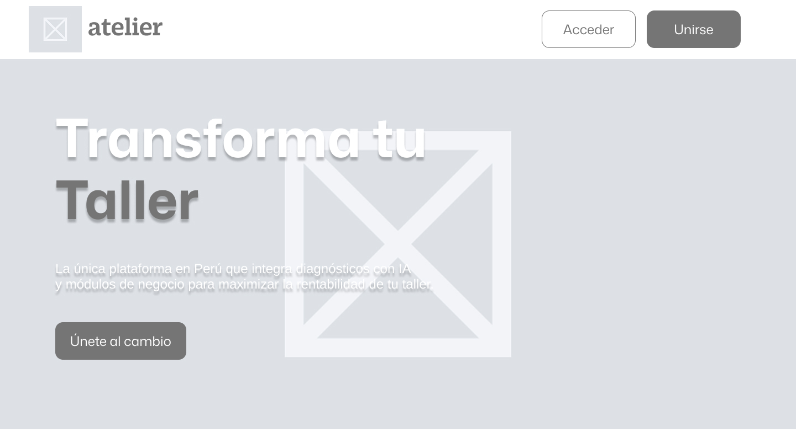

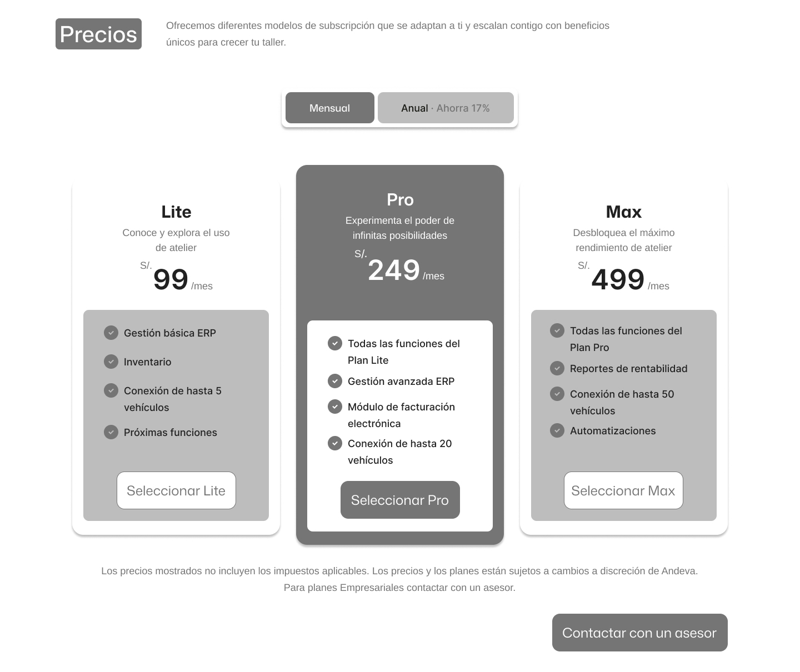
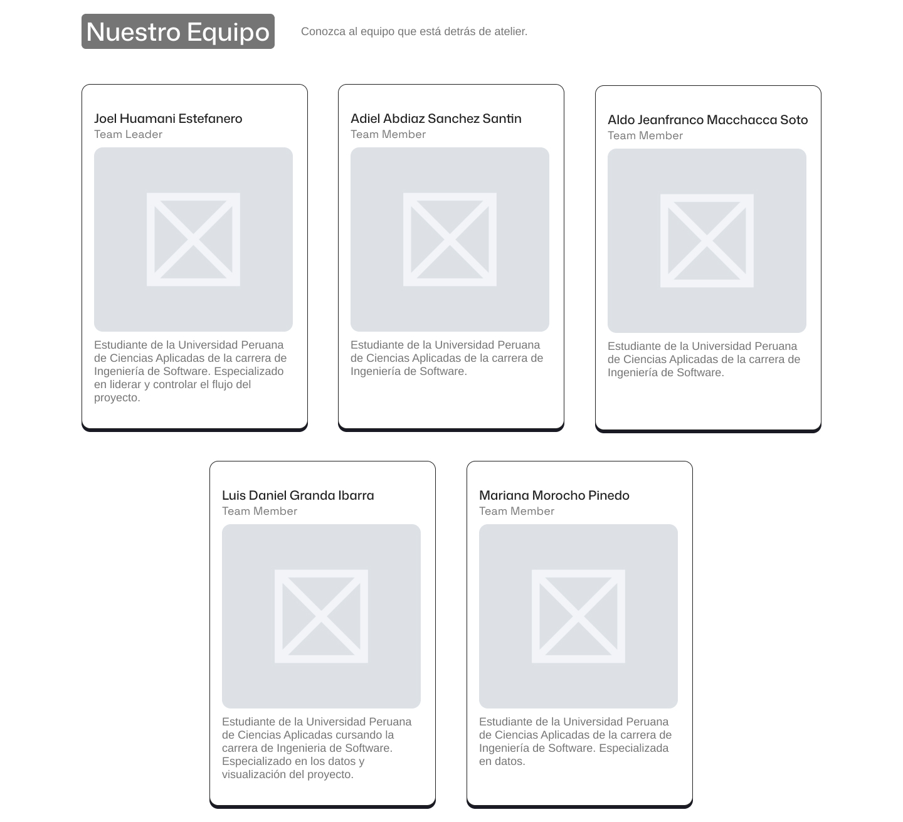
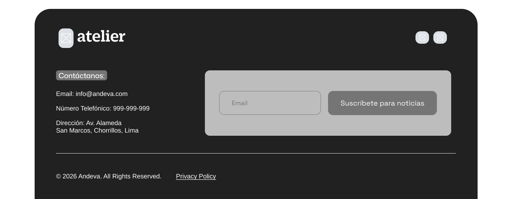

### 4.3.2.&emsp;&emsp;*Landing Page Mock-up* {#cap-4-3-2}

&emsp;&emsp;&emsp;&emsp;Esta sección presenta los Mock-ups de alta fidelidad para el Desktop Web Browser, donde los wireframes estructurales cobran vida mediante la aplicación rigurosa de nuestro Design System y pautas de estilo.

&emsp;&emsp;&emsp;&emsp;a identidad cromática se hace evidente con el uso estratégico del Primary Color (#0071EB). Este tono azul, que transmite estabilidad y tecnología , se emplea en los "Call to Action" (CTAs) principales como "Únete al cambio" y "Unirse", así como para destacar el plan de suscripción "Pro", guiando la mirada hacia las acciones críticas. Se utiliza el Light Primary Color (#B3D4F8) como fondo de apoyo en las tarjetas de miembros del equipo y servicios, suavizando la densidad de la información. A nivel tipográfico, la jerarquía se refuerza utilizando Mona Sans para los encabezados y los precios grandes , mientras que Arimo se aplica en el cuerpo de texto descriptivo para garantizar una legibilidad prolongada y eficiente en pantalla. El Primary Text (#212121) se utiliza para evitar la fatiga visual del negro puro.

&emsp;&emsp;&emsp;&emsp;El alto contraste entre el texto (#212121 y #FFFFFF) sobre fondos oscuros o azules puros asegura el cumplimiento de estándares de accesibilidad visual. El sistema de navegación global mediante el Sticky Header permanece visible en todo momento, permitiendo al usuario ingresar a la plataforma o registrarse sin importar en qué punto del recorrido de la página se encuentre, consolidando así un embudo de ventas altamente efectivo.

**Figura 29**

*Mock-up del Landing Page de atelier*

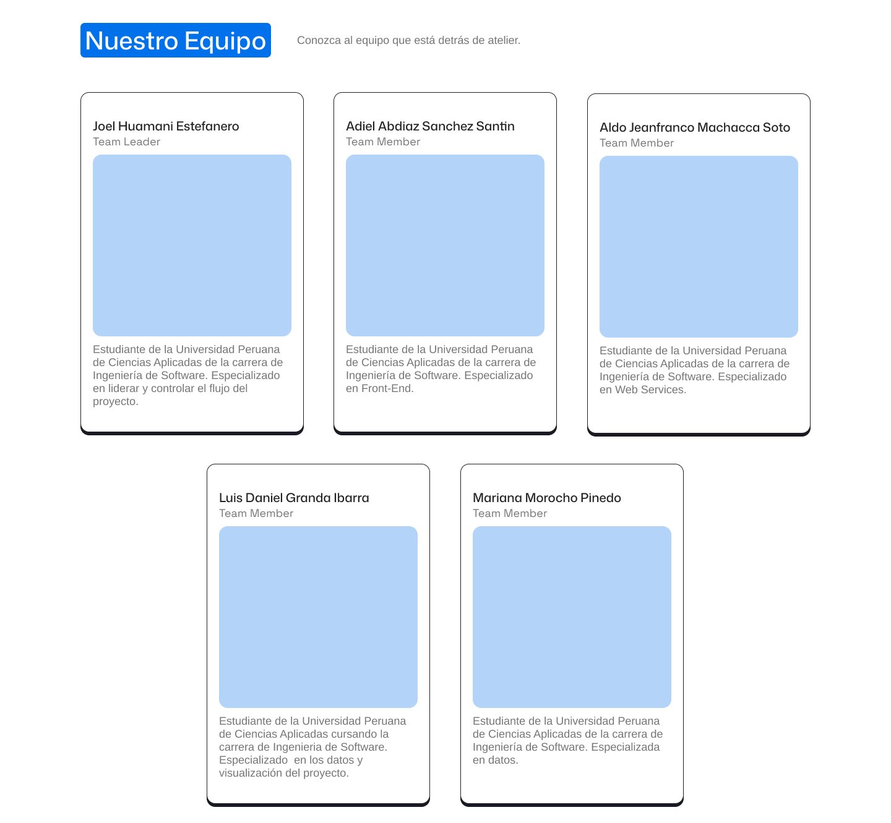
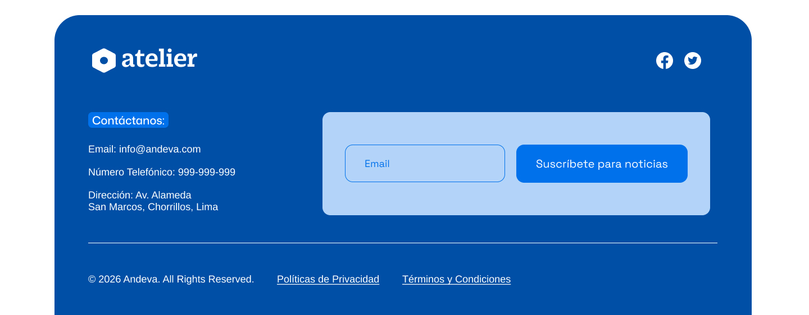

&emsp;&emsp;&emsp;&emsp;Asimismo, se presenta la versión Mobile Web Browser del Landing Page, adaptada a una pantalla de menor tamaño. Esta propuesta conserva la identidad visual de Atelier, reorganizando los contenidos en una estructura vertical, clara y fácil de navegar. Además, se mantiene la jerarquía visual y la visibilidad.

**Figura 30**

*Mock-up del Landing Page Mobile Web Browser de Atelier*

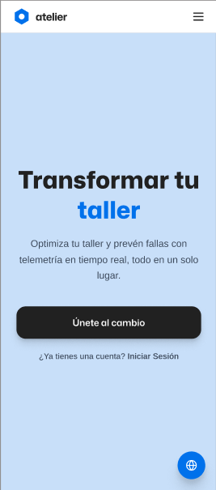
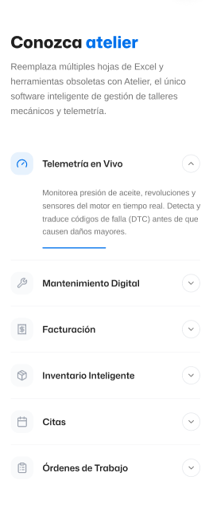
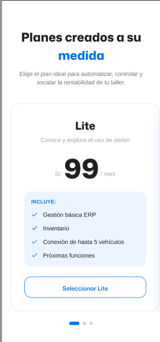
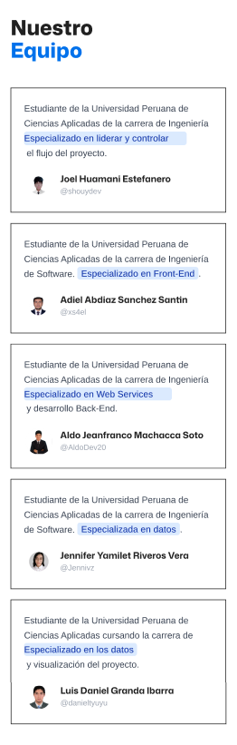
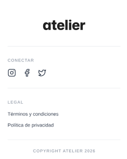
