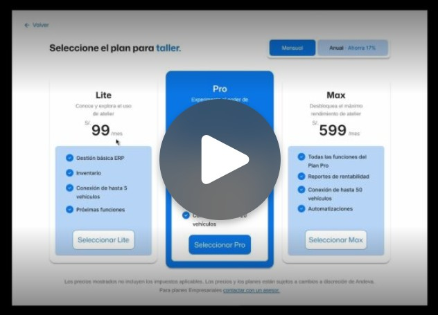

## 4.5. Web Applications Prototyping {#cap-4-5}

&emsp;&emsp;&emsp;&emsp;Las decisiones de interacción en Atelier se basaron en criterios de eficiencia operativa, accesibilidad y reducción de la carga cognitiva. Dado que los usuarios finales operan en entornos dinámicos y a menudo con tiempos limitados, el diseño busca minimizar el número de clics requeridos para completar una tarea, se puede visualizar en el siguiente link: [Web Applications Prototyping](https://upcedupe-my.sharepoint.com/:v:/g/personal/u20241e275_upc_edu_pe/IQCjruk7EbfKRIDg103R4HwTATHkvK59StGpj6WV-qRqMf8?nav=eyJyZWZlcnJhbEluZm8iOnsicmVmZXJyYWxBcHAiOiJPbmVEcml2ZUZvckJ1c2luZXNzIiwicmVmZXJyYWxBcHBQbGF0Zm9ybSI6IldlYiIsInJlZmVycmFsTW9kZSI6InZpZXciLCJyZWZlcnJhbFZpZXciOiJNeUZpbGVzTGlua0NvcHkifX0&e=5GcsUm).

**Figura 46**

*Captura de Pantalla del video de Web Applications Prototyping de atelier*

