## 4.6. Domain-Driven Software Architecture {#cap-4-6}

&emsp;&emsp;&emsp;&emsp;La presente sección expone el diseño estructural y funcional de la plataforma **atelier** bajo los lineamientos del Diseño Orientado al Dominio (*Domain-Driven Design* o DDD). La adopción de este paradigma avanzado de ingeniería asegura que nuestra arquitectura de software se encuentre rigurosamente alineada con las complejas reglas de negocio de la startup. Este enfoque nos permite modelar con alta fidelidad los procesos críticos de nuestro ecosistema corporativo: la ingesta y análisis predictivo de telemetría vehicular (OBD2) y la provisión de un Enterprise Resource Planning (ERP) centrado en el mantenimiento preventivo y la eficiencia operativa de los talleres mecánicos. Mediante esta aproximación estratégica, logramos una separación evidente y mantenible del conocimiento del dominio respecto a la tecnología subyacente.

### 4.6.1.&emsp;&emsp;*Design-Level Event Storming* {#cap-4-6-1}

&emsp;&emsp;&emsp;&emsp;El Design-Level Event Storming profundiza en los *Bounded Contexts* de la plataforma, conectando la visión general de negocio con la arquitectura técnica de software basada en *Domain-Driven Design* (DDD). A través de este proceso iterativo, modelamos con el mayor nivel de detalle los comandos, eventos, políticas y pantallas que dan vida al ecosistema predictivo y de gestión del taller.

**Paso 1: Collect Domain Events**

&emsp;&emsp;&emsp;&emsp;Se identificaron y colocaron secuencialmente todos los eventos de dominio clave (post-its naranjas) que representan cambios de estado inmutables en el sistema. Se mapearon eventos escritos en tiempo pasado, abarcando desde el registro inicial del taller (`TallerRegistrado`), pasando por la ingesta de telemetría (`LecturaRecibida`) y el flujo operativo (`OrdenAbierta`), hasta el cierre financiero (`FacturaEmitida`).

**Figura 47**

*Collect Domain Events*

**Paso 2: Timelines y Bounded Contexts**

&emsp;&emsp;&emsp;&emsp;Una vez identificados todos los eventos, los organizamos en una línea de tiempo cronológica y los agrupamos en módulos delimitados (*frames*) para establecer nuestros sub-dominios. Identificamos 6 flujos claros alineados al diseño de software: Core (Identidad y Multi-tenencia), IoT (Hardware y Telemetría), Fleet (Gestión de Flota), Operations (Órdenes de Trabajo), Inventory (Almacén) y Billing (Facturación y Pagos).

**Figura 48**

*Timelines y Bounded Contexts*

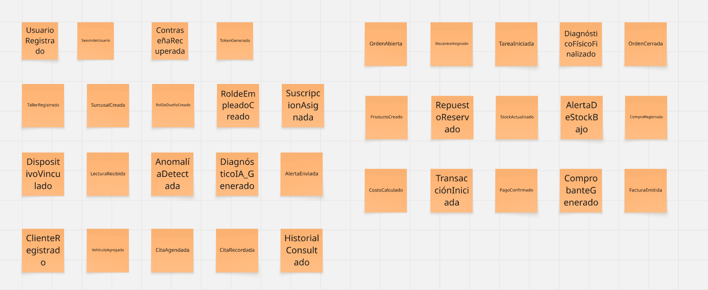

**Paso 3: Commands y Actors**

&emsp;&emsp;&emsp;&emsp;En este paso, respondimos a la pregunta "¿Quién hace qué?". Agregamos los actores (post-its amarillos pequeños) como el Dueño, Conductor, Mecánico o Almacenero, junto con los comandos (post-its azules en infinitivo) que ellos ejecutan para detonar los eventos. Debido a la extensión del flujo técnico, este se visualiza en dos secciones.

**Figura 49**

*Commands y Actors - Parte 1*

**Figura 50**

*Commands y Actors - Parte 2*

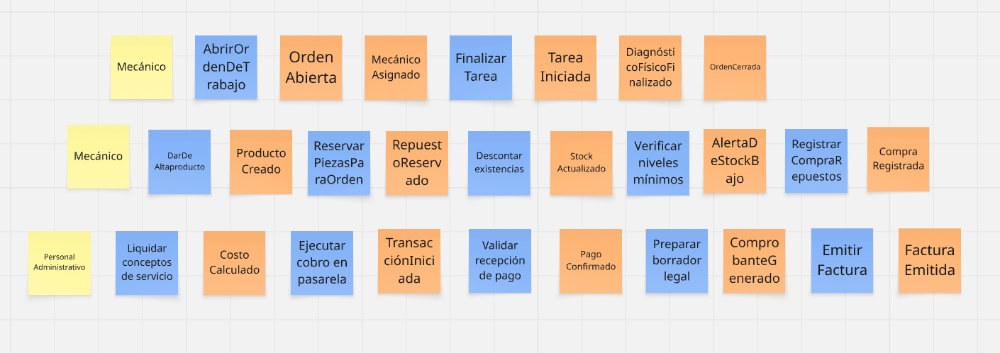

**Paso 4: Policies (Reglas de Negocio)**

&emsp;&emsp;&emsp;&emsp;Incorporamos las políticas del sistema (post-its lilas/morados), que representan las automatizaciones y reglas de negocio reactivas que conectan distintos contextos. Estas se redactan bajo la premisa "Siempre que pase X, hacer Y". Por ejemplo: *"Siempre que el sistema IoT detecte una anomalía, notificar al conductor para agendar una cita de mantenimiento"*.

**Figura 51**

*Policies - Parte 1*

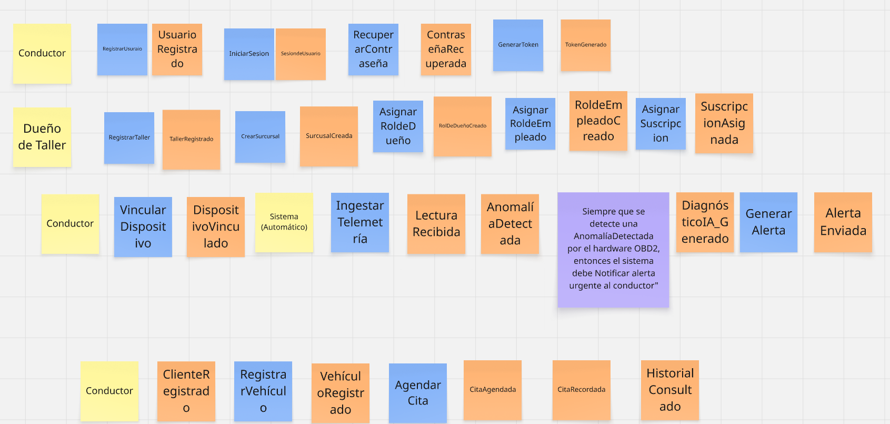

**Figura 52**

*Policies - Parte 2*

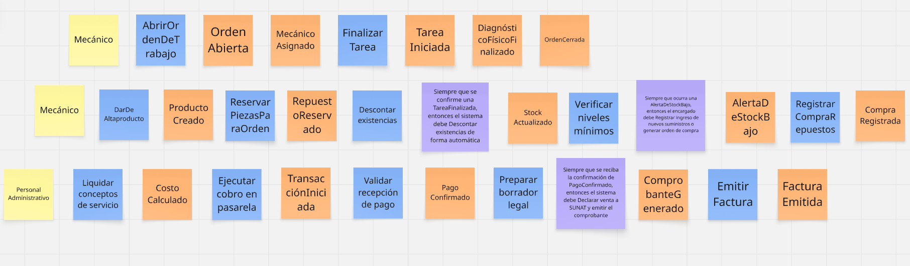

**Paso 5: Pain Points, External Systems y Read Models**

&emsp;&emsp;&emsp;&emsp;Añadimos las capas de interfaz de usuario, dependencias de terceros y análisis de riesgos. Colocamos los modelos de lectura (post-its verdes), que son las pantallas necesarias para la toma de decisiones. Además, integramos los sistemas externos (post-its rosados) como el Hardware OBD2, el Motor IA Andeva, la Pasarela de Pagos y la API de SUNAT.

**Figura 53**

*Read Models y External Systems - Parte 1*

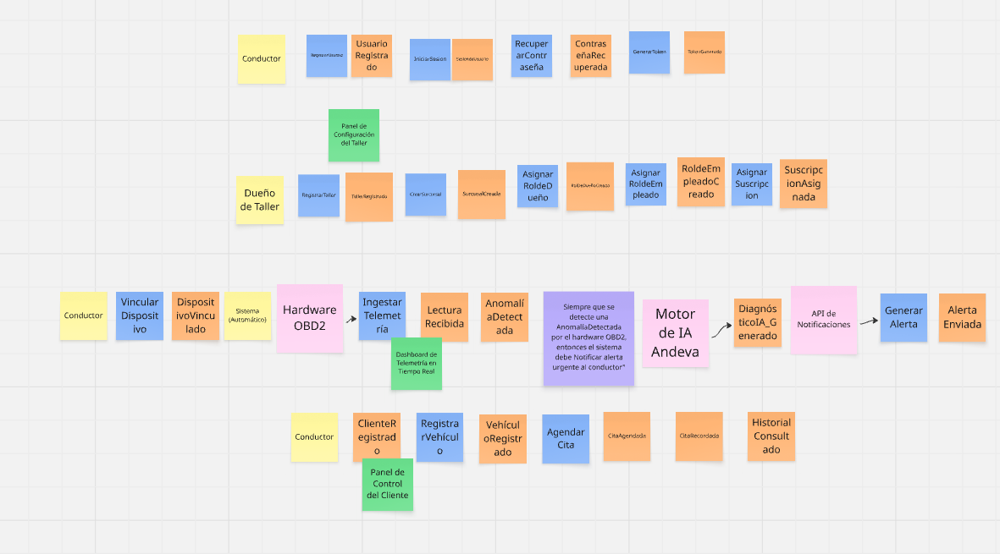

**Figura 54**

*Read Models y External Systems - Parte 2*

**Paso 6: Detalle de Bounded Contexts y Aggregates**

&emsp;&emsp;&emsp;&emsp;En la fase final, procedimos a identificar las entidades raíz o "Agregados" (post-its amarillos grandes) para cada contexto delimitado, asegurando la consistencia transaccional de cada módulo. A continuación, se detalla cada uno de los 6 Bounded Contexts definidos:

&emsp;&emsp;&emsp;&emsp;**a) Core:** Este contexto gestiona la identidad y el acceso multi-inquilino. Contiene los agregados `Tenant`, `Profile` y `Subscription`, encargados de vincular la identidad digital con la suscripción comercial del taller.

**Figura 55**

*Design-Level: Contexto de Core*

&emsp;&emsp;&emsp;&emsp;**b) IoT:** Representa el núcleo tecnológico predictivo. Se encarga de la ingesta de datos en el agregado `TelemetryRecord` y utiliza el agregado `Device` para gestionar el hardware vinculado a los vehículos.

**Figura 56**

*Design-Level: Contexto de IoT*

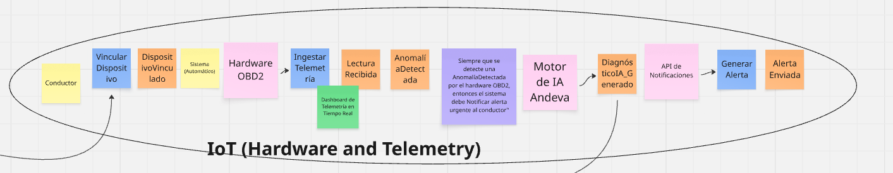

&emsp;&emsp;&emsp;&emsp;**c) Fleet:** Administra la relación operativa entre clientes, empleados, sedes y vehículos dentro del taller. En la versión actualizada del backend, este bounded context incorpora los agregados `Appointment`, `CustomerRegistration` y `EmployeeRegistration`, permitiendo coordinar citas de mantenimiento, registrar la vinculación de clientes con una sede y registrar la asignación de empleados o personal técnico a una sede. De esta manera, Fleet concentra reglas de negocio relacionadas con la planificación de servicios, la disponibilidad operativa y la trazabilidad de registros asociados a la atención del taller.

**Figura 57**

*Design-Level: Contexto de Fleet*

&emsp;&emsp;&emsp;&emsp;**d) Operations:** Es el corazón operativo del sistema. Todo el flujo gira en torno al agregado central `WorkOrder` y las tareas técnicas `MaintenanceTask`, controlando el ciclo de vida de la reparación.

**Figura 58**

*Design-Level: Contexto de Operations*

&emsp;&emsp;&emsp;&emsp;**e) Inventory:** Gestiona la integridad de los suministros del taller. Agrupa los agregados `Product` y `WarehouseItem` para el descuento automático de repuestos e insumos usados.

**Figura 59**

*Design-Level: Contexto de Inventory*

&emsp;&emsp;&emsp;&emsp;**f) Billing:** Maneja el cierre financiero y legal. Utiliza los agregados `PaymentTransaction` e `Invoice` para procesar cobros y emitir comprobantes electrónicos ante las entidades tributarias.

**Figura 60**

*Design-Level: Contexto de Billing*

&emsp;&emsp;&emsp;&emsp;**g) IAM:** Contexto especializado en la Identidad y Gestión de Accesos (Identity & Access Management). Su responsabilidad exclusiva es manejar el registro, inicio de sesión y recuperación de credenciales mediante los agregados `User` y `UserStatus`.

**Figura 61**

*Design-Level: Contexto de IAM*

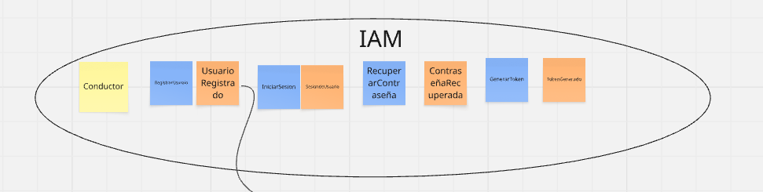

&emsp;&emsp;&emsp;&emsp;Para una visualización interactiva y en máxima resolución del *Design-Level Event Storming* completo, se puede acceder a nuestra pizarra oficial: [Atelier Design-Level Event Storming (Miro Board)](https://miro.com/welcomeonboard/d2pUcVdMSVllNHRvRU05UGEzQXE5OSs3UGJmQWw0TlhmUDEwcWpPWG9vTTdGWERndEZ1cFEwZThkYVVMbjUxaUkyUk9nV2tBaEdqNm85SVJYZFZ5c0VtNkUvVTB0dUJhNnRjMXdseDVrcG1QT3FVVmh1U0RGRk8vY0dyUlQ4emV3VHhHVHd5UWtSM1BidUtUYmxycDRnPT0hdjE=?share_link_id=354791055916).

### 4.6.2.&emsp;&emsp;*Software Architecture Context Diagram* {#cap-4-6-2}

&emsp;&emsp;&emsp;&emsp;El diagrama de contexto proporciona una panorámica fundamental orientada a comprender el alcance global del proyecto. En este nivel inicial de abstracción, se ilustra a atelier como un sistema central dinámico interactuando con sus tres actores principales: el **Dueño/Administrador del taller**, el **Mecánico/Empleado** y el **Cliente del taller**, todos ellos consumiendo la plataforma a través de una única aplicación web.

&emsp;&emsp;&emsp;&emsp;A nivel de sistemas externos, el código confirma cinco integraciones reales: el **Dispositivo OBD2**, que envía lotes de telemetría directamente a la API; **Facthub**, la API externa de facturación electrónica que emite los comprobantes ante SUNAT (reemplaza la referencia genérica "SUNAT / PSE" de la versión anterior); **Google Identity Platform**, usada para el inicio de sesión social; y un **servidor SMTP (Gmail)**, único canal de notificaciones saliente implementado hoy, utilizado exclusivamente para la recuperación de contraseña. Se identificó además un **procesador de pagos (Stripe)** referenciado en el código para el cobro de la suscripción SaaS del taller, pero su llamada está simulada (`log.info`, sin SDK ni llamada HTTP real), por lo que se documenta como una integración mockeada. La pasarela de pagos para cobrar al cliente final (antes descrita genéricamente como "Culqi, Niubiz") y el servicio de notificaciones por WhatsApp no tienen ninguna integración en el código fuente actual; se mantienen en el modelo como elementos planeados.

**Figura 62**

*Software Architecture Context Diagram*

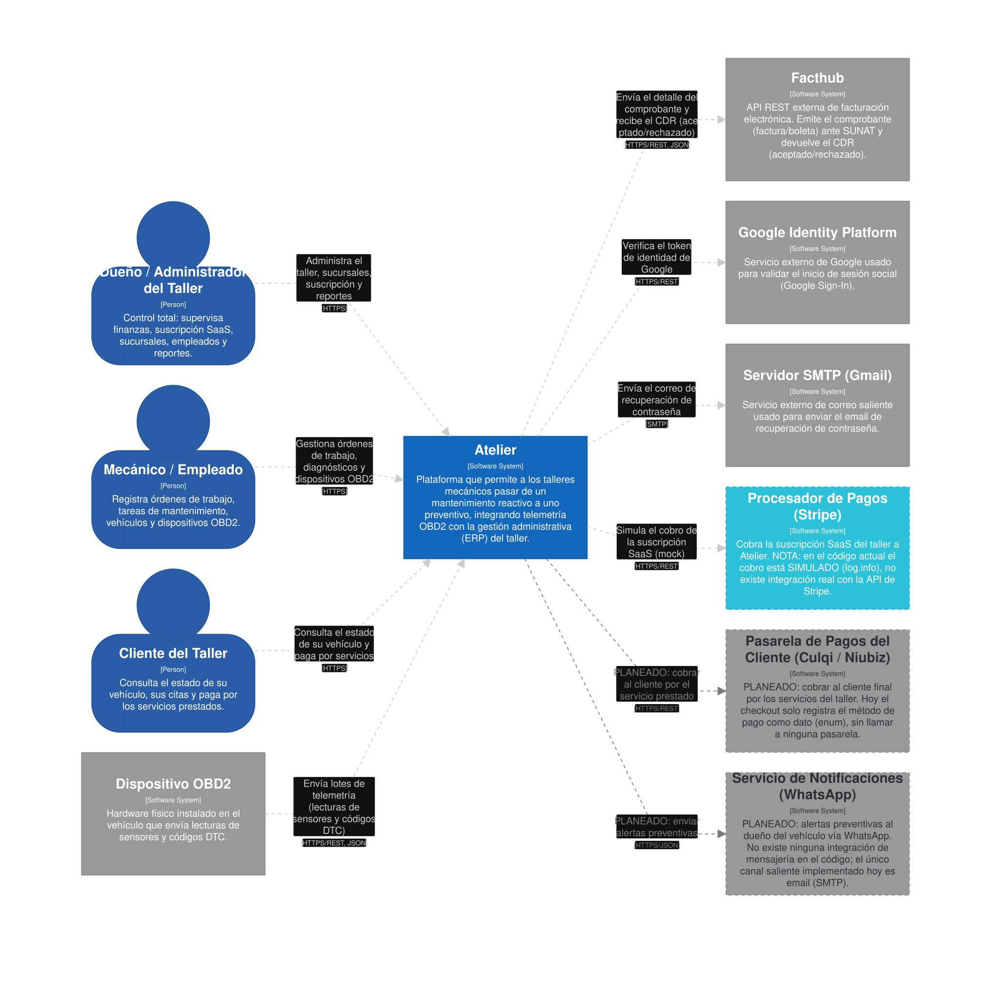

### 4.6.3.&emsp;&emsp;*Software Architecture Container Diagrams* {#cap-4-6-3}

&emsp;&emsp;&emsp;&emsp;El diagrama de contenedores confirma que, a la fecha, **atelier** se despliega como tres contenedores reales:

&emsp;&emsp;&emsp;&emsp;**a) Web Application:** SPA construida en **Angular 21** (Angular Material, PrimeNG, Chart.js/ng2-charts), desplegada en Vercel. Es la **única** aplicación cliente que existe en el código entregado: sirve tanto al Dueño/Administrador como al Mecánico/Empleado y al Cliente, adaptando las vistas según el rol autenticado.

&emsp;&emsp;&emsp;&emsp;**b) Core Backend API:** monolito modular en **Java 21 / Spring Boot 4**, desplegado en Render, que expone toda la lógica de negocio vía REST (`/api/v1/...`) organizada en ocho Bounded Contexts (DDD): `iam`, `core`, `fleet`, `iot`, `operations`, `inventory`, `billing` y `shared`. No existen microservicios independientes: toda la plataforma corre en un único proceso.

&emsp;&emsp;&emsp;&emsp;**c) Database:** base de datos relacional **PostgreSQL** (no MySQL, como indicaba la versión anterior de este documento), con `hibernate.dialect=PostgreSQLDialect` confirmado en la configuración. No existe una base de datos especializada en series de tiempo: las lecturas de telemetría OBD2 se almacenan en la misma base relacional, dentro del Bounded Context `iot`.

&emsp;&emsp;&emsp;&emsp;Los tres contenedores adicionales que figuraban en la versión anterior del documento — Mobile App, Message Broker y Async Worker Service — no tienen código ni repositorio en el material entregado. Se conservan en el diagrama actualizado, pero marcados visualmente como Planeado(borde punteado), ya que corresponden a trabajo que el equipo aún tiene pendiente de implementar.

**Figura 63**

*Software Architecture Container Diagram*

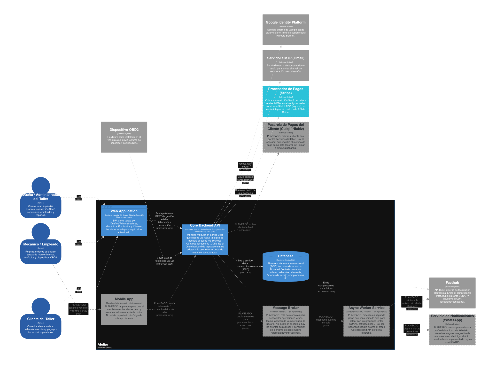

### 4.6.4.&emsp;&emsp;*Software Architecture Components Diagrams* {#cap-4-6-4}

&emsp;&emsp;&emsp;&emsp;El diagrama de componentes descompone el **Core Backend API** —el único contenedor de backend que existe hoy— en sus componentes reales, agrupados por Bounded Context, siguiendo el mismo patrón de capas (`interfaces.rest` → `application` → `domain`/`infrastructure.persistence`) en los ocho módulos:

&emsp;&emsp;&emsp;&emsp;**a) IAM:** `AuthenticationController` y `UsersController` exponen login, login con Google y recuperación de contraseña; delegan en los servicios de aplicación, que a su vez usan un `JWT Token Service`, un `Password Hashing Service` (BCrypt) y un `SmtpEmailService` (adaptador de salida hacia el servidor SMTP).

&emsp;&emsp;&emsp;&emsp;**b) Core:** `WorkshopsController`, `BranchesController`, `OwnersController`, `EmployeesController`, `CustomersController` y `ProfilesController` gestionan la multi-tenencia; el `SubscriptionCommandService` administra el plan de suscripción de cada sucursal y **simula** el cobro con tarjeta (Stripe mockeado).

&emsp;&emsp;&emsp;&emsp;**c) Fleet:** `AppointmentsController` junto con los controladores de auto-registro de clientes y empleados.

&emsp;&emsp;&emsp;&emsp;**d) IoT:** `TelemetryBatchesController` ingesta los lotes OBD2; `Obd2DevicesController`, `Obd2DeviceRegistrationsController`, `VehiclesController` y `CustomerVehiclesController` administran dispositivos y vehículos.

&emsp;&emsp;&emsp;&emsp;**e) Operations:** `WorkOrdersController`, `WorkOrderTasksController` y `ServicesController` gestionan el ciclo de vida de la Orden de Trabajo. El `WorkOrderPaymentListener` escucha el evento de integración `PaymentProcessedEvent` (publicado en el mismo proceso, vía `ApplicationEventPublisher` de Spring — **no** a través de una cola de mensajes) para marcar la orden como pagada.

&emsp;&emsp;&emsp;&emsp;**f) Inventory:** `ProductsController` administra el stock de repuestos.

&emsp;&emsp;&emsp;&emsp;**g) Billing:** `QuotesController`, `VouchersController` y `CheckoutsController` orquestan la cotización y el cobro; `FacthubGatewayImpl` es el adaptador anti-corrupción (ACL) que llama de forma **síncrona** a la API REST de Facthub para emitir el comprobante; `VoucherPaidListener` traduce el evento de dominio `VoucherPaidEvent` en el evento de integración `PaymentProcessedEvent` consumido por Operations.

&emsp;&emsp;&emsp;&emsp;**h) Shared:** un conjunto de `Spring Data JPA Repositories` centraliza el acceso ORM a PostgreSQL para los ocho Bounded Contexts.

**Figura 64**

*Component Diagram: Core Backend API*

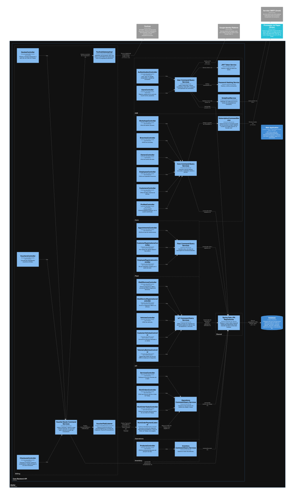

    Dentro del componente **Fleet**, los controladores `AppointmentsController`, `CustomerRegistrationsController` y `EmployeeRegistrationsController` exponen endpoints RESTful para consultar, crear, actualizar y eliminar registros relacionados con citas, clientes registrados y empleados registrados. La lógica de negocio no se concentra en los controladores, sino en servicios de aplicación separados en command services y query services. Estos servicios orquestan los casos de uso y delegan las reglas principales a los agregados del dominio. Finalmente, la infraestructura implementa repositorios y adaptadores JPA para persistir la información en PostgreSQL, manteniendo la separación entre interfaces, aplicación, dominio e infraestructura.

&emsp;&emsp;&emsp;&emsp;Los diagramas de componentes de **Single-Page Application**, **Mobile App** y **Async Worker Service** que figuraban en la versión anterior de este documento se retiraron de esta sección: el primero corresponde a un solo contenedor (Web Application) ya cubierto a nivel de contenedor en 4.6.3, y los otros dos pertenecen a contenedores aún no implementados, por lo que no existe código del cual derivar sus componentes internos todavía.

**Figura 65**

*Component Diagram: Single-Page Application*

&emsp;&emsp;&emsp;&emsp;**c) Mobile App:** Detalla los componentes internos de la aplicación Android (Kotlin) utilizada por los mecánicos a pie de motor. Destaca la gestión de diagnósticos vehiculares, el empaquetado y envío de telemetría OBD2 en lotes, y la recepción de notificaciones push.

**Figura 66**

*Component Diagram: Mobile App*

&emsp;&emsp;&emsp;&emsp;**d) Async Worker Service:** Ilustra el procesador de tareas asíncronas y pesadas. Escucha eventos desde la cola de mensajes (RabbitMQ) y orquesta la comunicación con sistemas externos como la validación tributaria (SUNAT / PSE) y el envío de alertas preventivas (WhatsApp), evitando bloqueos en la experiencia del usuario final.

**Figura 67**

*Component Diagram: Async Worker Service*

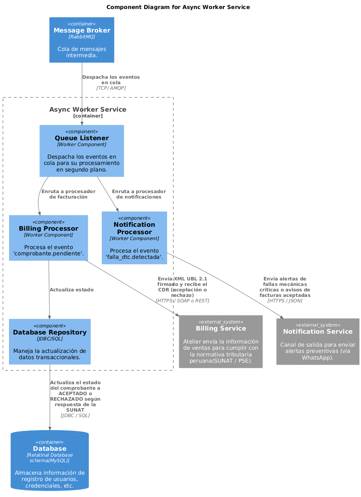