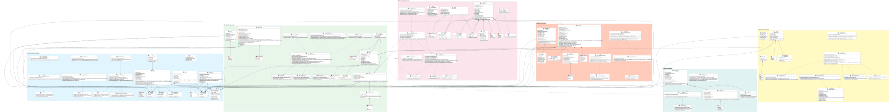
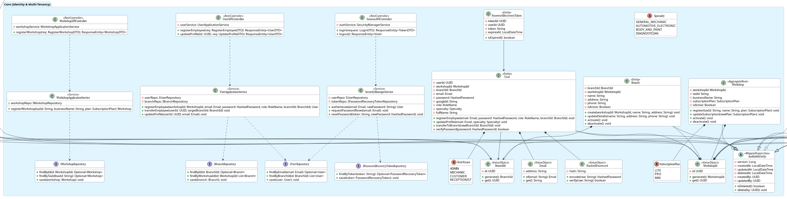
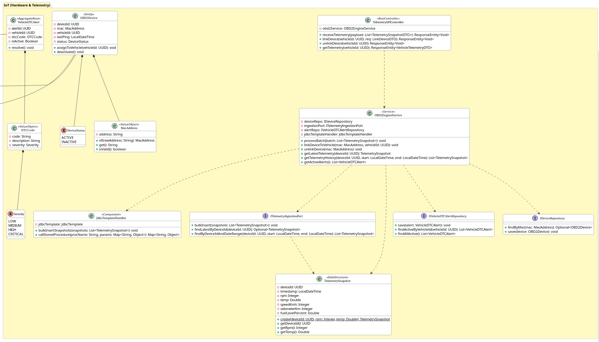
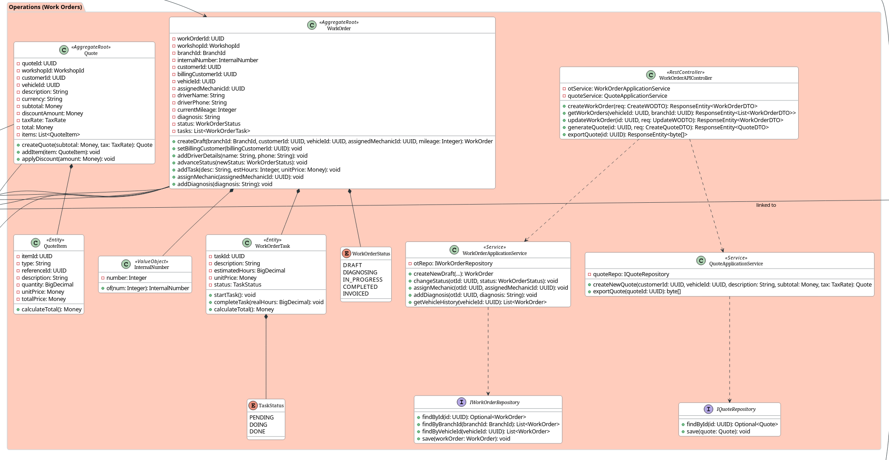
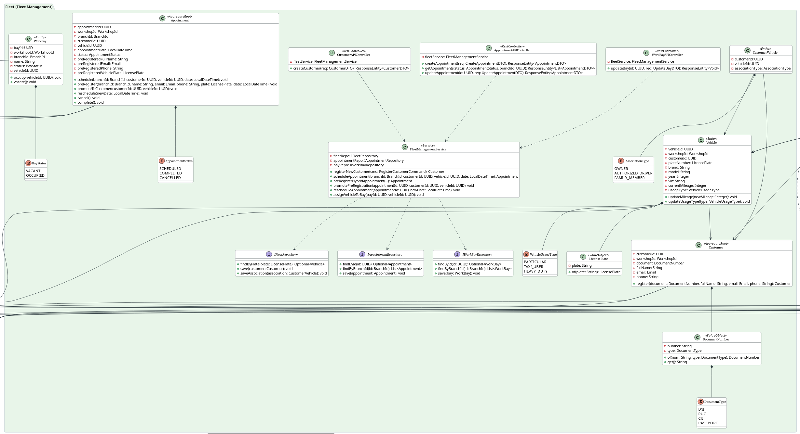
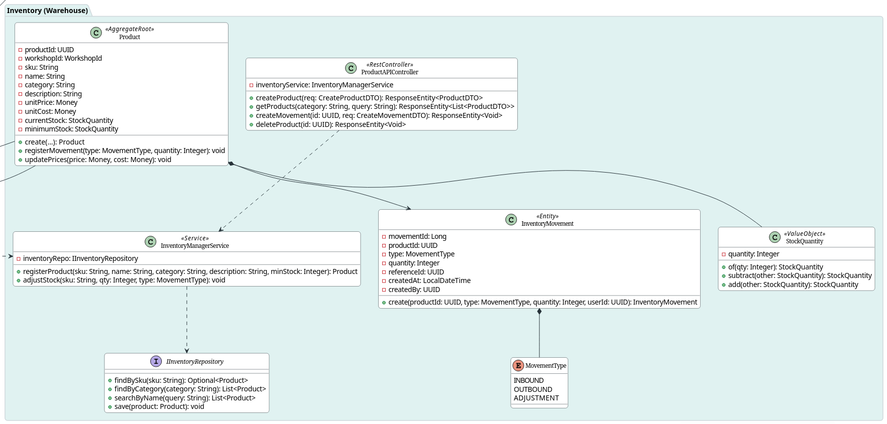
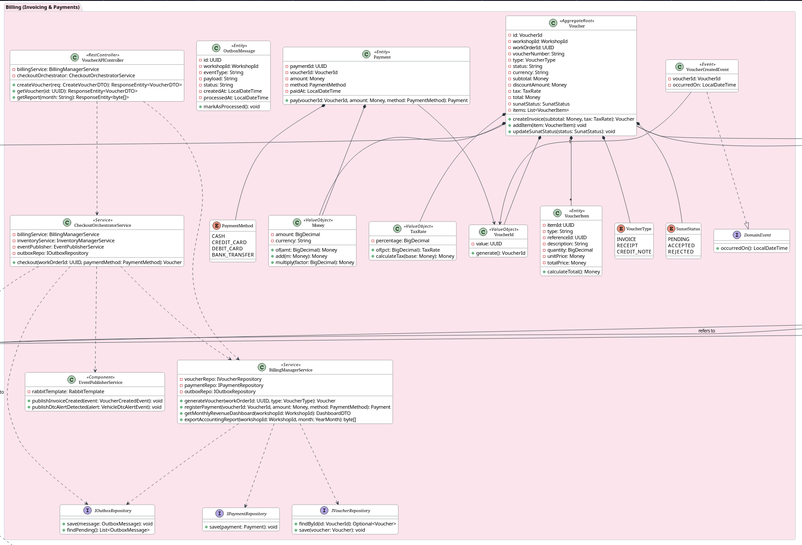

## 4.7. Software Object-Oriented Design {#cap-4-7}

&emsp;&emsp;&emsp;&emsp;En esta sección se presentan y explican los Diagramas de Clases UML para el Backend (Web Service) del sistema **atelier**, dividiéndolo por *Bounded Contexts* de acuerdo con el enfoque *Domain-Driven Design* (DDD). Cada diagrama detalla las clases, interfaces, enumeraciones y sus relaciones, incluyendo los miembros para cada clase (atributos, métodos) y el *scope* en cada caso (private, public, protected), así como la calificación, dirección y multiplicidad de las relaciones.

### 4.7.1.&emsp;&emsp;Class Diagrams {#cap-4-7-1}

&emsp;&emsp;&emsp;&emsp;A continuación se presenta el diagrama de clases general del *Web Service* (Backend), abarcando la totalidad de la aplicación. Posteriormente, el diseño se desglosa y detalla según cada *Bounded Context*.

**Figura 68**

*Class Diagram*

**Bounded Context: Core (Identity and Multi-Tenancy)**

&emsp;&emsp;&emsp;&emsp;El siguiente diagrama detalla la estructura orientada a objetos para la gestión de usuarios, roles, talleres y suscripciones, garantizando el esquema *multi-tenant* de la plataforma.

**Figura 69**

*Class Diagram - Core (Identity and Multi-Tenancy)*

**Bounded Context: IoT (Hardware y Telemetría)**

&emsp;&emsp;&emsp;&emsp;En este diagrama se exponen los componentes encargados de la ingesta, procesamiento y gestión de la telemetría generada por los dispositivos OBD2 instalados en los vehículos.

**Figura 70**

*Class Diagram - IoT (Hardware and Telemetry)*

**Bounded Context: Operations (Work Orders)**

&emsp;&emsp;&emsp;&emsp;El diagrama ilustra el modelo de dominio central para la operación de los talleres, focalizándose en el ciclo de vida de las órdenes de trabajo y las tareas mecánicas asignadas.

**Figura 71**

*Class Diagram - Operations (Work Orders)*

**Bounded Context: Fleet (Fleet Management)**

&emsp;&emsp;&emsp;&emsp;Este modelo describe la estructura requerida para administrar la cartera de clientes de cada taller y la gestión del registro de los vehículos de sus flotas respectivas.

**Figura 72**

*Class Diagram - Fleet (Fleet Management)*

**Bounded Context: Inventory (Warehouse)**

&emsp;&emsp;&emsp;&emsp;El diagrama de clases presenta la gestión del catálogo de productos, repuestos e insumos, así como el control transaccional del stock en los almacenes del taller.

**Figura 73**

*Class Diagram - Inventory (Warehouse)*

**Bounded Context: Billing (Invoicing and Payments)**

&emsp;&emsp;&emsp;&emsp;Finalmente, este diagrama detalla los componentes relacionados con la facturación, el desglose de los montos de servicio y la gestión de estados financieros y tributarios.

**Figura 74**

*Class Diagram - Billing (Invoicing and Payments)*

