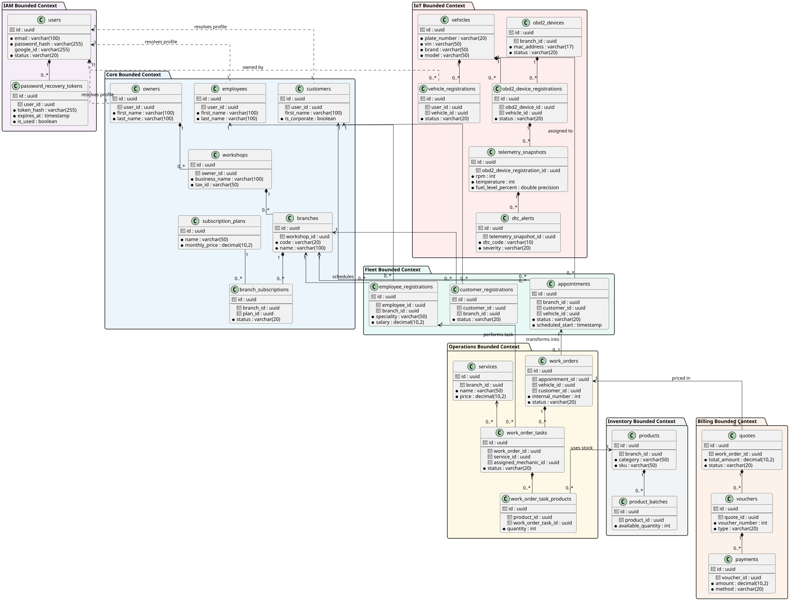
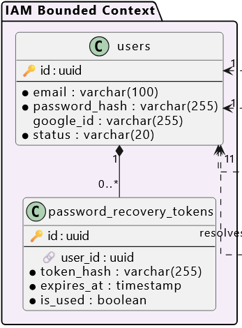
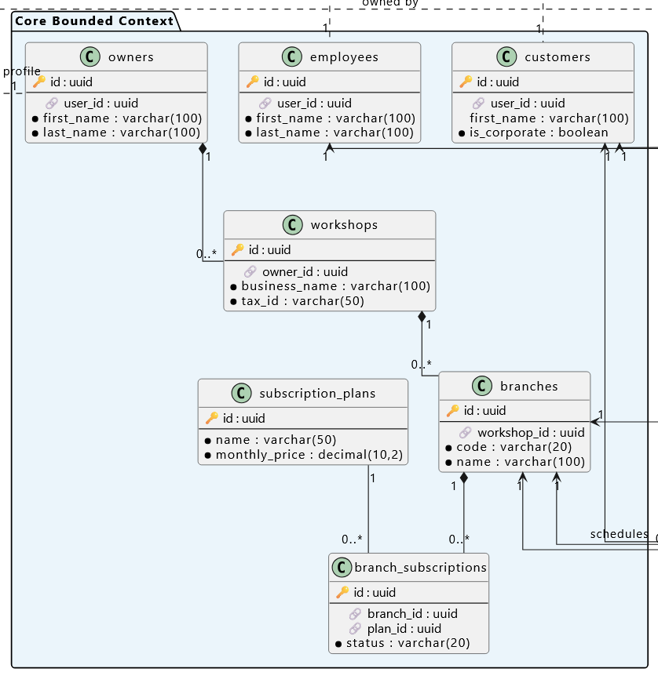
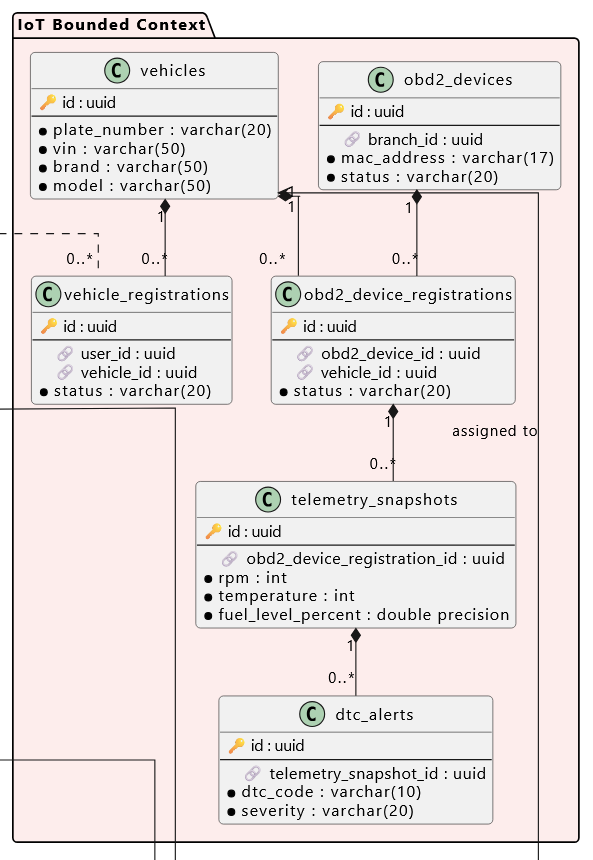
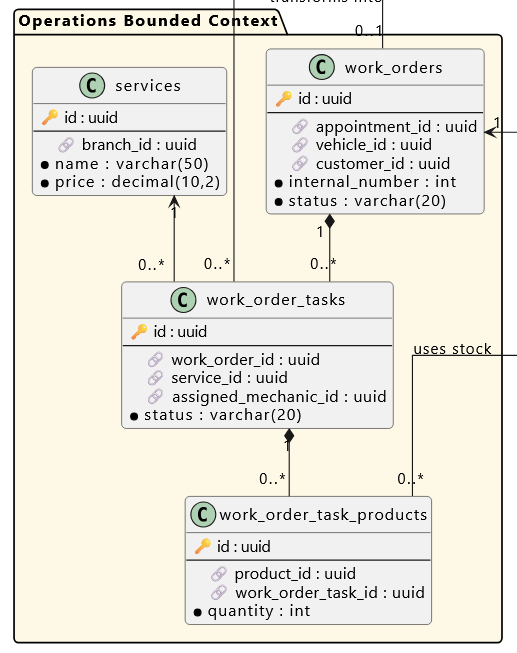
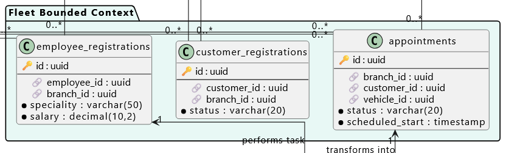
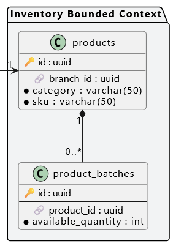
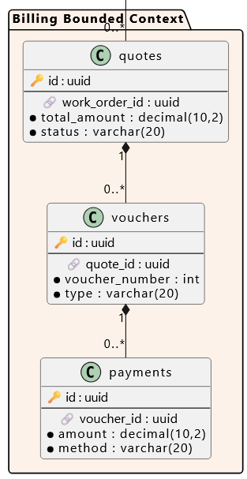

## 4.8. Database Design {#cap-4-8}

&emsp;&emsp;&emsp;&emsp;En esta sección se presentan y explican los diagramas de base de datos para cada Bounded Context de la plataforma atelier. Estos diagramas ilustran la estructura de persistencia de datos, resumiendo las principales características consideradas en el diseño e identificando los objetos de base de datos necesarios para cada módulo.

### 4.8.1.&emsp;&emsp;Database Diagrams {#cap-4-8-1}

&emsp;&emsp;&emsp;&emsp;A continuación se presenta el diagrama de base de datos general, abarcando la totalidad de la aplicación. Posteriormente, el diseño se desglosa y detalla según cada Bounded Context.

**Figura 75**

*Database Diagram*

&emsp;&emsp;&emsp;&emsp;A continuación, se detallan los diagramas de base de datos relacional para cada Bounded Context. Cada diagrama especifica los objetos que permitirán la persistencia de la información, evidenciando las tablas, columnas, restricciones y las relaciones entre tablas.

**Bounded Context: IAM**

&emsp;&emsp;&emsp;&emsp;El siguiente diagrama detalla la estructura de tablas para el control de acceso y manejo de los usuarios.

**Figura 76**

*Database Diagram - IAM*

**Bounded Context: Core**

&emsp;&emsp;&emsp;&emsp;El siguiente diagrama detalla la estructura de tablas para la gestión de usuarios, roles, talleres y suscripciones, estableciendo las bases para el esquema *multi-tenant* de la plataforma.

**Figura 76**

*Database Diagram - Core*

**Bounded Context: IoT**

&emsp;&emsp;&emsp;&emsp;En este diagrama se exponen las tablas encargadas de almacenar la configuración de dispositivos y los registros de telemetría provenientes de los escáneres OBD2.

**Figura 77**

*Database Diagram - IoT*

**Bounded Context: Operations**

&emsp;&emsp;&emsp;&emsp;El diagrama ilustra el esquema de base de datos para la operación de los talleres, estructurando la persistencia de las órdenes de trabajo, citas y tareas mecánicas.

**Figura 78**

*Database Diagram - Operations*

**Bounded Context: Fleet**

&emsp;&emsp;&emsp;&emsp;Este modelo describe las tablas requeridas para administrar el registro de clientes y los vehículos de sus flotas respectivas, asociados a cada taller.

**Figura 79**

*Database Diagram - Fleet*

**Bounded Context: Inventory**

&emsp;&emsp;&emsp;&emsp;El diagrama presenta la estructura relacional para la gestión del catálogo de repuestos, productos e insumos, controlando el stock y movimientos en los almacenes.

**Figura 80**

*Database Diagram - Inventory*

**Bounded Context: Billing**

&emsp;&emsp;&emsp;&emsp;Finalmente, este diagrama detalla las tablas relacionadas con la facturación, los pagos, impuestos y el registro de comprobantes financieros de los servicios realizados.

**Figura 81**

*Database Diagram - Billing (Invoicing and Payments)*

