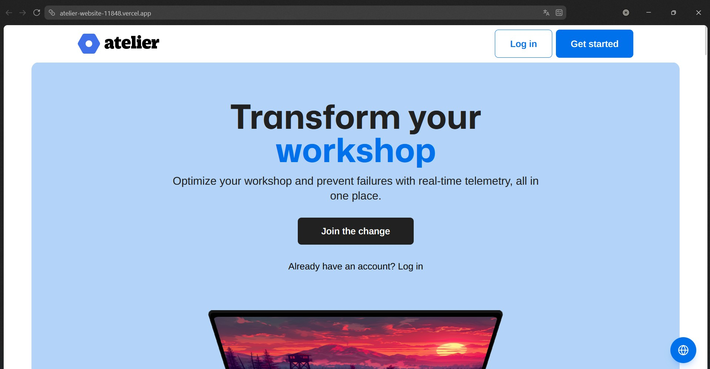

# Capítulo V: Product Implementation, Validation & Deployment {#cap-5}

## 5.1. Software Configuration Management {#cap-5-1}

### 5.1.1.&emsp;&emsp;*Software Development Environment Configuration* {#cap-5-1-1}

&emsp;&emsp;&emsp;&emsp;En esta sección se detallan las herramientas y entornos tecnológicos seleccionados para gestionar cada fase del ciclo de vida de desarrollo de los productos de software que conforman el proyecto.

**Project Management**

&emsp;&emsp;&emsp;&emsp;Para la coordinación del equipo, el seguimiento de avances y la resolución de problemas, se establecieron reuniones periódicas a través de Discord. Asimismo, la documentación del proyecto se centralizó utilizando el formato Markdown y se alojó en un repositorio de GitHub para llevar un estricto control de versiones para usar la herramienta Pandoc para poder convertir los archivos Markdown aún solo documento PDF.

**Requirements Management**

&emsp;&emsp;&emsp;&emsp;La administración de los requisitos, incluyendo el Product Backlog, Sprint Backlog, User Stories, Technical Stories, entre otros, se gestionó mediante Trello. Esta plataforma permitió estructurar el flujo de trabajo en tableros visuales interactivos.

**Product UX/UI Design**

&emsp;&emsp;&emsp;&emsp;Para la investigación y el diseño centrado en el usuario, se empleó un conjunto de herramientas especializadas:

&emsp;&emsp;&emsp;&emsp;UXPressia: Utilizada para construir los User Personas, Impact Maps, User Journey Maps y Empathy Maps, aprovechando sus plantillas profesionales y el uso de métricas.

&emsp;&emsp;&emsp;&emsp;Canva: Seleccionada para diagramar el Lean UX Canvas por su agilidad gráfica y facilidad para exportar documentos colaborativos.

&emsp;&emsp;&emsp;&emsp;Miro: Empleada para Big Picture Event Storming, Ubiquitous Language y Organization Systems. Esta aplicación permite una colaboración en tiempo real entre equipos, ofrece una interfaz visual e intuitiva.

&emsp;&emsp;&emsp;&emsp;Figma: Herramienta principal para el diseño de interfaces, abarcando desde los wireframes hasta la creación del prototipo final interactivo. Esta plataforma permitió simular el comportamiento de la aplicación en distintos dispositivos para validar la experiencia del usuario.

**Software Development**

&emsp;&emsp;&emsp;&emsp;El control del código fuente de todas las aplicaciones se administró colaborativamente mediante GitHub. El desarrollo se dividió en las siguientes áreas:

&emsp;&emsp;&emsp;&emsp;Landing Page y Frontend: Se codificaron utilizando el entorno integrado JetBrains WebStorm. Se implementaron tecnologías base como HTML5, CSS y JavaScript, integrando el framework Angular para la arquitectura de componentes del lado del cliente con el uso de TypeScript.

&emsp;&emsp;&emsp;&emsp;Backend (Web Services): La lógica del servidor y los endpoints se programaron en JetBrains IntelliJ IDEA, utilizando el lenguaje Java y el framework Spring Boot.

&emsp;&emsp;&emsp;&emsp;Base de Datos: El esquema relacional se estructuró y administró con PostgreSQL y se construyó con la herramienta ERD, garantizando la correcta creación y persistencia de los datos vinculados a la API.

**Software Testing**

&emsp;&emsp;&emsp;&emsp;Para asegurar la calidad del producto, se aplicaron distintas estrategias de validación:

&emsp;&emsp;&emsp;&emsp;Landing Page: Se realizaron auditorías visuales y de responsividad utilizando el navegador Google Chrome para confirmar la correcta adaptabilidad del diseño en múltiples pantallas.

&emsp;&emsp;&emsp;&emsp;Frontend: Se implementó una API falsa mediante JSON Server para simular el intercambio de datos y validar la interacción de las interfaces antes de la integración real.

&emsp;&emsp;&emsp;&emsp;Backend: Los endpoints de la API fueron testeados rigurosamente utilizando Swagger UI y Postman. Estas herramientas permitieron simular peticiones HTTP, evaluar los códigos de estado y comprobar que la lógica del servidor respondiera de manera óptima ante diversos escenarios.

**Software Deployment**

&emsp;&emsp;&emsp;&emsp;La puesta en producción de los distintos módulos se ejecutó utilizando servicios especializados en la nube:

&emsp;&emsp;&emsp;&emsp;Landing Page: Fue alojada en Vecel, Esta plataforma ofrece un entorno optimizado para frameworks de frontend modernos, permitiendo una integración fluida de despliegue continuo desde GitHub.

&emsp;&emsp;&emsp;&emsp;Frontend: Para el despliegue de la aplicación web, se ha seleccionado Vercel. Su infraestructura garantiza tiempos de carga mínimos y una alta disponibilidad para que los administradores de los talleres accedan al sistema sin interrupciones.

&emsp;&emsp;&emsp;&emsp;Backend: La API fue desplegada en Render, una plataforma en la nube que automatiza el alojamiento de servicios web, garantizando la disponibilidad pública e ininterrumpida de la aplicación.

&emsp;&emsp;&emsp;&emsp;Base de Datos: Para el despliegue de la base de datos relacional conectada al backend, se recurrió a Aiven, facilitando el alojamiento remoto y gratuito de la información.

### 5.1.2.&emsp;&emsp;*Source Code Management* {#cap-5-1-2}

&emsp;&emsp;&emsp;&emsp;En esta sección se detallan los mecanismos y esquemas organizativos adoptados para administrar de forma eficiente los archivos de código del proyecto atelier, integrando los componentes de la Landing Page, los Web Services y las aplicaciones Frontend. Para el almacenamiento y gestión centralizada de estos recursos, se utiliza la plataforma GitHub, implementando el modelo de trabajo GitFlow. Esto facilita la colaboración paralela de los miembros del equipo de desarrollo mediante el uso de ramas especializadas, asegurando un control de versiones riguroso y una evolución estable del software.

**Repositorios**

&emsp;&emsp;&emsp;&emsp;A continuación, se detallan los enlaces a los repositorios oficiales donde se aloja el ecosistema digital de atelier.

&emsp;&emsp;&emsp;&emsp;Landing Page: [https://github.com/andeva-upc/atelier-website-open-source](https://github.com/andeva-upc/atelier-website-open-source)

&emsp;&emsp;&emsp;&emsp;Webapp: [https://github.com/andeva-upc/atelier-webapp-open-source](https://github.com/andeva-upc/atelier-webapp-open-source)

&emsp;&emsp;&emsp;&emsp;Platform: [https://github.com/andeva-upc/atelier-platform](https://github.com/andeva-upc/atelier-platform)

**GitFlow**

&emsp;&emsp;&emsp;&emsp;El uso de GitFlow permite al equipo de desarrollo gestionar el ciclo de vida del producto de manera ordenada, optimizando la integración de nuevas características y la corrección de errores dentro de un entorno colaborativo.

**Main Branches**

&emsp;&emsp;&emsp;&emsp;Main Branch: Constituye la rama principal y predeterminada del repositorio, representando el historial de versiones estables y el código que se encuentra actualmente en producción.

&emsp;&emsp;&emsp;&emsp;Develop Branch: Actúa como la rama de integración principal, donde se bifurca el código para definir nuevos rumbos operativos y evaluar la evolución de las funciones antes de su lanzamiento final.

**Supporting Branches**

&emsp;&emsp;&emsp;&emsp;Feature Branch: Ramas específicas destinadas a la incorporación de nuevas funciones del ERP o módulos de telemetría, permitiendo que varios colaboradores trabajen simultáneamente en características aisladas sin afectar la rama de desarrollo principal.

&emsp;&emsp;&emsp;&emsp;Release Branch: Versiones de código utilizadas para iniciar nuevos ciclos de lanzamiento, permitiendo realizar correcciones finales y ajustes de versión antes de fusionar los cambios en la rama principal.

&emsp;&emsp;&emsp;&emsp;Fix Branch: Ramas de mantenimiento dedicadas a la corrección de errores detectados en alguna sección del producto de software en producción.

**Release Versioning Conventions**

&emsp;&emsp;&emsp;&emsp;Para la nomenclatura de las versiones de Atelier, se aplica el estándar Semantic Versioning, el cual describe el impacto de los cambios mediante tres identificadores numéricos:

&emsp;&emsp;&emsp;&emsp;Número principal (Major): Se incrementa ante cambios estructurales y significativos que rompen la compatibilidad con versiones previas.

&emsp;&emsp;&emsp;&emsp;Número secundario (Minor): Se incrementa al añadir nuevas funcionalidades o realizar mejoras funcionales de forma retrocompatible.

&emsp;&emsp;&emsp;&emsp;Número terciario (Patch): Se incrementa al aplicar parches para la corrección de errores específicos o bugs visuales.

**Commits Conventions**

&emsp;&emsp;&emsp;&emsp;Los mensajes de confirmación o 'commits' en Git siguen el estándar de Conventional Commits, garantizando que el historial de cambios sea comprensible para todos los miembros de la organización. La estructura definida incluye:

&emsp;&emsp;&emsp;&emsp;Type: Define la categoría del cambio aplicado.

&emsp;&emsp;&emsp;&emsp;Description: Breve resumen descriptivo del cambio realizado.

&emsp;&emsp;&emsp;&emsp;Body: Explicación técnica detallada sobre el impacto y los cambios aplicados al proyecto.

### 5.1.3.&emsp;&emsp;*Source Code Style Guide & Conventions* {#cap-5-1-3}

&emsp;&emsp;&emsp;&emsp;En esta sección, se definen las referencias normativas que se adoptaron para establecer las estrategias de nomenclatura, estructuración y formato de los elementos de programación en los lenguajes y frameworks que componen la solución tecnológica de atelier. Como regla transversal para garantizar la mantenibilidad y el estándar internacional del código, toda la nomenclatura de archivos, variables, clases, métodos y secciones se redactará estrictamente en idioma inglés.

**Nomenclatura en HTML**

&emsp;&emsp;&emsp;&emsp;Para la estructuración semántica del proyecto, se utilizará como referencia el artículo "HTML Style Guide and Coding Conventions" ([https://www.w3schools.com/html/html5_syntax.asp](https://www.w3schools.com/html/html5_syntax.asp)). Este documento contiene directrices esenciales sobre la sintaxis correcta en HTML5, incluyendo el uso adecuado de minúsculas para las etiquetas, el cierre de elementos y la organización del árbol del documento. Se aplicará esta normativa en la construcción de las vistas de la Landing Page estática y las plantillas base de las aplicaciones web de Atelier.

**Nomenclatura en CSS**

&emsp;&emsp;&emsp;&emsp;Para la codificación de las hojas de estilo en cascada, se adoptarán los lineamientos de la "Google HTML/CSS Style Guide" ([https://google.github.io/styleguide/htmlcssguide.html](https://google.github.io/styleguide/htmlcssguide.html)). Este artículo proporciona reglas estrictas sobre el formato, la capitalización en códigos de color (uso de minúsculas para hexadecimales), la estructuración de selectores y la organización de reglas para evitar redundancias. Se implementará en la definición del sistema de diseño tanto para la Landing Page como para los estilos globales de la plataforma web de atelier.

**Nomenclatura en TypeScript**

&emsp;&emsp;&emsp;&emsp;Para la programación orientada a objetos en el lado del cliente, se aplicará la "Google TypeScript Style Guide"([https://google.github.io/styleguide/tsguide.html](https://google.github.io/styleguide/tsguide.html)). Esta guía establece convenciones rigurosas sobre el tipado estático, la declaración de interfaces, el uso de decoradores y la nomenclatura en CamelCase o PascalCase según corresponda.

**Nomenclatura en Angular**

&emsp;&emsp;&emsp;&emsp;Para el entorno de desarrollo basado en Angular, se seguirá la "Angular Coding Style Guide" ([https://angular.dev/style-guide](https://angular.dev/style-guide)). Su objetivo principal es promover un código consistente, legible y fácilmente testeable, definiendo estándares para la creación de componentes, directivas, pipes y servicios.

**Nomenclatura en Java**

&emsp;&emsp;&emsp;&emsp;Para la lógica del servidor, se aplicará la "Google Java Style Guide" ([https://google.github.io/styleguide/javaguide.html](https://google.github.io/styleguide/javaguide.html)). Esta normativa establece las convenciones de codificación que Google exige para Java, abarcando desde la indentación, el manejo de excepciones, hasta la declaración de paquetes e importaciones, promoviendo un código robusto a nivel empresarial.

**Nomenclatura en Spring Boot**

&emsp;&emsp;&emsp;&emsp;Para la arquitectura del framework backend, se tomará como referencia la documentación oficial de "Spring Boot Features" ([https://docs.spring.io/spring-boot/reference/features/index.html](https://docs.spring.io/spring-boot/reference/features/index.html)). Este recurso es vital para comprender la inyección de dependencias, la modularidad, la configuración automática y las mejores prácticas para estructurar controladores, servicios y repositorios.

**Nomenclatura para RESTful API**

&emsp;&emsp;&emsp;&emsp;Para la definición de las rutas de comunicación entre el frontend y el backend, se adoptarán las normativas del artículo "REST API URI Naming Conventions and Best Practices" ([https://restfulapi.net/resource-naming/](https://restfulapi.net/resource-naming/)). Esta guía detalla el uso correcto de sustantivos en plural para los recursos, el uso de guiones medios para separar palabras y la correcta implementación de los verbos HTTP.

**Nomenclatura en MySQL**

&emsp;&emsp;&emsp;&emsp;Para el diseño del esquema de la base de datos relacional, se utilizará el artículo "MySQL Naming Conventions" ([https://medium.com/@centizennationwide/mysql-naming-conventions-e3a6f6219efe](https://medium.com/@centizennationwide/mysql-naming-conventions-e3a6f6219efe)). Esta referencia establece lineamientos claros para el nombrado de tablas, llaves primarias, claves foráneas y restricciones, asegurando integridad y legibilidad en las consultas SQL.

### 5.1.4.&emsp;&emsp;*Software Deployment Configuration* {#cap-5-1-4}

**Landing Page**

&emsp;&emsp;&emsp;&emsp;A continuación, se presentan la configuración para realizar el despliegue de la landing page de atelier.

&emsp;&emsp;&emsp;&emsp;Paso 1: Ubicados en el repositorio con el codigo fuente de la landing page de atelier, nos preparamos y verificamos que los archivos ubicados en la rama main esten correctos.

**Figura 81**

*Repositorio del website de atelier*

&emsp;&emsp;&emsp;&emsp;Paso 2: Una vez ubicados en la seccion de proyectos de Vercel, hacemos click en "Add New...".

**Figura 82**

*Captura de pantalla de la seccion de proyectos de Vercel*

&emsp;&emsp;&emsp;&emsp;Paso 3: Seleccionamos el repositorio que aloja el codigo fuente de la landing page de atelier.

**Figura 83**

*Captura de pantalla de la seccion de despliegue de Vercel*

&emsp;&emsp;&emsp;&emsp;Paso 4: Configuramos el correcto desplegamiento de la landing page.

**Figura 84**

*Captura de pantalla de la configuración de despliegue de Vercel*

&emsp;&emsp;&emsp;&emsp;Paso 5: A través del siguiente link: [https://atelier-website-11848.vercel.app/](https://atelier-website-11848.vercel.app/), comprobamos el correcto despliegue de atelier.

**Figura 85**

*Captura de pantalla del Landing Page de atelier en Vercel*

**Web Application**

&emsp;&emsp;&emsp;&emsp;A continuación, se presentan la configuración para realizar el despliegue de la web application de atelier.

&emsp;&emsp;&emsp;&emsp;Paso 1: Ubicados en el repositorio con el codigo fuente de la web application de atelier, nos preparamos y verificamos que los archivos ubicados en la rama main esten correctos.

**Figura 86**

*Repositorio del web application de atelier*

&emsp;&emsp;&emsp;&emsp;Paso 2: Una vez ubicados en la seccion de proyectos de Vercel, hacemos click en "Add New...".

**Figura 87**

*Captura de pantalla de la seccion de proyectos de Vercel*

&emsp;&emsp;&emsp;&emsp;Paso 3: Seleccionamos el repositorio que aloja el codigo fuente de la web application de atelier.

**Figura 88**

*Captura de pantalla de la seccion de despliegue de Vercel*

&emsp;&emsp;&emsp;&emsp;Paso 4: Configuramos el correcto desplegamiento de la web application de atelier.

**Figura 89**

*Captura de pantalla de la configuración de despliegue de Vercel*

&emsp;&emsp;&emsp;&emsp;Paso 5: A través del siguiente link: [https://atelier-webapp-11848.vercel.app/](https://atelier-webapp-11848.vercel.app/), comprobamos el correcto despliegue de atelier.

**Figura 90**

*Captura de pantalla de la Web Application de atelier en Vercel*

**Platform**

&emsp;&emsp;&emsp;&emsp;A continuación, se presentan la configuración para realizar el despliegue del platform de atelier.

&emsp;&emsp;&emsp;&emsp;Paso 1: Ubicados en el repositorio con el codigo fuente del platform de atelier, nos preparamos y verificamos que los archivos ubicados en la rama main esten correctos.

**Figura 91**

*Repositorio del platform de atelier*

&emsp;&emsp;&emsp;&emsp;Paso 2: Una vez ubicados en el dashboard de Render, hacemos click en "New Web Service".

**Figura 92**

*Captura de pantalla del dashboard de Render*

&emsp;&emsp;&emsp;&emsp;Paso 3: Colocamos el url del repositorio que aloja el codigo fuente del platform de atelier.

**Figura 93**

*Captura de pantalla de la seccion de configuración de Render*

&emsp;&emsp;&emsp;&emsp;Paso 4: Configuramos el correcto desplegamiento del platform de atelier.

**Figura 94**

*Captura de pantalla de la configuración de despliegue de Render*

&emsp;&emsp;&emsp;&emsp;Paso 5: A través del siguiente link: [https://atelier-platform.onrender.com/swagger-ui/index.html](https://atelier-platform.onrender.com/swagger-ui/index.html), comprobamos el correcto despliegue del backend atelier.

**Figura 95**

*Captura de pantalla de confirmación atelier en Render*

