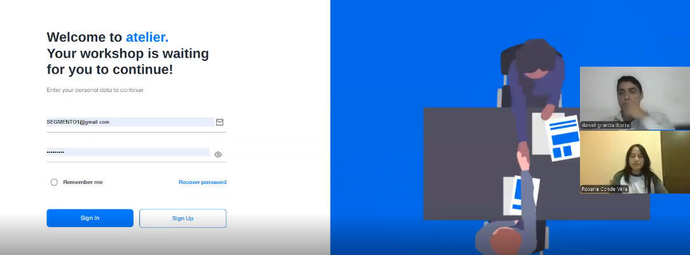
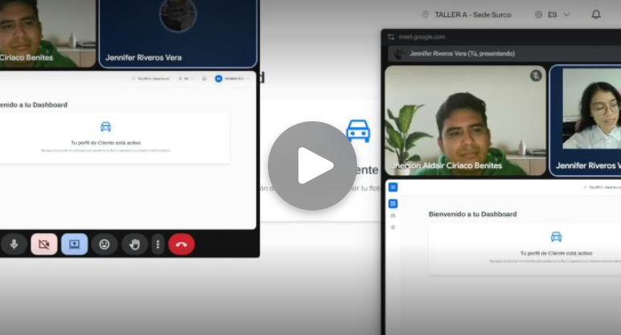
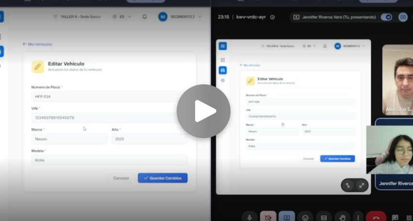
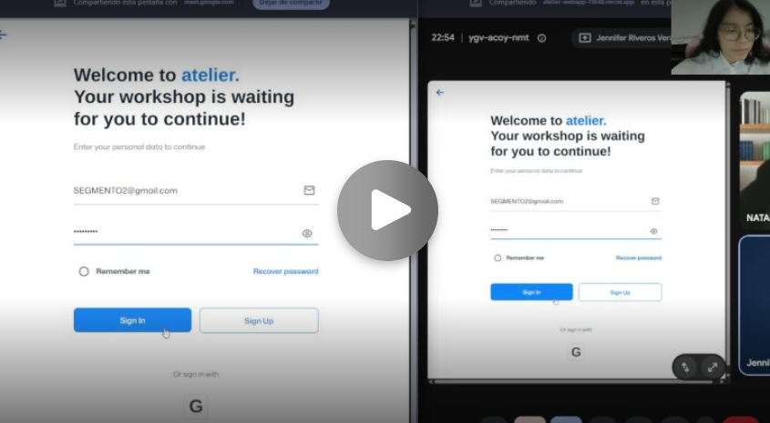

## 5.3. Validation Interviews {#cap-5-3}

### 5.3.1.&emsp;&emsp;*Diseño de Entrevistas* {#cap-5-3-1}

**Segmento Objetivo 1: Dueños o administradores de talleres automotrices independientes en Lima**

- Landing Page

- Webapp

**Segmento Objetivo 2: Conductores de vehículos de Lima**

- Landing Page

- Webapp

**Flujos a Desarrollar:**

| User Goal | Descripción del Flujo                                                                                                 | Objetivo de Validación                                                   |
| ------------- | ------------------------------------------------------------------------------------------------------------------------- | ---------------------------------------------------------------------------- |
| **UG 2**      | En este flujo se detalla el proceso para que el dueño del taller consulte los antecedentes técnicos de un vehículo específico. El usuario accede a la sección de Gestión de Vehículos o al buscador global, donde ingresa el número de placa o bastidor para localizar la unidad. Una vez seleccionado el vehículo, el sistema despliega el Historial de Órdenes de Trabajo, permitiendo visualizar de forma cronológica todas las reparaciones, repuestos instalados y diagnósticos previos realizados en el taller                            | Validar claridad del registro de una work order y las tareas que contiene. |
| **UG 3**      | EEn este flujo se describe el proceso para la administración y control de suministros dentro del taller. El usuario accede al módulo de Inventario, donde puede seleccionar la opción para registrar nuevos repuestos completando los datos técnicos, categoría y cantidad inicial. Asimismo, el sistema permite realizar ajustes manuales de stock para corregir discrepancias o registrar ingresos extraordinarios de mercancía.                                               | Validar el registro de un producto y el lote del producto.                   |
| **UG 4**      | En este flujo se detalla el proceso integral desde la recepción del cliente hasta el registro del ingreso. El usuario con rol de administrador accede al Calendario Interactivo, donde selecciona la fecha y hora disponible para agendar una cita de mantenimiento preventivo, vinculando los datos del vehículo y el cliente.                                             | Confirmar acceso intuitivo para una cita y registrar una work order de esa cita.              |
| **UG 5**      | En este flujo se detalla cuando el usuario inicia en el Control de Citas, donde puede visualizar los servicios en progreso y navegar hacia el Historial de Citas para revisar servicios completados o cancelados. Para programar una nueva atención, el administrador utiliza el formulario de registro, donde selecciona al cliente, ingresa los datos del vehículo (placa y tipo de servicio), y define la fecha y hora en el calendario interactivo | Validar el cobro de una work order.                  |

### 5.3.2.&emsp;&emsp;*Registro de Entrevistas* {#cap-5-3-2}

&emsp;&emsp;&emsp;&emsp;A continuación, se mostrarán los registros de las entrevistas de validación realizadas a nuestros segmentos objetivos. Cada entrevista conforma un cuadro, el cual contiene lo siguiente nombre, edad, provincia y ocupación, captura de pantalla de la entrevista, link de la entrevista: [upc-pre-202610-1asi0729-11848-andeva-validation-sprint-1](https://upcedupe-my.sharepoint.com/:v:/g/personal/u20241e275_upc_edu_pe/IQAy23C_CfwNRaiTkPEI2AHNAfpRihCR0GgeK8RoZ1X1pEQ?nav=eyJyZWZlcnJhbEluZm8iOnsicmVmZXJyYWxBcHAiOiJPbmVEcml2ZUZvckJ1c2luZXNzIiwicmVmZXJyYWxBcHBQbGF0Zm9ybSI6IldlYiIsInJlZmVycmFsTW9kZSI6InZpZXciLCJyZWZlcnJhbFZpZXciOiJNeUZpbGVzTGlua0NvcHkifX0&e=FHRIbg) y resumen de la entrevista.

**Segmento Objetivo 1: Dueños o administradores de talleres automotrices independientes en Lima**

**Tabla 39**

*Entrevista a Roxana Conde Vera*

<table>
	<tbody>
		<tr>
			<td>
<b>Datos del Entrevistado</b>
</td>
			<td rowspan="2"></td>
		</tr>
		<tr>
			<td>Nombre: Roxana Conde Vera 
            Edad: 28 
            Provincia: Lima 
            Ocupación: Asistente de administración 
			Minuto de inicio: 00:00 
			Duración: 9:54min 
            </td>
		</tr>
		<tr>
			<td colspan="2">
<b>Resumen</b>
</td>
		</tr>
		<tr>
			<td colspan="2">Es una administradora de 28 años que gestiona las operaciones diarias de un taller automotriz, encargándose de la recepción de clientes, la elaboración de presupuestos y la asignación de órdenes de trabajo a los mecánicos. Valora mucho la organización y la optimización del tiempo para evitar cuellos de botella y asegurar que las entregas se cumplan en los plazos acordados. Se mantiene en constante comunicación con los proveedores de repuestos para garantizar el abastecimiento del inventario sin generar sobrecostos. Reconoce que depender de registros manuales en papel o en hojas de cálculo aisladas genera desorden y pérdida de información. Desea un aplicativo que funcione como un sistema centralizado donde pueda registrar rápidamente los ingresos, automatizar la facturación, controlar el stock de piezas y visualizar en tiempo real en qué etapa de reparación se encuentra cada vehículo para informar a los clientes.</td>
		</tr>
	</tbody>
</table>

**Segmento Objetivo 2: Conductores de vehículos de Lima**

**Tabla 40**

*Entrevista a Jheferson Aldair Ciriaco Benite*

<table>
	<tbody>
		<tr>
			<td>
<b>Datos del Entrevistado</b>
</td>
			<td rowspan="2"></td>
		</tr>
		<tr>
			<td>Nombre: Jheferson Aldair Ciriaco Benite 
            Edad: 26 
            Provincia: Lima 
            Ocupación: Conductor y universitario 
			Minuto de inicio: 9:54 
			Duración: 8:20min 
            </td>
		</tr>
		<tr>
			<td colspan="2">
<b>Resumen</b>
</td>
		</tr>
		<tr>
			<td colspan="2">Es un estudiante universitario de 26 años que reside en Pueblo Libre y trabaja como conductor de aplicativo utilizando su propio vehículo, un Toyota Yaris del año 2012. Considera que el prototipo de la aplicación para el registro de vehículos es funcional y cumple con su objetivo principal de manera adecuada. Sin embargo, para agilizar la experiencia del usuario, sugiere implementar opciones de autocompletado o listas desplegables al momento de seleccionar la marca del carro, evitando así el ingreso manual de texto. Además, tiene una visión práctica y recomienda conectar la plataforma con bases de datos públicas o de entidades pertinentes para que la información del vehículo (como modelo y año) se llene automáticamente a partir de la placa. A nivel general, aunque reconoce que se pueden realizar ciertas mejoras estéticas, aprueba el flujo de trabajo actual de la página.</td>
		</tr>
	</tbody>
</table>

**Tabla 41**

*Entrevista a Alex Cruz*

<table>
	<tbody>
		<tr>
			<td>
<b>Datos del Entrevistado</b>
</td>
			<td rowspan="2"></td>
		</tr>
		<tr>
			<td>Nombre: Alex Cruz 
            Edad:  
            Provincia: Lima 
            Ocupación: Estudiante universitario 
			Minuto de inicio: 22:52 
			Duración: 10:50min 
            </td>
		</tr>
		<tr>
			<td colspan="2">
<b>Resumen</b>
</td>
		</tr>
		<tr>
			<td colspan="2">Por un lado, se encuentra un especialista en analítica de datos y TI de 35 años, con más de 15 años de experiencia al volante y propietario de un Nissan Kicks 2023. Desde su visión técnica, señala que el propósito de la aplicación debe ser claro en los primeros segundos de uso, por lo que sugiere implementar un flujo introductorio que explique rápidamente la propuesta de valor. Recomienda orientar la plataforma hacia el mantenimiento preventivo, proponiendo un sistema que haga seguimiento del kilometraje y envíe notificaciones automáticas para derivar al usuario al taller más cercano cuando corresponda su revisión. Además, hace mucho énfasis en la seguridad y privacidad, indicando que es vital incluir un aviso legal (disclaimer) para el tratamiento de datos personales, campos adicionales de contacto (nombre y teléfono) y registrar la fecha exacta de creación del perfil del vehículo para fines de auditoría.</td>
		</tr>
	</tbody>
</table>

**Tabla 42**

*Entrevista a Nataly Rojas Luja*

<table>
	<tbody>
		<tr>
			<td>
<b>Datos del Entrevistado</b>
</td>
			<td rowspan="2"></td>
		</tr>
		<tr>
			<td>Nombre: Nataly Rojas Luja 
            Edad: 28 
            Provincia: Lima 
            Ocupación: Estudiante universitaria y conductora 
			Minuto de inicio: 32:42 
			Duración: 07:15min 
            </td>
		</tr>
		<tr>
			<td colspan="2">
<b>Resumen</b>
</td>
		</tr>
		<tr>
			<td colspan="2">Por otro lado, una estudiante de 28 años que reside en Santa Anita y conduce un Toyota, aportó sugerencias enfocadas en la usabilidad y la estética de la interfaz. Ella propone mejorar el diseño visual integrando más colores y habilitando un espacio para subir una fotografía del vehículo. Para facilitar el uso de la aplicación a nuevos usuarios, recomienda incorporar un instructivo o guía paso a paso a modo de "onboarding" al momento de registrar el automóvil. Finalmente, considera que los datos solicitados actualmente son muy básicos, por lo que desea una sección adicional o de "otros detalles" donde se puedan ingresar características y especificaciones más precisas del vehículo.</td>
		</tr>
	</tbody>
</table>

### 5.3.3.&emsp;&emsp;*Evaluaciones según heurísticas* {#cap-5-3-3}

- App a evaluar: Atelier

- Tareas a Evaluar:

1. Inicio de sesión de un owner.

2. Inicio de sesión de un customer.

3. Registro de una work order, tareas y producto.

4. Agregar una tarea a una work order con los productos.

5. Agendar una cita.

6. Registro de un producto y agregar un lote.

7. Registro de un vehiculo.

8. Visualizar las dtc alerts de un vehiculo.

9. Vincular un dispostivo OBD2 con un vehiculo.

10. Registrar un cliente.

 - ESCALA DE SEVERIDAD:

**Tabla 43**

*Escalas de severidad*

| Nivel | Descripción                                                                                                                                                                                     |
| ----- | ----------------------------------------------------------------------------------------------------------------------------------------------------------------------------------------------- |
| 1     | Problema superficial: puede ser fácilmente superado por el usuario o ocurre con muy poca frecuencia. No necesita ser arreglado a no ser que exista disponibilidad de tiempo.                    |
| 2     | Problema menor: puede ocurrir un poco más frecuentemente o es un poco más difícil de superar para el usuario. Se le debería asignar una prioridad baja resolverlo de cara al siguiente reléase. |
| 3     | Problema mayor: ocurre frecuentemente o los usuarios no son capaces de resolverlo. Es importante que sea corregido y se le debe asignar una prioridad alta.                                     |
| 4     | Problema muy grave: un error de gran impacto que impide al usuario continuar con el uso de la herramienta. Es imperativo que sea corregido antes del lanzamiento.                               |

**Tabla 44**

*Tabla de resumen*

| #   | Problema                                                                                                | Escala de severidad | Heurística/Principio violado                                                        |
| --- | ------------------------------------------------------------------------------------------------------- | ------------------- | ----------------------------------------------------------------------------------- |
| 1   | Falta de retroalimentación inmediata o indicador de carga al registrar un vehículo |        3            | Heurística violada: Usabilidad - Visibilidad del estado del sistema  |
| 2   |        El formulario no cuenta con una lista/autocompletado para seleccionar marca o modelo del vehículo                                      |       3            |         Heurística violada: Usabilidad - Reconocimiento antes que recuerdo.                                            |

- Descripción de problemas

1. Problema #1: Falta de retroalimentación inmediata o indicador de carga al registrar un vehículo

Severidad: 3
Heuristica violada: Usabilidad - Visibilidad del estado del sistema

Problema: Al hacer clic en el botón de registrar un vehículo, el sistema procesa la solicitud en segundo plano pero la interfaz no muestra ningún tipo de animación de carga (spinner) o indicador de que la petición está en curso. Como consecuencia, el usuario asume que el botón no funciona y tiende a presionarlo múltiples veces, lo que puede provocar solicitudes duplicadas o frustración.

Recomendacion: Implementar un spinner de carga o deshabilitar el botón de envío temporalmente con un estado visual que indique "Registrando...", seguido de una notificación toast emergente que confirme el éxito del registro o informe del error. 

2. Problema #2: El formulario no cuenta con una lista/autocompletado para seleccionar marca o modelo del vehículo

Severidad: 3
Heuristica violada: Usabilidad - Visibilidad del estado del sistema

Problema: Durante la entrevista, Jheferson Aldair Ciriaco Benite indicó que, al registrar un vehículo, le gustaría que el sistema muestre una lista de carros o un buscador con autocompletado. Mencionó que debería funcionar de manera similar a cuando se selecciona un país en una lista desplegable: el usuario escribe apenas una letra y el sistema muestra opciones relacionadas. Actualmente, el formulario permite escribir manualmente la marca y el modelo del vehículo, lo que obliga al usuario a recordar el nombre exacto y puede generar errores o inconsistencias al ingresar la información.

Recomendacion: Implementar un campo de autocompletado para la marca y el modelo del vehículo. Por ejemplo, al escribir una letra o parte del nombre, el sistema debería mostrar una lista de opciones disponibles para que el usuario seleccione la alternativa correcta. Esto facilitaría el registro del vehículo, reduciría errores de escritura y haría el flujo más rápido e intuitivo para el conductor.

2. Problema #2: El formulario no cuenta con una lista/autocompletado para seleccionar marca o modelo del vehículo

Severidad: 3
Heuristica violada: Usabilidad - Visibilidad del estado del sistema

Problema: Durante la entrevista, Jheferson Aldair Ciriaco Benite indicó que, al registrar un vehículo, le gustaría que el sistema muestre una lista de carros o un buscador con autocompletado. Mencionó que debería funcionar de manera similar a cuando se selecciona un país en una lista desplegable: el usuario escribe apenas una letra y el sistema muestra opciones relacionadas. Actualmente, el formulario permite escribir manualmente la marca y el modelo del vehículo, lo que obliga al usuario a recordar el nombre exacto y puede generar errores o inconsistencias al ingresar la información.

Recomendacion: Implementar un campo de autocompletado para la marca y el modelo del vehículo. Por ejemplo, al escribir una letra o parte del nombre, el sistema debería mostrar una lista de opciones disponibles para que el usuario seleccione la alternativa correcta. Esto facilitaría el registro del vehículo, reduciría errores de escritura y haría el flujo más rápido e intuitivo para el conductor.

