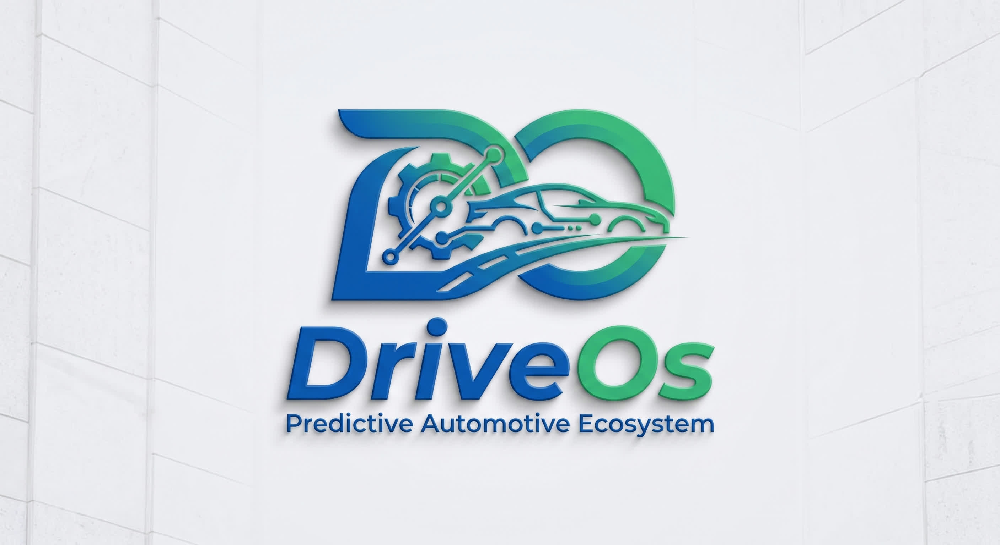

# Capítulo II: Requirements & Analysis

## 2.1. Competidores

En esta sección se identifican, analizan y comparan las principales soluciones existentes en el mercado frente a nuestra propuesta de valor **DriveOS**. Este estudio comparativo permite evaluar las fortalezas, debilidades y modelos operativos de los competidores actuales, con el objetivo de identificar oportunidades estratégicas y ventajas competitivas que permitan resolver eficientemente las necesidades de nuestros segmentos objetivo.

### 2.1.1. Análisis Competitivo

| Competidor | ForkDevs / DriveOS | Mi Taller CRM | OK CAR | Taller GP |
| :--- | :--- | :--- | :--- | :--- |
| **Logo** |  |  |  |  |
| **Overview** | ForkDevs es una startup tecnológica peruana originada en la Universidad Peruana de Ciencias Aplicadas (UPC) en 2026, dedicada a profesionalizar y digitalizar el mantenimiento automotriz mediante datos, transparencia y rentabilidad operativa. Nuestro producto estrella *DriveOS* es un ecosistema digital integral (web + móvil + hardware) diseñado para cambiar el paradigma del mantenimiento vehicular de reactivo a predictivo con SUNAT nativo. | Startup peruana fundada en 2022 en Lima, especializada en digitalizar talleres mecánicos independientes. Resuelve el caos administrativo (papel, Excel, mensajería desordenada) centralizando órdenes de trabajo, inventario y caja en una sola plataforma en la nube. | Startup mexicana fundada en 2019, líder en Latam con presencia en 6 países (México, Colombia, Perú, Chile, Argentina, Ecuador). Digitaliza talleres medianos y grandes, eliminando el papel y centralizando la operación completa (administrativa + comercial). | Empresa española fundada en 2008 en Valencia, con +15 años de trayectoria. ERP robusto para cadenas de talleres y grandes operadores. Resuelve la complejidad administrativa de multi-sucursales con consolidado financiero y control centralizado. |
| **Ventaja Competitiva** | Somos la única solución en Perú que combina un ERP/MRO multi-tenant con *ingesta telemática IoT hardware-agnostic* (compatible con cualquier escáner OBD2) para lectura en tiempo real de PIDs y códigos DTC. Ofrecemos facturación electrónica SUNAT nativa (Régimen MYPE), control de inventario bajo principio FIFO estricto por lote, órdenes móviles con respaldo fotográfico inmutable (Direct-to-Cloud) y control de mano de obra verificado por geocerca perimetral. | Adaptación 100% a la realidad peruana: facturación electrónica SUNAT nativa, alertas ilimitadas de servicio y soporte local en tiempo real (menos de 2h de respuesta). Su curva de aprendizaje es mínima (menos de 15 min de onboarding). | App móvil para clientes finales muy pulida (historial del vehículo, citas, pagos en línea) que genera fidelización. Su módulo de "Proyección de Servicios" usa IA básica para predecir mantenimientos por historial, no por telemetría. | Escalabilidad enterprise: soporta 50+ sucursales con roles granulares, alertas de ITV/mantenimiento preventivo y consultas a la DGT (en España). Certificación de seguridad ISO 27001, algo crítico para cadenas grandes. |
| **Mercado Objetivo** | Talleres multimarca independientes de pequeño y mediano tamaño (1 a 5 elevadores/bahías) en Lima Metropolitana y principales ciudades del Perú, que atienden vehículos particulares y ligeros (modelo 2008+ con puerto OBD2), con facturación entre S/ 8,000 y S/ 40,000 mensuales y que buscan profesionalizar sus operaciones y diferenciarse con diagnóstico telemétrico proactivo. | Talleres multimarca independientes de pequeño y mediano tamaño en Lima Metropolitana (1–5 elevadores), que atienden vehículos particulares y motos, con facturación entre S/ 5,000 y S/ 30,000 mensuales. | Talleres multimarca de mediano y gran tamaño (2–10 elevadores) en zonas urbanas de Latinoamérica, que facturan más de $8,000 USD mensuales y tienen entre 5 y 20 empleados. | Cadenas de talleres y grupos automotrices (3–50 sucursales) en España y Latinoamérica, que facturan más de €50,000 mensuales y requieren consolidado financiero y control centralizado. |
| **Estrategias de Marketing** | Marketing digital B2B enfocado en gestores de taller, demos en vivo con escaneo telemétrico en tiempo real, alianzas estratégicas con importadoras de scanners OBD2 y repuestos, programa de prueba gratuita de 14 días y programa de referidos. Participación en eventos del sector automotriz y ferias de innovación de la UPC. | Marketing digital B2B: fuerte presencia en Facebook/Instagram con casos de éxito de talleres locales. Demos gratuitas por Zoom, programa de referidos y SEO en Google. | Estrategia híbrida: publicidad pagada en Google Ads y Facebook, presencia en ferias automotrices, webinars semanales y programa de embajadores. | Venta consultiva B2B: participación en ferias industriales, partnerships con consultoras de gestión automotriz, casos de estudio de cadenas exitosas. |
| **Productos y Servicios** | Ecosistema multiplataforma (Dashboard Web gerencial + App Móvil Offline-First para mecánicos en bahía + App Móvil DriveOS para conductores): módulo de ingesta telemática IoT (PIDs y DTCs), ERP completo, facturación electrónica SUNAT nativa (RMT), alertas telemáticas automáticas y medición de tiempos con validación perimetral. | Software web y móvil (responsive) de gestión: órdenes de servicio, inventario, caja, agenda, facturación electrónica SUNAT, alertas de servicio. No incluye hardware OBD2. | Software web y app móvil (iOS/Android) para taller y cliente: órdenes de servicio, inventario, facturación (MX/CO), pasarela de pagos, módulo de lealtad, proyección de servicios. No incluye hardware OBD2. | ERP web (desktop-first): agenda multi-sucursal, órdenes de reparación, facturación, stock avanzado, campañas de marketing, integración con contabilidad externa. No incluye hardware OBD2. |
| **Precios y Costos** | Modelo SaaS por suscripción mensual: Plan Básico desde S/ 149/mes y Plan Pro desde S/ 279/mes. Sin costos ocultos de implementación en planes anuales. | Suscripción mensual desde S/ 129.99 (Plan Básico) hasta S/ 249.99 (Plan Empresarial). Onboarding gratuito. | Suscripción desde $37 USD/mes hasta $97 USD/mes. Costo de implementación: $150 USD. | Precio no publicado (cotización personalizada). Estimado: €80–€200/mes. Implementación: €500–€1.500. |
| **Canales de Distribución** | Modelo 100% SaaS en la nube con ventas directas digitales B2B (sitio web oficial forkdevs.pe, demos por Zoom/Google Meet) y canal de venta consultiva. | 100% SaaS (nube). Venta directa digital + demos por Zoom. | SaaS en la nube con venta híbrida: web directa + distribuidores locales. | SaaS en la nube con venta consultiva (demo + cotización). |
| **SWOT - Fortalezas** | - Plataforma ERP/MRO 100% peruana con integración telemática IoT hardware-agnostic. - Facturación electrónica SUNAT nativa. - Respaldo fotográfico inmutable Direct-to-Cloud. - Valorización de inventario contable bajo principio FIFO. - Interfaces adaptadas por rol (Web + Mobile App Offline-First). | - Marca 100% peruana con soporte local en tiempo real. - Facturación electrónica SUNAT 100% integrada. - +80 talleres activos en Lima. - Interfaz muy intuitiva. | - Presencia en 6 países. - App móvil muy pulida para clientes. - Módulo de Proyección de Servicios. - Capacitación ilimitada. | - ERP enterprise-grade (50+ sucursales). - Alertas de ITV/Mantenimiento preventivo. - Integración con contadores externos. - +15 años en el mercado. |
| **SWOT - Debilidades** | - Startup en etapa inicial. - Presupuesto de marketing inicial acotado frente a competidores internacionales. - Requiere un proceso inicial de capacitación para mecánicos. | - Cero integración con hardware OBD2. - Módulo de contabilidad básico. - Sin app nativa móvil. - Sin IA para diagnósticos. | - Sin integración OBD2. - Facturación electrónica no adaptada a SUNAT. - Soporte en huso horario extranjero. - Interfaz sobrecargada para talleres pequeños. | - Enfoque 100% administrativo. - Precio alto para talleres independientes. - Sin facturación electrónica SUNAT. - Implementación lenta. |
| **SWOT - Oportunidades** | - Crecimiento acelerado del parque automotor con puerto OBD2 (post-2008). - Demanda creciente de digitalización y formalización SUNAT. - Alianzas con aseguradoras y flotas. - Acceso a fondos de innovación y aceleradoras (UPC Launchpad). | - Crecimiento de vehículos híbridos/eléctricos. - Adopción masiva de Yape/Plin. - Alianzas con aseguradoras. | - Expandir a talleres de cadena en Perú. - Integrar pasarelas locales. - Alianzas con importadoras de scanners OBD2. | - Crecimiento de cadenas de talleres en Lima. - Demanda de ERPs multi-sucursal. - Alianzas con aseguradoras. |
| **SWOT - Amenazas** | - Competidores locales/regionales que adopten módulos telemétricos o bajen precios. - Cambios imprevistos en normativas SUNAT. - Resistencia cultural al cambio por parte de dueños tradicionales. | - Entrada de DriveOS con OBD2 + SUNAT nativo. - Cambios bruscos en normativa SUNAT. - Competidores internacionales bajando precios. | - ForkDevs con ingesta telemática IoT + SUNAT nativo. - Fortalecimiento de competidores locales. - Devaluación del sol frente al USD. | - ForkDevs con modelo más ágil y adaptado para el mercado peruano. - Competidores locales escalando a multi-sucursal. - Brecha horaria de soporte. |

---

### 2.1.2. Estrategias y Tácticas frente a Competidores

| Competidores | Táctica diferenciadora | Fortalezas del rival que enfrentamos | Debilidad del rival que aprovecharemos |
| :---: | :--- | :--- | :--- |
|  | Ellos se posicionan como **la opción 100% peruana y la más fácil de usar**: *"En 15 minutos tu taller está digitalizado"*. Su gancho es la **inmediatez** (sin implementación larga) y el **soporte local en tiempo real** que responde en menos de 2 horas. | **Adaptación total a SUNAT y confianza local**: Llevan 4 años (2022–2026) en el mercado peruano con +80 talleres activos. Su facturación electrónica nunca falla porque la actualizan con cada cambio de la SUNAT. | **Somos técnicos, ellos solo administrativos**: Mi Taller CRM solo gestiona papeles, pero **no se conecta al vehículo**. El mecánico sigue usando su escáner OBD2 por separado. **DriveOS** elimina ese paso manual capturando datos telemétricos directamente. |
|  | Ellos se venden como **la plataforma más completa para crecer**: *"Lleva tu taller a otro nivel"*. Su gancho es la **app móvil para clientes finales** y su módulo de *"Proyección de Servicios"* basado en historial. | **Presencia regional y app pulida**: Operan en 6 países con miles de talleres, lo que les da economías de escala para invertir en una app móvil muy bien diseñada y capacitación continua. | **Su "predictivo" es falso, el nuestro es real**: La *"Proyección de Servicios"* de OK CAR solo predice según la última visita, **no lee datos reales del auto en tiempo real**. Además, **no tienen facturación electrónica para SUNAT**. |
|  | Ellos se venden como **el ERP enterprise para cadenas que quieren control total**: *"Gestiona 50 talleres como si fuera uno solo"*. Su gancho es la **escalabilidad y el consolidado financiero**. | **Trayectoria de 15+ años y robustez**: Llevan desde 2008 en el mercado, con certificación ISO 27001 de seguridad y clientes enterprise (cadenas de 20 - 50 sucursales). | **Son lentos, caros y nosotros ágiles, baratos y predictivos**: Su implementación toma 2 - 4 semanas y cuesta €500 - €1.500. Además, **no hacen diagnóstico técnico** ni cuentan con facturación **SUNAT**. |
