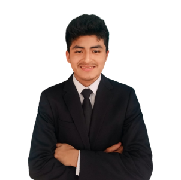

# Capítulo I: Introducción

## 1.1. Startup Profile

### 1.1.1. Descripción de la Startup

**¿Quiénes somos?**

ForkDevs es un equipo especializado de ingeniería de software dedicado al diseño y desarrollo de soluciones tecnológicas de vanguardia. Nuestro propósito fundamental es resolver desafíos complejos a través de la innovación, construyendo herramientas digitales eficientes, escalables y centradas en el usuario que impulsen la transformación y la innovación en un entorno tecnológico exigente.

El nombre ForkDevs encapsula la esencia de nuestra identidad y nuestra vocación técnica y colaborativa. Nace de los conceptos *Fork*, que representa la bifurcación, la evolución continua y la capacidad de tomar una base sólida para llevarla hacia nuevas y mejores soluciones en el desarrollo de software, y *Devs*, que simboliza a nuestro equipo de desarrolladores apasionados por crear tecnología de alto impacto. Juntos, ForkDevs expresa nuestro compromiso de crear tecnología viva, útil y trascendente desde el Perú hacia el futuro.

**Misión**

Diseñar y desarrollar soluciones de software innovadoras que empoderen a las organizaciones y a las personas. Buscamos brindar herramientas tecnológicas de primera categoría que optimicen procesos, fomentar la creatividad y resolver problemas complejos, garantizando siempre la máxima calidad técnica y una experiencia de usuario excepcional.

**Visión**

Ser el equipo de ingeniería de software líder y referente tecnológico a nivel internacional, reconocido por nuestra capacidad de innovar y dar vida a productos digitales excepcionales. Aspiramos a construir ecosistemas tecnológicos que definan los estándares del mañana, manteniendo siempre nuestro compromiso inquebrantable con la excelencia y el orgullo por nuestra identidad cultural.

Nuestro principal producto, **ForkDevs**, es un ecosistema de software diseñado para transformar radicalmente el modelo operativo tradicional de los talleres automotrices, evolucionándolo de un enfoque reactivo a uno proactivo, preventivo e inteligente. Más allá de modernizar la gestión diaria, DriveOS funciona como un completo sistema ERP y MRO que otorga al taller control total sobre sus ámbitos administrativos y económicos, logrando fidelizar clientes.

**¿Qué es y cómo funciona ForkDevs?**

El corazón de la innovación de **ForkDevs**, que nos permite ofrecer este mantenimiento preventivo, es un software capaz de reconocer e integrarse con cualquier dispositivo OBD2 del mercado. Mediante la telemetría, ya sea conectando OBD2 con tarjeta SIM directa al servidor, o vía Bluetooth/WiFi utilizando el smartphone del conductor como gateway, el sistema anticipa los fallos vehiculares, a través del flujo de datos extraídos o alertas DTC y automatiza el flujo de servicio.

El ecosistema se divide estratégicamente en dos fases para conectar a todos los actores del proceso; en este caso nos enfocaremos en el desarrollo de DriveOS:

- **DriveOS:** Una completa aplicación web y móvil orientada al segmento B2B. Con una sólida arquitectura multi-tenant y un estricto control de acceso basado en roles (RBAC), garantiza que cada miembro del equipo, desde el dueño con control global hasta el administrador de sucursal o el mecánico en la zona de trabajo, disponga exactamente de las herramientas e información que necesita para operar con máxima eficiencia.
- **DriveOS Driver:** Una aplicación móvil orientada a los clientes finales, que pueden ser conductores individuales o empresas con flotas vehiculares. Funciona como portal de interacción directa: los usuarios con el servicio OBD2 contratado reciben diagnósticos y alertas preventivas en tiempo real. Para los vehículos sin telemetría activa, la aplicación sigue siendo un canal indispensable para agendar citas, consultar presupuestos y revisar el historial de reparaciones y mantenimientos, integrándose orgánicamente con el ERP del taller.

### 1.1.2. Perfiles de integrantes del equipo

#### **Machacca Soto, Aldo Jeanfranco** (`u202419485`)
*Estudiante de Ingeniería de Software*

Soy Aldo Jeanfranco Machacca Soto, actualmente estoy cursando la carrera de Ingeniería de Software, disciplina centrada en el diseño, desarrollo y mantenimiento de soluciones tecnológicas eficientes, escalables y de calidad. En cuanto a mi perfil técnico, me destaco principalmente en el ámbito del desarrollo backend, contando con sólida experiencia en la creación y arquitectura de APIs. Mi stack tecnológico abarca lenguajes como Python, C++, JavaScript y TypeScript, además de frameworks y bibliotecas como React y Next.js para el desarrollo frontend. Tengo experiencia en la gestión de bases de datos optimizadas para soportar grandes volúmenes de información, así como en procesos de despliegue (deploy) para llevar proyectos a producción. Como habilidad diferenciadora, cuento con experiencia práctica integrando agentes de inteligencia artificial (como OpenCode) en los flujos de trabajo. En un equipo, puedo aportar una visión integral del ciclo de vida del software, capaz de conectar eficientemente la lógica del servidor, la interfaz de usuario y la infraestructura, garantizando soluciones robustas y de alto rendimiento.

---

#### **Granda Ibarra, Luis Daniel** (`uXXXXXXXXX`)
*Estudiante de Ingeniería de Software*

Estudiante de Ingeniería de Software de la Universidad Peruana de Ciencias Aplicadas (UPC). Especializado en el análisis de procesos de negocio, facilitación de metodologías Lean UX, diseño funcional de la solución y definición estratégica de segmentos objetivo.
